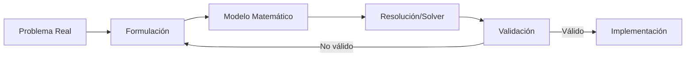

# Introducción a la Investigación Operativa

## Raíces Históricas

La **investigación operativa (IO)** o *Operations Research* nace formalmente durante la Segunda Guerra Mundial:

*   **Problemas complejos**: Logística, despliegue de radares, escolta de convoyes y asignación de recursos limitados.
*   **Enfoque interdisciplinar**: Grupos de científicos (matemáticos, físicos, ingenieros) colaborando para aplicar el método científico a operaciones militares.
*   **Postguerra**: Aplicación exitosa al crecimiento industrial, el comercio y la gestión pública.

---

## Definición de Investigación Operativa

::: {.callout-note title="Operational Research Society"}
La Investigación Operativa es la **aplicación del método científico** a los **problemas complejos** producidos en la dirección y gestión de grandes sistemas de personas, máquinas, materiales y dinero, en la industria, comercio, administración y defensa.
:::

*   Consiste en construir un **modelo científico** del sistema (incluyendo azar y riesgo) para predecir y **comparar los resultados** de diferentes decisiones estratégicas.

---

## Herramientas de la Investigación Operativa

La IO abarca múltiples metodologías cuantitativas:

*   **Optimización matemática** (Lineal, Entera, No Lineal) $\leftarrow$ *Foco del bloque I*
*   **Teoría de grafos y redes** $\leftarrow$ *Foco del bloque II*
*   Sistemas dinámicos y teoría de control
*   Modelos estocásticos y teoría de colas
*   Simulación de eventos discretos
*   Teoría de juegos y teoría de la decisión

# El Concepto de Modelo

## ¿Qué es un Modelo?

Un **modelo** es una representación simplificada de la realidad diseñada para estructurar, analizar y predecir el comportamiento de un sistema real.

### Tipos de Modelos
*   **Modelos Concretos (Físicos)**: Representaciones físicas a escala (ej. túnel de viento, maqueta de un edificio).
*   **Modelos Abstractos (Matemáticos)**: Relaciones y ecuaciones cuantitativas que definen la lógica interna del sistema. Son la herramienta central en ciencias de la decisión.

---

## Ciclo de Vida del Modelado

El proceso de modelización matemática es iterativo:

1.  **Formulación**: Traducir la realidad a variables y ecuaciones.
2.  **Resolución**: Aplicar algoritmos para hallar el óptimo.
3.  **Validación**: Contrastar con datos reales y analizar sensibilidad.
4.  **Implementación**: Toma de decisiones informada.

# Modelos de Optimización

## Formulación General

Un modelo de programación matemática consta de:

$$
\begin{aligned}
\min_{x \in \mathbb{R}^n} \quad & f(x) \\
\text{sujeto a} \quad & g_i(x) \le 0, \quad i = 1, \dots, m \\
& h_j(x) = 0, \quad j = 1, \dots, p
\end{aligned}
$$

*   **Variables de decisión ($x$)**: Las incógnitas que podemos controlar.
*   **Función objetivo ($f$)**: La función real a maximizar o minimizar.
*   **Restricciones ($g_i, h_j$)**: Límites físicos, económicos o lógicos que restringen las variables.

---

## Clasificación de Modelos de Optimización

Atendiendo al tipo de ecuaciones y funciones:

*   **Optimización Lineal (LP)**: Función objetivo y restricciones estrictamente lineales.
*   **Optimización No Lineal (NLP)**: Objetivo o alguna restricción presentan curvatura no lineal.
*   **Optimización Estocástica**: Incluye parámetros probabilísticos y aleatorios.

---

## Clasificación según el Tipo de Variables

*   **Optimización Continua**: Las variables de decisión pueden tomar cualquier valor real dentro de un intervalo:
    $$ x_i \ge 0, \quad x_i \in \mathbb{R} $$
*   **Optimización Entera**: Las variables deben ser valores enteros (ej. número de camiones a comprar):
    $$ x_i \in \mathbb{Z} $$
*   **Optimización Binaria**: Decisiones lógicas sí/no ($x_i \in \{0, 1\}$).
*   **Entera Mixta (MIP)**: Combina variables continuas y enteras.

# Optimización No Lineal y en Redes

## Bloque I: Optimización No Lineal (NLP)

Se estudian problemas continuos donde la curvatura juega un papel crítico:

*   **Diferenciabilidad**: Uso del gradiente y la matriz Hessiana para el análisis de curvatura local.
*   **Convexidad**: Si el problema es convexo, se garantiza la globalidad de los óptimos.
*   **Algoritmos**:
    *   *Búsqueda 1D*: Bisección, Newton, Sección Áurea.
    *   *Multivariables*: Máximo Descenso, Newton, BFGS.
    *   *Con restricciones*: Condiciones de Karush-Kuhn-Tucker (KKT).

---

## Bloque II: Optimización en Redes

Modelado y resolución eficiente de problemas estructurados sobre grafos:

::: {.columns}
::: {.column width="55%"}
*   **Matriz de incidencia**: Totalmente unimodular (garantiza soluciones enteras en relajación lineal).
*   **Algoritmos especializados**: Símplex de redes, Dijkstra, Kruskal, algoritmos de flujo máximo.
:::

::: {.column width="45%"}
### Problemas Clave
*   Caminos mínimos.
*   Flujo máximo.
*   Emparejamientos.
*   Rutas de reparto (TSP).
:::
:::
