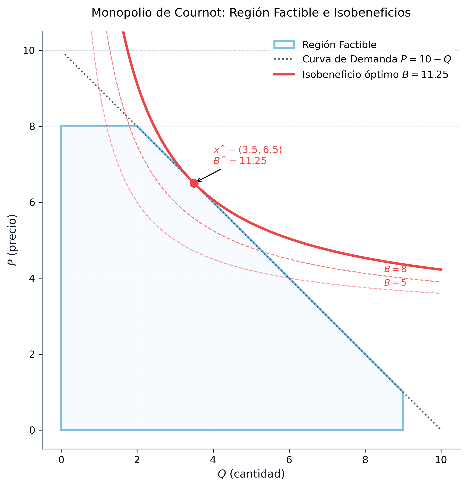
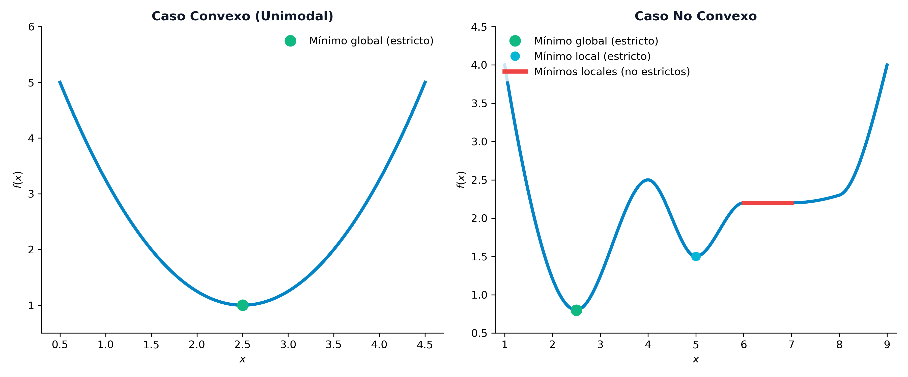
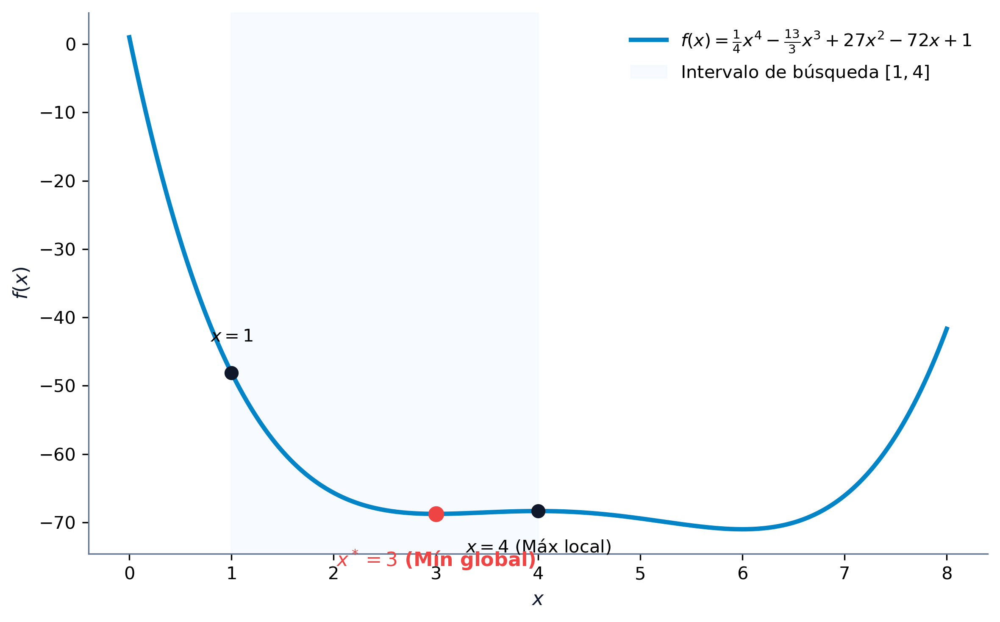
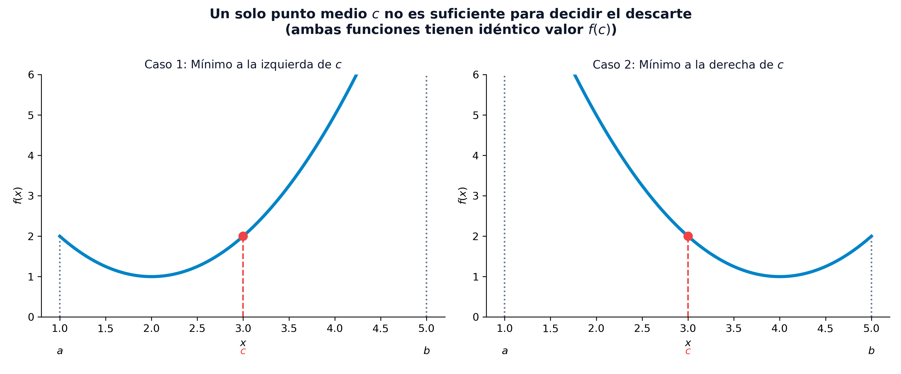
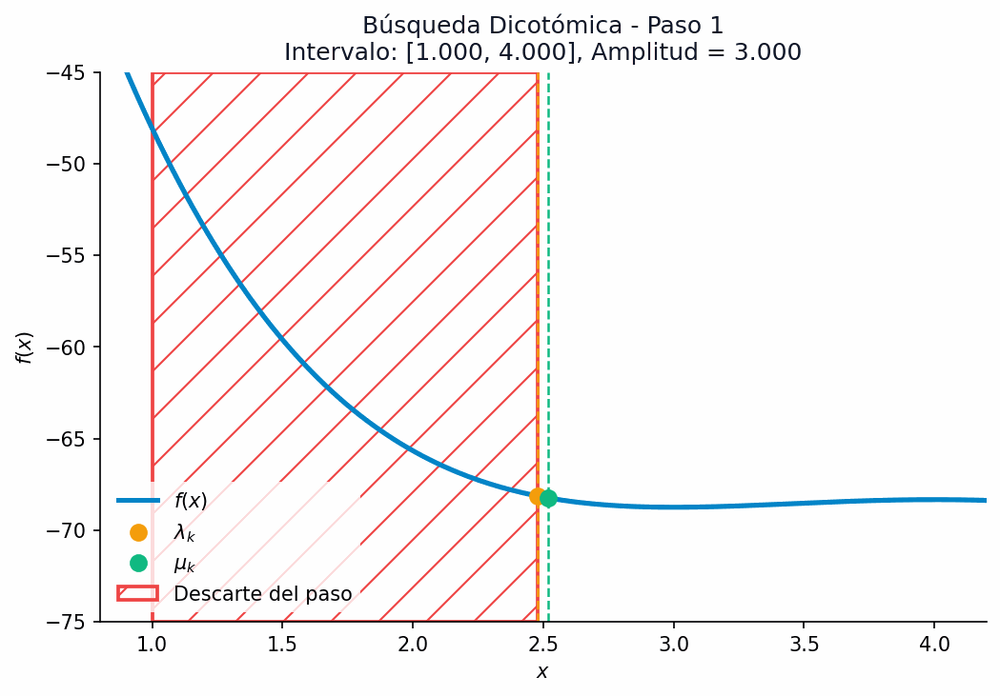
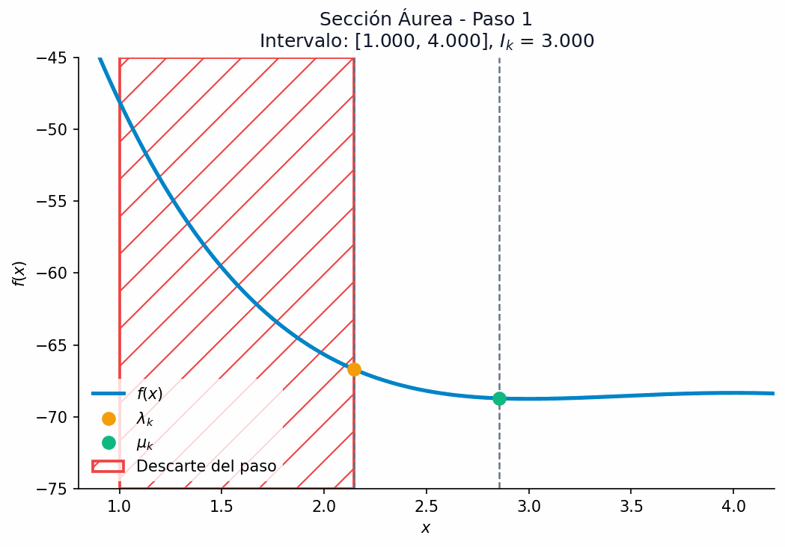
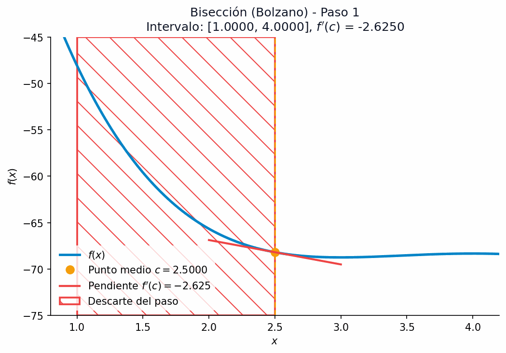
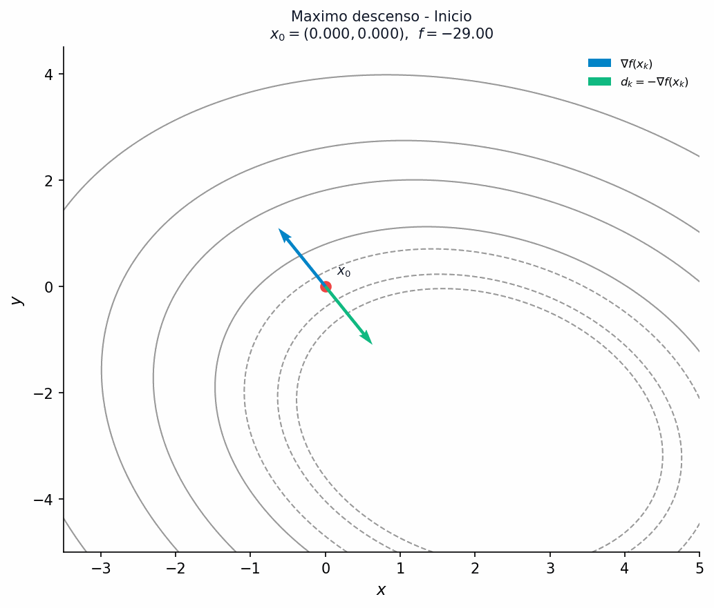

# Introducción y formulación

## ¿De qué trata este tema?

La optimización no lineal (NLP) aborda problemas reales donde las relaciones matemáticas no se comportan de forma proporcional o lineal.

*   **Economías de escala**: El coste unitario disminuye con el volumen de producción, rompiendo la proporcionalidad directa.
*   **Elasticidad de la demanda**: La cantidad demandada es sensible al precio de venta, por lo que la función de ingresos ($I = P \cdot Q$) es inherentemente cuadrática.
*   **Riesgo financiero**: La volatilidad de una cartera se modela mediante la covarianza conjunta (forma cuadrática acoplada).
*   **Ajuste de modelos**: La estimación de parámetros en ciencia de datos suele penalizar errores cuadráticamente (mínimos cuadrados), generando funciones objetivo no lineales.

---

## ¿Qué aprenderás en este tema?

*   **Formulación matemática**: Plantear modelos no lineales con restricciones generales.
*   **Análisis local de curvatura**: Utilizar el gradiente y la matriz hessiana para caracterizar geométricamente las funciones.
*   **Condiciones de optimalidad**: Aplicar las condiciones diferenciales necesarias y suficientes para identificar máximos, mínimos y puntos de silla.
*   **Algoritmos de búsqueda 1D**: Programar y analizar la convergencia de solvers de una variable sin y con derivadas.
*   **Algoritmos multivariables**: Implementar y comparar los principales métodos de búsqueda local sin restricciones (coordenadas cíclicas, máximo descenso, Newton y Cuasi-Newton BFGS).

---

## Formulación matemática general

Un **problema de optimización no lineal (PNL)** general se define matemáticamente sobre un espacio vectorial $\mathbb{R}^n$ como:

$$
\begin{aligned}
\min_{x \in \mathbb{R}^n} \quad & f(x) \\
\text{sujeto a} \quad & g_i(x) \le 0, \quad i = 1, \dots, m \\
& h_j(x) = 0, \quad j = 1, \dots, p
\end{aligned}
$$

Donde:

*   $f(x)$ es la **función objetivo**.
*   $g_i(x)$ representa las restricciones de **desigualdad**.
*   $h_j(x)$ representa las restricciones de **igualdad**.
*   Al menos una de estas funciones es no lineal.

---

## Geometría de la optimización: lineal vs no lineal

La no linealidad altera profundamente la geometría del espacio de búsqueda:

*   **Programación lineal (LP)**:
    
    *   Conjunto factible: Siempre un poliedro convexo.
    *   Óptimo: Se localiza necesariamente en un **vértice** (punto extremo).
    *   Algoritmos: El Símplex explora únicamente un número finito de vértices.
*   **Programación no lineal (NLP)**:
    
    *   Conjunto factible: Las restricciones no lineales curvan las fronteras.
    *   Óptimo: Puede hallarse en el **interior** o en cualquier punto de la **frontera**.
    *   Múltiples óptimos locales: Los solvers locales pueden quedar atrapados en soluciones subóptimas.

---

## Casos particulares de la optimización no lineal

Clasificamos los problemas en familias según sus propiedades:

*   **Programación cuadrática (QP)**: Objetivo cuadrático y restricciones afines (lineales):
    $$ \min_{x} \quad \frac{1}{2} x^T Q x - b^T x \quad \text{sujeto a} \quad A x \le d $$
*   **Programación convexa**: Objetivo y restricciones de desigualdad convexas, e igualdades afines. ¡Todo mínimo local es global!
*   **Programación separable**: Las funciones se pueden descomponer en sumas de una variable: $f(x) = \sum f_j(x_j)$.
*   **Programación geométrica**: Modelada con posinomios, transformable en convexa mediante el cambio $y_j = \ln(x_j)$.
*   **Programación fraccionaria**: Objetivo como cociente de dos funciones.

---

## El monopolio de Cournot (1838)

*   **Precio de venta**: $P(Q) = 10 - Q$ (elasticidad).
*   **Coste total**: $C(Q) = 1 + 3Q$ (lineal).
*   **Modelo de maximización**:
    $$ \max_{Q, P} \quad B(Q, P) = P \cdot Q - 3Q - 1 $$
    $$ \text{sujeto a} \quad Q \le 10 - P, \quad 0 \le P \le 8, \quad 0 \le Q \le 9 $$
*   **Reducción**: Sustituyendo la demanda activa ($P = 10 - Q$):
    $$ \max_{Q} \quad B(Q) = -Q^2 + 7Q - 1 \quad \text{sujeto a} \quad 2 \le Q \le 9 $$
*   **Óptimo analítico**: $B'(Q) = -2Q + 7 = 0 \implies Q^* = 3.5 \in [2, 9]$.

---

## Monopolio de Cournot: análisis geométrico

El punto óptimo $(3.5, 6.5)$ se sitúa en la frontera y no coincide con ningún vértice de la región factible polimórfica:

{fig-align="center" width="50%"}

---

## Selección de cartera de valores (Markowitz, 1952)

Inversión de capital $C$ en $n$ activos para maximizar rendimiento neto del riesgo:

$$
\begin{aligned}
\max_{x \in \mathbb{R}^n} \quad & \sum_{i=1}^n \mu_i x_i - \beta \sum_{i=1}^n \sum_{j=1}^n \sigma_{ij} x_i x_j \\
\text{sujeto a} \quad & \sum_{i=1}^n x_i \le C \\
& x_i \ge 0, \quad i = 1, \dots, n
\end{aligned}
$$

Donde:

*   $\mu_i$: Rendimiento esperado del activo $i$.
*   $\sigma_{ij}$: Covarianza del rendimiento (riesgo cuadrático acoplado).
*   $\beta > 0$: Coeficiente de aversión al riesgo.
*   Es un problema **cuadrático convexo (QP)**.

# Óptimos y análisis diferencial

## Óptimos locales, globales y puntos de silla

Sea $f: \mathbb{R}^n \to \mathbb{R}$ definida sobre un conjunto factible $\mathcal{X} \subseteq \mathbb{R}^n$:

*   **Mínimo global**: $x^*$ es el óptimo absoluto si:
    $$ f(x) \ge f(x^*) \quad \forall x \in \mathcal{X} $$
*   **Mínimo local**: $x^*$ es el mejor en su entorno local si existe un radio $\epsilon > 0$ tal que:
    $$ f(x) \ge f(x^*) \quad \forall x \in \mathcal{X} \quad \text{con} \quad \|x - x^*\| \le \epsilon $$
*   **Estricto**: Si la desigualdad se cumple de forma estricta ($>$) para todo $x \neq x^*$.
*   **Punto de silla**: Punto crítico que no es ni mínimo ni máximo local.

---

## Tipos de óptimos de un vistazo

Diferencia fundamental con LP: múltiples óptimos locales mediocres frente al mínimo global único:

{fig-align="center" width="70%"}

---

## Herramientas de análisis diferencial

Asumiendo funciones con derivadas segundas continuas (de clase $\mathcal{C}^2$):

*   **Vector gradiente**: Vector columna de derivadas de primer orden (pendiente):
    $$ \nabla f(x) = \left( \frac{\partial f(x)}{\partial x_1}, \frac{\partial f(x)}{\partial x_2}, \dots, \frac{\partial f(x)}{\partial x_n} \right)^T $$
*   **Matriz hessiana**: Matriz simétrica de segundas derivadas parciales (curvatura):
    $$ [\nabla^2 f(x)]_{ij} = \frac{\partial^2 f(x)}{\partial x_i \partial x_j} $$

---

## Desarrollo de Taylor multivariable

Aproximación cuadrática local de $f(x)$ alrededor de un punto de referencia $\bar{x}$:

$$ f(x) = f(\bar{x}) + \nabla f(\bar{x})^T (x - \bar{x}) + \frac{1}{2} (x - \bar{x})^T \nabla^2 f(\bar{x}) (x - \bar{x}) + o(\|x - \bar{x}\|^2) $$

Donde:

*   El término lineal $\nabla f(\bar{x})^T (x - \bar{x})$ define el plano tangente.
*   El término cuadrático $\frac{1}{2} (x - \bar{x})^T \nabla^2 f(\bar{x}) (x - \bar{x})$ define la parábola de ajuste.
*   Si la función $f(x)$ es cuadrática, la aproximación es exacta en todo el dominio.

---

## Clasificación de la curvatura y matrices

Clasificación de $H = \nabla^2 f(x)$ según la forma cuadrática $z^T H z$:

*   **Definida positiva ($H \succ 0$)**: $z^T H z > 0 \quad \forall z \neq 0$. Menores principales $> 0$. Autovalores $> 0$. (Curva en cuenco).
*   **Semidefinida positiva ($H \succeq 0$)**: $z^T H z \ge 0 \quad \forall z$. Autovalores $\ge 0$.
*   **Definida negativa ($H \prec 0$)**: $z^T H z < 0 \quad \forall z \neq 0$. Menores alternan signo ($M_1 < 0, M_2 > 0$). Autovalores $< 0$. (Cúpula).
*   **Semidefinida negativa ($H \preceq 0$)**: $z^T H z \le 0 \quad \forall z$. Autovalores $\le 0$.
*   **Indefinida**: Autovalores positivos y negativos. (Punto de silla).

---

## Condiciones de optimalidad en optimización libre

Caracterización diferencial de extremos locales sin restricciones:

*   **Condición necesaria de primer orden (FONC)**: Si $x^*$ es un mínimo local, entonces el gradiente se anula:
    $$ \nabla f(x^*) = 0 $$
    (El punto $x^*$ es un **punto crítico** o estacionario).
*   **Condición necesaria de segundo orden (SONC)**: Si $x^*$ es un mínimo local:
    $$ \nabla^2 f(x^*) \succeq 0 $$
*   **Condición suficiente de segundo orden (SOSC)**: Si se cumple simultáneamente que:
    $$ \nabla f(x^*) = 0 \qquad \text{y} \qquad \nabla^2 f(x^*) \succ 0 $$
    Entonces $x^*$ es un **mínimo local estricto**.

# Métodos de búsqueda unidimensional

## Métodos de búsqueda unidimensional

Consiste en minimizar una función real de una variable $f: \mathbb{R} \to \mathbb{R}$ en un intervalo acotado $[a, b]$.

*   Caso de prueba para trazas numéricas:
    $$ f(x) = \frac{1}{4}x^4 - \frac{13}{3}x^3 + 27x^2 - 72x + 1 \quad \text{en} \quad [1, 4] $$
*   Mínimo global analítico situado exactamente en $x^* = 3.0$:

{fig-align="center" width="50%"}

---

## Métodos sin derivadas: búsqueda uniforme

*   Subdivide el intervalo $[a, b]$ en $n$ subintervalos iguales mediante una rejilla.
*   Poco eficiente debido a que no aprovecha la información de las evaluaciones previas.

{fig-align="center" width="55%"}

---

## Búsqueda dicotómica: insuficiencia de un solo punto

Evaluar un único punto medio es insuficiente porque dos funciones unimodales diferentes pueden tener idéntico valor en el centro teniendo sus mínimos en lados opuestos:

{fig-align="center" width="70%"}

---

## Métodos sin derivadas: búsqueda dicotómica

*   Calcula dos puntos simétricos separados por una pequeña perturbación $\delta$:
    $$ \lambda_k = \frac{a_k + b_k}{2} - \delta \qquad \mu_k = \frac{a_k + b_k}{2} + \delta $$
*   Compara los valores de la función en ambos puntos para descartar una porción del intervalo en cada iteración:
    *   Si $f(\lambda_k) < f(\mu_k) \implies$ el mínimo no está en $[\mu_k, b_k]$, nuevo intervalo $[a_k, \mu_k]$.
    *   Si $f(\lambda_k) > f(\mu_k) \implies$ el mínimo no está en $[a_k, \lambda_k]$, nuevo intervalo $[\lambda_k, b_k]$.

---

## Búsqueda dicotómica: paso a paso numérico

Minimizamos $f(x)$ en $[1, 4]$ con $\delta = 0.02$ y tolerancia $\epsilon = 0.15$:

*   **Paso 1**: $[a_0, b_0] = [1, 4]$. Punto medio $c = 2.5$.
    
    *   Planteamos y sustituimos:
        $$ \lambda_0 = \frac{a_0 + b_0}{2} - \delta = \frac{1 + 4}{2} - 0.02 = 2.48 $$
        $$ \mu_0 = \frac{a_0 + b_0}{2} + \delta = \frac{1 + 4}{2} + 0.02 = 2.52 $$
    *   Calculamos evaluaciones:
        $$ f(2.48) \approx -68.397 \qquad f(2.52) \approx -68.490 $$
    *   Como $f(\lambda_0) > f(\mu_0) \implies$ descartamos $[a_0, \lambda_0]$. Nuevo intervalo: $[2.48, 4]$.
*   **Paso 2**: $[a_1, b_1] = [2.48, 4]$. Punto medio $c = 3.24$.
    
    *   $\lambda_1 = 3.22 \implies f(3.22) = -68.730$
    *   $\mu_1 = 3.26 \implies f(3.26) = -68.683$
    *   Como $f(\lambda_1) < f(\mu_1)$, descartamos $[\mu_1, b_1]$. Nuevo intervalo: $[2.48, 3.26]$.
*   **Paso 3**: $[a_2, b_2] = [2.48, 3.26]$. Punto medio $c = 2.87$.
    
    *   $\lambda_2 = 2.85 \implies f(2.85) = -68.711$, $\mu_2 = 2.89 \implies f(2.89) = -68.724$.
    *   $f(\lambda_2) > f(\mu_2) \implies$ nuevo intervalo: $[2.85, 3.26]$.

---

## Búsqueda dicotómica: visualización del método

El proceso divide iterativamente el intervalo de búsqueda prácticamente a la mitad, convergiendo con rapidez hacia el óptimo mediante evaluaciones pareadas:

{fig-align="center" width="55%"}

---

## Métodos sin derivadas: sección áurea

*   Optimiza la búsqueda dicotómica al reutilizar uno de los puntos evaluados en el paso anterior, reduciendo el coste computacional.
*   La amplitud del intervalo se reduce de forma constante por la razón áurea:
    $$ I_k = \frac{b_k - a_k}{\alpha} \quad \text{con} \quad \alpha = \frac{1 + \sqrt{5}}{2} \approx 1.61803 $$
*   Los puntos se localizan simétricamente en el intervalo:
    $$ \lambda_k = b_k - I_k \qquad \mu_k = a_k + I_k $$

---

## Sección áurea: paso a paso numérico

Minimizamos $f(x)$ en $[1, 4]$ con tolerancia $\epsilon = 0.15$:

*   **Paso 1**: $[a_0, b_0] = [1, 4]$.
    
    *   Amplitud teórica:
        $$ I_1 = \frac{b_0 - a_0}{\alpha} = \frac{4 - 1}{1.61803} \approx 1.8541 $$
    *   Sustituimos y calculamos puntos:
        $$ \lambda_0 = b_0 - I_1 = 4 - 1.8541 = 2.1459 \implies f(2.1459) \approx -66.692 $$
        $$ \mu_0 = a_0 + I_1 = 1 + 1.8541 = 2.8541 \implies f(2.8541) \approx -68.714 $$
    *   Como $f(\lambda_0) > f(\mu_0) \implies$ descartamos $[a_0, \lambda_0]$. Nuevo intervalo: $[2.1459, 4]$.
*   **Paso 2**: $[a_1, b_1] = [2.1459, 4]$. Amplitud $I_2 = 1.8541 / 1.618 = 1.1459$.
    
    *   Reutilizamos $\lambda_1 = \mu_0 = 2.8541 \implies f(2.8541) = -68.714$.
    *   Calculamos $\mu_1 = 2.1459 + 1.1459 = 3.2918 \implies f(3.2918) = -68.654$.
    *   $f(\lambda_1) < f(\mu_1) \implies$ nuevo intervalo: $[2.1459, 3.2918]$.
*   El algoritmo continúa reutilizando evaluaciones hasta el paso 7, donde la amplitud $0.1033 \le 0.15$.

---

## Sección áurea: visualización del método

La amplitud del intervalo se contrae de forma secuencial manteniendo la proporción de la sección áurea, reutilizando las evaluaciones previas de forma simétrica:

{fig-align="center" width="55%"}

---

## Métodos sin derivadas: Fibonacci

*   Fija de antemano el número total de evaluaciones de función $N$ para maximizar la reducción del intervalo final.
*   Utiliza los términos de la serie de Fibonacci para definir los coeficientes de reducción:
    $$ F_0=1, F_1=1, F_2=2, F_3=3, F_4=5, F_5=8, F_6=13, F_7=21, \dots $$
*   La amplitud del paso en cada iteración $k$ se calcula mediante:
    $$ I_k = \frac{F_{N-k}}{F_{N-k+2}} (b_{k-1} - a_{k-1}) $$

---

## Fibonacci: paso a paso numérico

Minimizamos $f(x)$ en $[1, 4]$ mediante Fibonacci para un total de $N=6$ evaluaciones ($F_7 = 21$):

*   **Paso 1**: $[a_0, b_0] = [1, 4]$.
    
    *   Amplitud teórica del paso:
        $$ I_1 = \frac{F_6}{F_7}(b_0 - a_0) = \frac{13}{21}(4 - 1) = \frac{39}{21} \approx 1.8571 $$
    *   Sustituimos y calculamos:
        $$ \lambda_0 = b_0 - I_1 = 4 - 1.8571 = 2.1429 \implies f(2.1429) \approx -66.673 $$
        $$ \mu_0 = a_0 + I_1 = 1 + 1.8571 = 2.8571 \implies f(2.8571) \approx -68.715 $$
    *   Como $f(\lambda_0) > f(\mu_0) \implies$ nuevo intervalo: $[2.1429, 4]$.
*   **Paso 2**: $[a_1, b_1] = [2.1429, 4]$. Paso $I_2 = \frac{8}{21} \cdot 3 = 1.1429$.
    Reutiliza $\lambda_1 = \mu_0 = 2.8571$. Calcula $\mu_1 = 2.1429 + 1.1429 = 3.2857 \implies f(3.2857) = -68.657 \implies [2.1429, 3.2857]$.

---

## Métodos con derivadas: bisección (Bolzano)

*   Busca el cero de la primera derivada ($f'(x) = 0$) en un intervalo $[a, b]$ donde el signo de la derivada en los extremos sea opuesto ($f'(a) \cdot f'(b) < 0$).
*   En cada paso, evalúa el punto medio del intervalo:
    $$ c_k = \frac{a_k + b_k}{2} $$
*   Reduce el intervalo a la mitad analizando el signo de $f'(c_k)$:
    *   Si $f'(c_k) < 0 \implies$ nuevo intervalo $[c_k, b_k]$.
    *   Si $f'(c_k) > 0 \implies$ nuevo intervalo $[a_k, c_k]$.

---

## Bisección: paso a paso numérico

Minimizamos $f(x)$ con $f'(x) = x^3 - 13x^2 + 54x - 72$ en $[1, 4]$, $\epsilon = 0.15$:

*   **Paso 1**: $[a_0, b_0] = [1, 4]$.
    
    *   Punto medio teórico:
        $$ c_0 = \frac{a_0 + b_0}{2} = \frac{1 + 4}{2} = 2.5 $$
    *   Sustituimos y calculamos la derivada:
        $$ f'(2.5) = (2.5)^3 - 13(2.5)^2 + 54(2.5) - 72 = -2.625 < 0 $$
    *   Descartamos la mitad izquierda $\implies$ nuevo intervalo $[2.5, 4]$.
*   **Paso 2**: $[a_1, b_1] = [2.5, 4]$. Punto medio $c = 3.25$.
    
    *   $f'(3.25) = 0.5156 > 0$.
    *   Descartamos la mitad derecha $\implies$ nuevo intervalo $[2.5, 3.25]$.
*   **Paso 3**: $[a_2, b_2] = [2.5, 3.25]$. Punto medio $c = 2.875$.
    
    *   $f'(2.875) = -0.4433 < 0 \implies$ nuevo intervalo $[2.875, 3.25]$.
*   El proceso finaliza en el paso 5 con un intervalo de amplitud $0.0938 \le 0.15$.

---

## Bisección: visualización del método

El método se basa en el teorema de Bolzano, acotando sucesivamente el valor donde la derivada se anula dividiendo a la mitad la amplitud en cada iteración:

{fig-align="center" width="55%"}

---

## Métodos con derivadas: método de Newton 1D

*   Aproxima la función objetivo mediante su polinomio de Taylor cuadrático alrededor del punto de búsqueda actual $x_k$.
*   El siguiente punto iterado se obtiene saltando directamente al vértice de la parábola aproximada (donde la derivada aproximada se anula):
    $$ x_{k+1} = x_k - \frac{f'(x_k)}{f''(x_k)} $$
*   Requiere que la función sea de clase $\mathcal{C}^2$ y que $f''(x_k) \neq 0$.

---

## Newton 1D: paso a paso numérico

Minimizamos la misma función partiendo de $x_0 = 1.0$:

*   **Paso 1**: Partimos de $x_0 = 1.0$.
    
    *   Ecuaciones teóricas y derivadas ($f''(x) = 3x^2 - 26x + 54$):
        $$ f'(x_0) = f'(1.0) = 1^3 - 13(1)^2 + 54(1) - 72 = -30.0 $$
        $$ f''(x_0) = f''(1.0) = 3(1)^2 - 26(1) + 54 = 31.0 $$
    *   Sustituimos en la regla de Newton:
        $$ x_1 = x_0 - \frac{f'(x_0)}{f''(x_0)} = 1.0 - \frac{-30.0}{31.0} \approx 1.9677 $$
*   **Paso 2**: $x_1 = 1.9677$.
    
    *   $f'(1.9677) \approx -8.459$, $f''(1.9677) \approx 14.450$.
    *   $x_2 = 1.9677 - (-8.459 / 14.450) \approx 2.5529$.
*   **Paso 3**: $x_2 = 2.5529$.
    
    *   $f'(2.5529) \approx -2.235$, $f''(2.5529) \approx 7.177$.
    *   $x_3 = 2.5529 - (-2.235 / 7.177) \approx 2.8637$.
*   **Paso 4**: $x_3 = 2.8637 \implies x_4 = 2.8637 - (-0.485 / 4.146) \approx 2.9808$.
*   **Paso 5**: $x_4 = 2.9808 \implies x_5 = 2.9808 - (-0.059 / 3.154) \approx 2.9995 \approx 3.0$.

---

## Newton 1D: visualización del método

El algoritmo aproxima de manera local mediante parábolas sucesivas y converge muy rápido si el punto inicial $x_0$ está próximo al óptimo:

{fig-align="center" width="55%"}

---

## Método de la secante

*   Evita el cálculo de la segunda derivada del método de Newton.
*   Aproxima la curvatura mediante la diferencia de gradientes en los últimos dos pasos:
    $$ x_{k+1} = x_k - f'(x_k) \frac{x_k - x_{k-1}}{f'(x_k) - f'(x_{k-1})} $$
*   Características:
    
    *   Convergencia superlineal con orden $\approx 1.618$.
    *   Exige disponer de dos puntos iniciales $x_0$ y $x_{-1}$.

# Métodos multivariables

## Métodos multivariables de optimización sin restricciones

Buscan minimizar $f: \mathbb{R}^n \to \mathbb{R}$ mediante la sucesión iterativa:

$$ x_{k+1} = x_k + \alpha_k d_k $$

Donde:

*   **Dirección de búsqueda ($d_k$)**: Debe ser de descenso (formar un ángulo obtuso con el gradiente):
    $$ \nabla f(x_k)^T d_k < 0 $$
*   **Tamaño de paso ($\alpha_k$)**: Determina el avance óptimo a lo largo de la dirección. Se calcula resolviendo el problema unidimensional:
    $$ \alpha_k = \arg\min_{\alpha > 0} f(x_k + \alpha d_k) $$

---

## Método de coordenadas cíclicas

*   Es un método de optimización multivariable de búsqueda directa (no requiere derivadas).
*   Avanza de forma iterativa minimizando respecto a una sola variable de decisión a la vez de forma cíclica (direcciones de búsqueda ortogonales $d_k = e_i$):
    $$ x_{k+1} = x_k + \alpha_k e_i $$
*   El tamaño de paso exacto $\alpha_k$ se calcula mediante una búsqueda lineal unidimensional exacta en la dirección $e_i$.

---

## Coordenadas cíclicas: paso a paso numérico

Minimizamos $f(x, y) = 8x^2 + 3xy + 7y^2 - 25x + 31y - 29$ desde $x_0 = (0, 0)^T$:

*   **Paso 1**: Optimizamos respecto a $x$ fijando $y = y_0 = 0$:
    
    *   Sustituimos en la ecuación teórica:
        $$ f(x, 0) = 8x^2 + 3x(0) + 7(0)^2 - 25x + 31(0) - 29 = 8x^2 - 25x - 29 $$
    *   Derivamos respecto a $x$ e igualamos a cero:
        $$ \frac{df(x,0)}{dx} = 16x - 25 = 0 \implies x = \frac{25}{16} = 1.5625 $$
    *   El punto resultante es $x_1 = (1.5625, 0)^T$.
*   **Paso 2**: Optimizamos respecto a $y$ con $x=1.5625$:
    
    *   $\min_y \quad f(1.5625, y) = 7y^2 + 35.6875y + \text{ct}$
    *   Derivando: $14y + 35.6875 = 0 \implies y_2 \approx -2.5491$.
    *   Punto resultante: $x_2 = (1.5625, -2.5491)^T$.
*   **Paso 3**: Optimizamos de nuevo respecto a $x$ con $y=-2.5491$:
    
    *   $\min_x \quad 8x^2 - 32.6473x + \text{ct} \implies 16x - 32.6473 = 0 \implies x_3 = (2.0405, -2.5491)^T$.

---

## Coordenadas cíclicas: visualización del método

La presencia de acoplamiento entre variables (términos cruzados en la Hessiana) afecta drásticamente a la convergencia:

::: {.columns}
::: {.column width="50%"}
### Variables desacopladas
Localiza el mínimo en exactamente $n=2$ búsquedas ortogonales.

{fig-align="center" width="100%"}
:::

::: {.column width="50%"}
### Variables acopladas
Dibuja un patrón en "escalera" que ralentiza la convergencia del algoritmo.

{fig-align="center" width="100%"}
:::
:::

---

## Método del máximo descenso

*   Dirección de búsqueda: opuesta al gradiente local ($d_k = -\nabla f(x_k)$).
*   Teorema de la ortogonalidad: Si el tamaño de paso se calcula mediante búsqueda de línea exacta, las direcciones consecutivas son ortogonales:
    $$ d_k^T d_{k+1} = 0 $$
*   Demostración:
    Definiendo $\phi(\alpha) = f(x_k + \alpha d_k)$, su derivada en el óptimo $\alpha_k$ debe ser nula:
    $$ \phi'(\alpha_k) = \nabla f(x_k + \alpha_k d_k)^T d_k = 0 \implies \nabla f(x_{k+1})^T d_k = 0 $$
    Dado que las direcciones son proporcionales a los gradientes, se cumple:
    $$ d_{k+1}^T d_k = 0 $$

---

## Máximo descenso: paso a paso numérico

Caso cuadrático acoplado $f(x, y)$ desde $x_0 = (0, 0)^T$:

*   **Paso 1**: Calculamos el gradiente y la dirección de descenso:
    
    *   Gradiente teórico:
        $$ \nabla f(x, y) = \begin{pmatrix} 16x+3y-25 \\ 3x+14y+31 \end{pmatrix} $$
    *   Sustituimos $x_0 = (0, 0)^T$:
        $$ \nabla f(x_0) = \begin{pmatrix} 16(0)+3(0)-25 \\ 3(0)+14(0)+31 \end{pmatrix} = \begin{pmatrix} -25 \\ 31 \end{pmatrix} $$
    *   Dirección de búsqueda ($d_0 = -\nabla f(x_0)$):
        $$ d_0 = \begin{pmatrix} 25 \\ -31 \end{pmatrix} $$
*   **Paso 2**: Búsqueda lineal exacta:
    
    *   Sustituimos $x_0 + \alpha d_0 = (25\alpha, -31\alpha)^T$ en $f(x, y)$ para obtener $\phi(\alpha)$:
        $$ \phi(\alpha) = f(25\alpha, -31\alpha) = 9402\alpha^2 - 1586\alpha - 29 $$
    *   Derivamos e igualamos a cero:
        $$ \phi'(\alpha) = 18804\alpha - 1586 = 0 \implies \alpha_0 = \frac{1586}{18804} \approx 0.0843 $$
*   **Paso 3**: Actualización:
    
    *   $x_1 = x_0 + \alpha_0 d_0 = \begin{pmatrix} 2.109 \\ -2.615 \end{pmatrix} $.
*   **Paso 4**: Verificación de la ortogonalidad en el nuevo punto:
    
    *   $\nabla f(x_1) \approx (0.8925, 0.7225)^T$.
    *   $d_0^T \nabla f(x_1) = 25(0.8925) - 31(0.7225) \approx 0$.

---

## Máximo descenso: visualización del método

La ortogonalidad obligada entre direcciones consecutivas debido a la búsqueda lineal exacta provoca un patrón de "zigzag" muy ineficiente en funciones con valles estrechos (elipses alargadas):

{fig-align="center" width="60%"}

---

## Método de Newton multivariable

Aproxima la función objetivo mediante una parábola multivariable en el punto actual $x_k$:

$$ x_{k+1} = x_k - [\nabla^2 f(x_k)]^{-1} \nabla f(x_k) $$

*   **Ventaja**: Convergencia cuadrática local de orden 2. Localiza el mínimo en 1 iteración para funciones cuadráticas.
*   **Limitaciones**:
    
    *   Coste computacional de resolver el sistema lineal es alto ($O(n^3)$).
    *   Exige que la Hessiana sea definida positiva ($H \succ 0$).
    *   Convergencia estrictamente local (puede divergir si se empieza lejos).

---

## Newton multivariable: paso a paso numérico

Minimizamos $f(x, y) = 8x^2 + 3xy + 7y^2 - 25x + 31y - 29$ desde $x_0 = (0, 0)^T$.

*   **Paso 1**: Calculamos el gradiente y la matriz hessiana en el punto actual:
    
    *   Ecuaciones del gradiente y de la hessiana:
        $$ \nabla f(x, y) = \begin{pmatrix} 16x + 3y - 25 \\ 3x + 14y + 31 \end{pmatrix} \implies \nabla f(x_0) = \begin{pmatrix} -25 \\ 31 \end{pmatrix} $$
        $$ H = \nabla^2 f(x, y) = \begin{pmatrix} 16 & 3 \\ 3 & 14 \end{pmatrix} \quad (\text{constante}) $$
*   **Paso 2**: Calculamos la inversa de la hessiana (determinante $D = 16 \cdot 14 - 3^2 = 215$):
    $$ H^{-1} = \frac{1}{215} \begin{pmatrix} 14 & -3 \\ -3 & 16 \end{pmatrix} $$
*   **Paso 3**: Aplicamos la actualización teórica de Newton:
    $$ x_1 = x_0 - H^{-1} \nabla f(x_0) = \begin{pmatrix} 0 \\ 0 \end{pmatrix} - \frac{1}{215} \begin{pmatrix} 14 & -3 \\ -3 & 16 \end{pmatrix} \begin{pmatrix} -25 \\ 31 \end{pmatrix} $$
    $$ x_1 = - \frac{1}{215} \begin{pmatrix} 14(-25) - 3(31) \\ -3(-25) + 16(31) \end{pmatrix} = -\frac{1}{215} \begin{pmatrix} -443 \\ 571 \end{pmatrix} = \begin{pmatrix} 443/215 \\ -571/215 \end{pmatrix} \approx \begin{pmatrix} 2.0605 \\ -2.6558 \end{pmatrix} $$
    ¡Al ser cuadrática, Newton converge al mínimo exacto en exactamente una iteración!

---

## Método cuasi-Newton: BFGS

Resuelven los inconvenientes del método de Newton estimando la inversa de la Hessiana $H_k \approx [\nabla^2 f(x_k)]^{-1}$ usando solo gradientes:

*   Fuerzan la **ecuación de la secante**:
    $$ H_{k+1} y_k = s_k $$
    donde $s_k = x_{k+1} - x_k$ y $y_k = \nabla f(x_{k+1}) - \nabla f(x_k)$.
*   Mantiene la matriz definida positiva en cada paso (si cumple condiciones de Wolfe).
*   Costo de $O(n^2)$ por iteración y convergencia superlineal.
