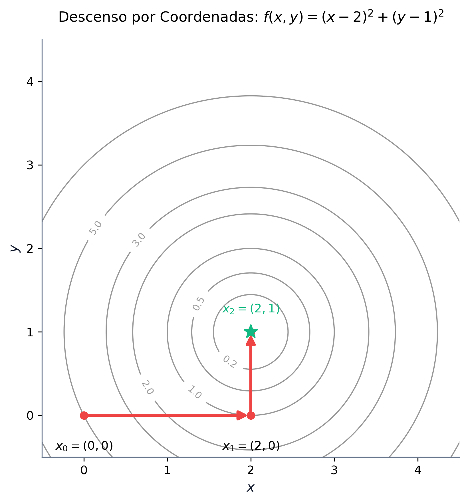
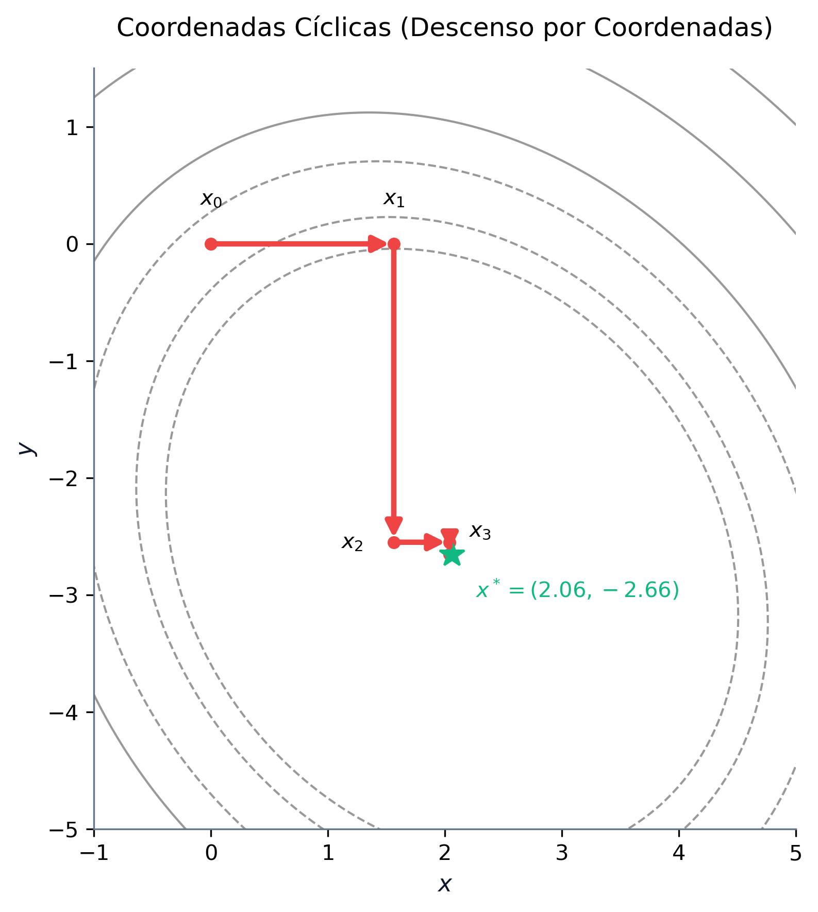
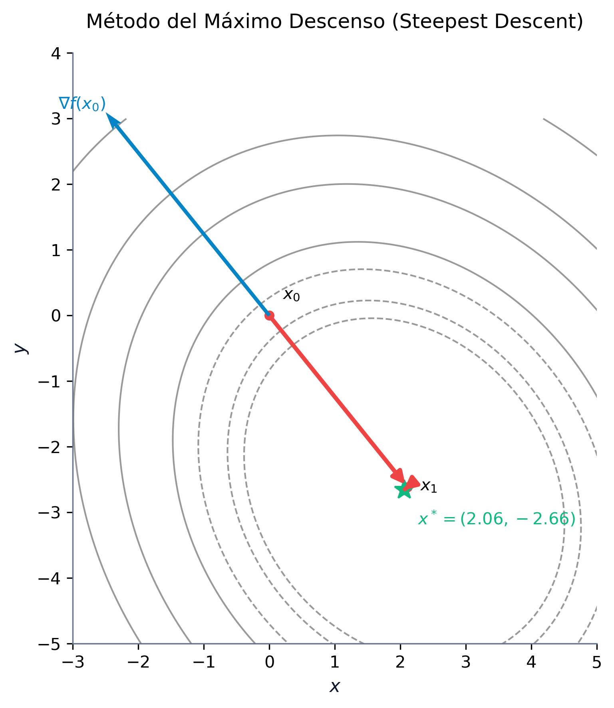

# Optimización No Lineal y Métodos Numéricos

La **optimización no lineal** (Nonlinear Programming, NLP) estudia problemas de decisión donde la función objetivo o alguna de las restricciones presentan comportamientos no lineales. A diferencia de la programación lineal, donde las soluciones óptimas se encuentran siempre en la frontera del conjunto factible (específicamente en sus puntos extremos o vértices), en optimización no lineal el óptimo puede situarse en el interior del espacio factible o en cualquier punto de su frontera. La presencia de curvatura en la función objetivo y en las restricciones exige herramientas avanzadas de análisis diferencial multivariable y algoritmos iterativos complejos.

En este capítulo, estudiaremos la formulación general de los problemas de optimización no lineal, su clasificación en familias estructurales específicas y su interpretación geométrica. Asimismo, desarrollaremos la fundamentación matemática basada en el gradiente y la matriz hessiana para caracterizar la curvatura local y establecer las condiciones de optimalidad. Por último, abordaremos de forma analítica y práctica los principales métodos numéricos de búsqueda unidimensional (1D) y multivariable sin restricciones, complementándolos con código numérico y simbólico en Python.

::: {.callout-important title="Objetivos de aprendizaje"}
Al finalizar este capítulo, serás capaz de:

1.  **Formular y clasificar** problemas de optimización no lineal en sus distintas familias estructurales.
2.  **Visualizar e interpretar geométricamente** la diferencia entre la optimización lineal y la no lineal a través del análisis de conjuntos factibles convexos y curvas de nivel no lineales.
3.  **Caracterizar la curvatura** de una función multivariable mediante el análisis del gradiente y de la matriz hessiana empleando el criterio de los menores principales.
4.  **Clasificar puntos estacionarios** aplicando las condiciones de optimalidad de primer y segundo orden (FONC, SONC, SOSC).
5.  **Implementar y trazar numéricamente** algoritmos de búsqueda lineal en una dimensión, tanto sin derivadas como con derivadas.
6.  **Comprender y programar** algoritmos de optimización multivariable sin restricciones, analizando el comportamiento de las coordenadas cíclicas, el fenómeno de zigzag del máximo descenso y las ventajas de los métodos de Newton y Cuasi-Newton (BFGS).
:::


## Introducción y Formulación de Problemas No Lineales

En el mundo real, la linealidad es una excepción matemática. Los fenómenos físicos, económicos y tecnológicos se comportan de manera inherentemente no lineal. En la industria, por ejemplo, las **economías de escala** provocan que el coste unitario de producción disminuya a medida que aumenta el volumen debido al reparto de costes fijos o descuentos por cantidad, lo que rompe la relación de proporcionalidad lineal. En el ámbito económico, la **elasticidad de la demanda** determina que la cantidad demandada de un bien sea sensible a su precio de venta, por lo que la función de ingresos resultante ($I = P \cdot Q$) es cuadrática y no lineal. En el sector financiero, siguiendo el modelo de selección de carteras de Markowitz, el riesgo se mide mediante la varianza del rendimiento de los activos, que constituye una combinación cuadrática de los pesos invertidos, mientras que el rendimiento esperado se mantiene lineal. Finalmente, en la ciencia de datos, la estimación de modelos y algoritmos de aprendizaje automático suele penalizar los errores de ajuste de forma cuadrática (mínimos cuadrados), generando funciones objetivo no lineales.

Un **problema de optimización no lineal (PNL)** general se define matemáticamente sobre un espacio vectorial $\mathbb{R}^n$ como:

$$
\begin{aligned}
\min_{x \in \mathbb{R}^n} \quad & f(x) \\
\text{sujeto a} \quad & g_i(x) \le 0, \quad i = 1, \dots, m \\
& h_j(x) = 0, \quad j = 1, \dots, p
\end{aligned}
$$

Donde $f: \mathbb{R}^n \to \mathbb{R}$ es la función objetivo, $g_i: \mathbb{R}^n \to \mathbb{R}$ representa las restricciones de desigualdad, e $h_j: \mathbb{R}^n \to \mathbb{R}$ representa las restricciones de igualdad. Para que el problema sea clasificado como no lineal, al menos una de estas funciones debe exhibir un comportamiento no lineal en el dominio de interés.

La transición de modelos lineales a no lineales altera profundamente la geometría del espacio de búsqueda. En programación lineal (LP), el conjunto factible es siempre un poliedro convexo y la solución óptima se localiza en uno de sus vértices. Esto permite que algoritmos como el Símplex resuelvan problemas de millones de variables explorando únicamente un número finito de candidatos. En optimización no lineal (NLP), las restricciones no lineales pueden deformar el conjunto factible, y el óptimo puede hallarse en el interior del espacio factible o en cualquier punto de la frontera. Además, la presencia de no convexidades puede generar múltiples óptimos locales, atrapando a los algoritmos numéricos antes de alcanzar el mínimo global.

### Casos Particulares de la Optimización No Lineal

Para abordar la resolución de problemas no lineales de forma eficiente, la disciplina los clasifica en familias estructuradas según las propiedades algebraicas y analíticas de sus funciones:

La **Programación Cuadrática (QP)** representa problemas donde la función objetivo es cuadrática y las restricciones son afines (lineales), formulándose como $\min_{x} \frac{1}{2} x^T Q x - b^T x$ sujeto a $A x \le d$. Si la matriz $Q$ es semidefinida positiva, el problema es convexo, lo que permite el uso de algoritmos especializados extremadamente eficientes como los métodos de conjuntos activos (*active-set*) o de punto interior, que resuelven el problema de forma exacta en pocas iteraciones.

La **Programación Convexa** constituye la clase de problemas más robusta en optimización no lineal. Un problema es convexo si la función objetivo $f(x)$ es convexa, las restricciones de desigualdad $g_i(x)$ son convexas y las restricciones de igualdad $h_j(x)$ son afines. La gran ventaja analítica de la programación convexa es que todo mínimo local es un mínimo global. Esto elimina la necesidad de realizar búsquedas globales exhaustivas y garantiza que métodos locales de gradiente converjan siempre a la solución óptima del sistema.

La **Programación Separable** se presenta cuando todas las funciones involucradas se pueden descomponer en la suma de funciones que dependen exclusivamente de una sola variable independiente, es decir, $f(x) = \sum_{j=1}^n f_j(x_j)$ y $g_i(x) = \sum_{j=1}^n g_{ij}(x_j) \le 0$. Esta propiedad estructural es muy útil, ya que permite aproximar funciones no lineales arbitrarias mediante funciones lineales a trozos (*piecewise linear approximation*), transformando el problema en un modelo lineal de variables continuas que se puede resolver con variantes del algoritmo del Símplex.

La **Programación Geométrica** surge cuando la función objetivo y las restricciones están modeladas por posinomios (sumas de términos monomios con coeficientes reales positivos de la forma $c x_1^{a_1} x_2^{a_2} \dots x_n^{a_n}$). Aunque un problema geométrico es inherentemente no convexo en sus variables originales, la aplicación de un cambio de variables logarítmico de la forma $y_j = \ln(x_j)$ transforma el modelo en un problema convexo equivalente en el espacio $y$, permitiendo su resolución exacta de forma global.

La **Programación Fraccionaria** se presenta cuando la función objetivo se formula como el cociente de dos funciones reales, es decir, $\min_{x} f_1(x) / f_2(x)$. Aparece habitualmente al optimizar ratios de eficiencia, rentabilidad de inversiones o productividad. Bajo condiciones de concavidad y convexidad de las funciones individuales, la transformación de variables de Charnes-Cooper permite linealizar el modelo y resolverlo de forma exacta.

### Caso de Estudio 1: El Monopolio de Cournot (1838)

Consideremos una empresa que opera en régimen de monopolio y desea maximizar su beneficio. La relación entre la cantidad demandada del mercado $Q$ y el precio de venta $P$ viene dada por la función de demanda inversa del mercado: $P(Q) = 10 - Q$. El coste total de producción de la empresa es lineal con respecto a la cantidad fabricada: $C(Q) = 1 + 3Q$. La empresa está sujeta a una limitación de capacidad física máxima de producción de $9$ unidades ($Q \le 9$). Por su parte, el organismo regulador estatal establece que el precio de venta al público no puede superar las $8$ unidades monetarias ($P \le 8$). 

Para determinar la política óptima de producción y precios, formulamos el problema como un modelo con dos variables de decisión ($Q$ y $P$):

$$
\begin{aligned}
\max_{Q, P} \quad & B(Q, P) = P \cdot Q - 3Q - 1 \\
\text{sujeto a} \quad & Q \le 10 - P \\
& 0 \le P \le 8 \\
& 0 \le Q \le 9
\end{aligned}
$$

Este problema presenta una función objetivo no lineal debido al término cuadrático $P \cdot Q$. Dado que la empresa busca maximizar el beneficio y el precio está acotado por la demanda, la solución óptima operará exactamente sobre la frontera de la curva de demanda activa (donde la restricción $Q \le 10 - P$ se cumple como igualdad: $P = 10 - Q$). Sustituyendo el precio en la función de beneficio, reducimos el problema a una única variable real $Q$:

$$ B(Q) = (10 - Q)Q - 3Q - 1 = -Q^2 + 7Q - 1 $$

El rango de factibilidad de $Q$ se obtiene combinando las restricciones: $Q \le 9$ y $P \le 8 \implies 10 - Q \le 8 \implies Q \ge 2$. Por lo tanto, el problema de una sola variable se reduce a:

$$ \max_{Q} \quad -Q^2 + 7Q - 1 \quad \text{sujeto a} \quad 2 \le Q \le 9 $$

Para hallar el óptimo, derivamos el beneficio con respecto a la cantidad de producción e igualamos a cero: $B'(Q) = -2Q + 7 = 0 \implies Q^* = 3.5$. Como $Q^* = 3.5$ pertenece al intervalo factible $[2, 9]$, constituye el óptimo global del problema. Sustituyendo, obtenemos el precio óptimo $P^* = 6.5$ y el beneficio máximo de la empresa: $B^* = -(3.5)^2 + 7(3.5) - 1 = 11.25$ u.m.

La región factible en el plano $(Q, P)$ es un polígono convexo con vértices en $(0,0)$, $(0,8)$, $(2,8)$, $(9,1)$, y $(9,0)$. Las curvas de nivel de la función objetivo (curvas de isobeneficio) son hipérbolas de la forma $P = 3 + (B + 1)/Q$. A medida que el beneficio $B$ aumenta, las hipérbolas se desplazan hacia arriba y a la derecha. El punto óptimo $(Q^*, P^*) = (3.5, 6.5)$ es el punto donde la curva de isobeneficio correspondiente a $B = 11.25$ es exactamente tangente al segmento de la frontera $P + Q = 10$, tal y como se ilustra en la @fig-cournot-monopolio.

{#fig-cournot-monopolio fig-align="center" width="60%"}

Este resultado ilustra la diferencia fundamental con la programación lineal: la solución óptima de un problema no lineal con restricciones lineales puede situarse en el interior de una de las caras de la región factible y no en un vértice (los vértices adyacentes son $(2,8)$ y $(9,1)$, los cuales arrojan beneficios inferiores, de $9.0$ y $8.0$ u.m. respectivamente).

### Caso de Estudio 2: Selección de Cartera de Valores (Markowitz, 1952)

Supongamos que disponemos de un capital $C$ para invertir entre $n$ activos financieros. Denotamos por $x_i$ la cantidad monetaria asignada al activo $i$. Cada activo presenta un rendimiento medio esperado $\mu_i$, y la relación de variabilidad conjunta del mercado se modela a través de la covarianza $\sigma_{ij}$ entre los activos $i$ y $j$. La varianza de la cartera (medida del riesgo o volatilidad) viene dada por la forma cuadrática $\sum_{i=1}^n \sum_{j=1}^n \sigma_{ij} x_i x_j$.

El inversor busca maximizar el rendimiento esperado de la cartera al tiempo que minimiza su riesgo, penalizándolo mediante un coeficiente de aversión al riesgo $\beta > 0$. El problema se formula como:

$$
\begin{aligned}
\max_{x \in \mathbb{R}^n} \quad & \sum_{i=1}^n \mu_i x_i - \beta \sum_{i=1}^n \sum_{j=1}^n \sigma_{ij} x_i x_j \\
\text{sujeto a} \quad & \sum_{i=1}^n x_i \le C \\
& x_i \ge 0, \quad i = 1, \dots, n
\end{aligned}
$$

Este problema posee una función objetivo cuadrática no lineal y restricciones lineales, lo que constituye un problema clásico de **Programación Cuadrática (QP)**. Su naturaleza estrictamente convexa (cuando la matriz de covarianzas es semidefinida positiva) asegura que cualquier óptimo local sea también el óptimo global del sistema [@boyd2004convex; @hillier2010investigacion].


## Tipos de Solución en Optimización No Lineal

Sea $f: \mathbb{R}^n \to \mathbb{R}$ una función real definida sobre un conjunto factible $\mathcal{X} \subseteq \mathbb{R}^n$. Un punto $x^* \in \mathcal{X}$ es un **mínimo global** si no existe ningún otro punto factible con un valor inferior de la función objetivo, es decir, $f(x) \ge f(x^*)$ para todo $x \in \mathcal{X}$. Del mismo modo, $x^*$ es un **mínimo global estricto** si se cumple que $f(x) > f(x^*)$ para cualquier $x \in \mathcal{X} \setminus \{x^*\}$. 

Por otro lado, un punto $x^*$ constituye un **mínimo local** si es la mejor solución dentro de un entorno local delimitado por una bola de radio $\epsilon > 0$ centrada en él, satisfaciendo $f(x) \ge f(x^*)$ para todo $x \in \mathcal{X}$ tal que $\|x - x^*\| \le \epsilon$. Finalmente, $x^*$ es un **mínimo local estricto** si existe un radio $\epsilon > 0$ tal que $f(x) > f(x^*)$ para todo $x \in \mathcal{X} \setminus \{x^*\}$ con $\|x - x^*\| \le \epsilon$.

En optimización no lineal general, debido a la posible presencia de no convexidades, los algoritmos locales basados en derivadas pueden converger hacia mínimos locales mediocres en lugar de alcanzar el óptimo global. Esta es la complejidad fundamental que diferencia al PNL de la programación lineal.


## Fundamentos Matemáticos y Condiciones de Optimalidad

Para caracterizar y clasificar los puntos óptimos locales en múltiples dimensiones, recurrimos al cálculo diferencial. Consideremos una función $f: \mathbb{R}^n \to \mathbb{R}$ diferenciable de clase $\mathcal{C}^2$ (con segundas derivadas continuas). El **vector gradiente** representa la dirección de máxima pendiente de subida local de la función y se define como el vector columna de derivadas parciales de primer orden: $\nabla f(x) = \left( \frac{\partial f(x)}{\partial x_1}, \frac{\partial f(x)}{\partial x_2}, \dots, \frac{\partial f(x)}{\partial x_n} \right)^T$. Por su parte, la **matriz hessiana** modela la curvatura local de la función (análoga a la segunda derivada en una dimensión) y se define como la matriz simétrica de segundas derivadas parciales $[\nabla^2 f(x)]_{ij} = \frac{\partial^2 f(x)}{\partial x_i \partial x_j}$.

### Desarrollo de Taylor Multivariable

El comportamiento local de una función no lineal alrededor de un punto de referencia $\bar{x}$ se aproxima mediante su desarrollo cuadrático de Taylor:

$$ f(x) = f(\bar{x}) + \nabla f(\bar{x})^T (x - \bar{x}) + \frac{1}{2} (x - \bar{x})^T \nabla^2 f(\bar{x}) (x - \bar{x}) + o(\|x - \bar{x}\|^2) $$

Si la función $f(x)$ es cuadrática, esta aproximación de segundo orden es exacta para todo $x \in \mathbb{R}^n$.

### Caracterización de Curvatura y Clasificación de Matrices

La curvatura local de la función está determinada por el carácter de su matriz hessiana $\nabla^2 f(x)$, el cual se clasifica analizando la forma cuadrática $z^T \nabla^2 f(x) z$:

*   **Definida positiva ($\nabla^2 f(x) \succ 0$)**: Si $z^T \nabla^2 f(x) z > 0$ para todo vector no nulo $z \in \mathbb{R}^n$. Todos sus autovalores son estrictamente positivos y todos sus menores principales son mayores que cero. La función se curva hacia arriba en forma de cuenco, lo que garantiza que un punto crítico sea un mínimo local estricto.
*   **Semidefinida positiva ($\nabla^2 f(x) \succeq 0$)**: Si $z^T \nabla^2 f(x) z \ge 0$ para todo vector $z \in \mathbb{R}^n$. Todos sus autovalores son no negativos y todos sus menores principales son no negativos.
*   **Definida negativa ($\nabla^2 f(x) \prec 0$)**: Si $z^T \nabla^2 f(x) z < 0$ para todo vector no nulo $z \in \mathbb{R}^n$. Sus menores principales alternan de signo comenzando por negativo ($M_1 < 0, M_2 > 0, M_3 < 0, \dots$) y todos sus autovalores son estrictamente negativos. La función se curva hacia abajo en forma de cúpula.
*   **Semidefinida negativa ($\nabla^2 f(x) \preceq 0$)**: Si $z^T \nabla^2 f(x) z \le 0$ para todo vector $z$. Todos sus autovalores son no positivos y todos sus menores principales alternan de signo de forma no estricta o son nulos.
*   **Indefinida**: Si existen autovalores estrictamente positivos y negativos. El punto crítico resultante constituye un **punto de silla** (con direcciones de subida y direcciones de bajada).

::: {.callout-note}
## Ejemplos de Clasificación de Matrices

1.  **Matriz Definida Positiva**:
    Sea $A_1 = \begin{pmatrix} 2 & 1 \\ 1 & 2 \end{pmatrix}$. Sus menores principales son $M_1 = |2| = 2 > 0$, y $M_2 = \det(A_1) = 4 - 1 = 3 > 0$. Al ser ambos menores principales estrictamente positivos, $A_1 \succ 0$. Resolviendo el polinomio característico $\det(A_1 - \lambda I) = (2-\lambda)^2 - 1 = 0 \implies \lambda^2 - 4\lambda + 3 = 0$, obtenemos los autovalores $\lambda_1 = 3$ y $\lambda_2 = 1$, los cuales confirman que es definida positiva.

2.  **Matriz Indefinida**:
    Sea $A_2 = \begin{pmatrix} 1 & 2 \\ 2 & 1 \end{pmatrix}$. Sus menores principales son $M_1 = |1| = 1 > 0$, y $M_2 = \det(A_2) = 1 - 4 = -3 < 0$. Dado que el determinante es negativo en dimensión 2, la matriz es indefinida. Resolviendo $\det(A_2 - \lambda I) = (1-\lambda)^2 - 4 = 0 \implies \lambda^2 - 2\lambda - 3 = 0$, hallamos los autovalores $\lambda_1 = 3$ (positivo) y $\lambda_2 = -1$ (negativo), lo que ratifica el carácter indefinido.

3.  **Matriz Semidefinida Positiva**:
    Sea $A_3 = \begin{pmatrix} 2 & -3 & -1 \\ -3 & 12 & 6 \\ -1 & 6 & 3.2 \end{pmatrix}$. Sus menores principales son $M_1 = |2| = 2 > 0$, $M_2 = 24 - 9 = 15 > 0$, y $M_3 = \det(A_3) = 2(38.4 - 36) + 3(-9.6 + 6) - 1(-18 + 12) = 4.8 - 10.8 + 6 = 0$. Al ser todos los menores principales no negativos y el determinante nulo, la matriz es semidefinida positiva y singular. Sus autovalores son $\lambda_1 \approx 15.75$, $\lambda_2 \approx 1.45$, y $\lambda_3 = 0$, confirmando la semidefinición ($A_3 \succeq 0$).
:::

### Condiciones de Optimalidad y Puntos Estacionarios

Las condiciones diferenciales para determinar extremos locales se enuncian en el siguiente teorema.

::: {.callout-important}
## Teorema: Condiciones de Optimalidad de Segundo Orden
Sea $f: \mathbb{R}^n \to \mathbb{R}$ una función diferenciable de clase $\mathcal{C}^2$:

1.  **Condición Necesaria de Primer Orden (FONC)**: Si $x^*$ es un mínimo local, entonces el gradiente de la función se anula en dicho punto:
    $$ \nabla f(x^*) = 0 $$
    Cualquier punto que verifique esta condición se denomina **punto estacionario** o punto crítico.
2.  **Condición Necesaria de Segundo Orden (SONC)**: Si $x^*$ es un mínimo local, entonces además de cumplirse la FONC, la matriz hessiana en dicho punto es semidefinida positiva:
    $$ \nabla^2 f(x^*) \succeq 0 $$
3.  **Condición Suficiente de Segundo Orden (SOSC)**: Si un punto $x^*$ satisface simultáneamente que:
    $$ \nabla f(x^*) = 0 \qquad \text{y} \qquad \nabla^2 f(x^*) \succ 0 $$
    Entonces $x^*$ es un **mínimo local estricto** de la función.
:::

::: {.callout-warning}
## Importancia de la Definición Positiva en SOSC
Es fundamental notar que en la condición suficiente (SOSC), la matriz hessiana debe ser **estrictamente definida positiva** ($\nabla^2 f(x^*) \succ 0$) y no simplemente semidefinida positiva. Si la hessiana es semidefinida con algún autovalor nulo (por ejemplo, en la función $f(x) = x^4$ en el origen $x^*=0$, donde $f'(0)=0$ y $f''(0)=0 \succeq 0$), el análisis de segundo orden es insuficiente para garantizar analíticamente si el punto es un mínimo, un máximo o un punto de inflexión.
:::

::: {.callout-note}
## Ejemplos de Clasificación de Puntos Estacionarios

*   **Punto de Silla**: Sea $f(x, y) = \frac{1}{2} x^2 + 2xy + \frac{1}{2} y^2 - y + 9$. Su gradiente es $\nabla f(x, y) = (x + 2y, 2x + y - 1)^T$. Igualando a cero obtenemos el punto crítico en $x^* = 2/3, y^* = -1/3$. La matriz hessiana es $\nabla^2 f = \begin{pmatrix} 1 & 2 \\ 2 & 1 \end{pmatrix}$. Como su menor principal de segundo orden es $M_2 = -3 < 0$, la matriz es indefinida, lo que clasifica al punto $(2/3, -1/3)$ como un **punto de silla**.
*   **Mínimo Local Estricto**: Sea $f(x, y) = (x-2)^2 + (y-1)^2$. Su gradiente es $\nabla f(x, y) = (2(x-2), 2(y-1))^T$, anulándose en $(x^*, y^*) = (2, 1)$. La matriz hessiana es $\nabla^2 f = \begin{pmatrix} 2 & 0 \\ 0 & 2 \end{pmatrix}$. Al ser definida positiva ($M_1=2>0, M_2=4>0$), el punto crítico constituye un **mínimo local estricto**.
*   **Función Cuadrática Acoplada**: Sea $f(x, y) = 8x^2 + 3xy + 7y^2 - 25x + 31y - 29$. Su gradiente es $\nabla f(x, y) = (16x + 3y - 25, 3x + 14y + 31)^T$, el cual se anula en el punto crítico $x^* \approx 2.060, y^* \approx -2.656$. La matriz hessiana es $\nabla^2 f = \begin{pmatrix} 16 & 3 \\ 3 & 14 \end{pmatrix}$. Sus menores principales son $M_1=16>0$ y $M_2=215>0$, por lo que la matriz es definida positiva, clasificando al punto como un **mínimo local estricto**.
:::

### Resolución Simbólica con Python y SymPy

El análisis algebraico de gradientes, matrices hessianas y sistemas de ecuaciones no lineales puede automatizarse de forma exacta utilizando la biblioteca de computación simbólica **SymPy** de Python. El siguiente fragmento de código ilustra cómo definir la función acoplada del ejemplo anterior, calcular de forma analítica su gradiente y su matriz hessiana, y resolver el sistema $\nabla f(x,y) = 0$ para encontrar las coordenadas exactas de su punto crítico:

```python
import sympy as sp

# 1. Definir las variables simbólicas reales
x, y = sp.symbols('x y', real=True)

# 2. Definir la función objetivo cuadrática acoplada
f = 8*x**2 + 3*x*y + 7*y**2 - 25*x + 31*y - 29

# 3. Calcular el gradiente simbólico (derivadas parciales de primer orden)
grad_f = [sp.diff(f, var) for var in (x, y)]
print("Gradiente Simbólico:")
print(f"  df/dx = {grad_f[0]}")
print(f"  df/dy = {grad_f[1]}\n")

# 4. Calcular la matriz Hessiana simbólica
H = sp.hessian(f, (x, y))
print("Matriz Hessiana:")
sp.pprint(H)
print()

# 5. Clasificar la matriz calculando sus menores principales
m1 = H[0, 0]
m2 = H.det()
print(f"Menor principal M1 = {m1}")
print(f"Menor principal M2 = {m2}")
if m1 > 0 and m2 > 0:
    print("La matriz es definida positiva.\n")

# 6. Resolver el sistema grad_f = 0 para hallar los puntos críticos
soluciones = sp.solve(grad_f, (x, y))
print(f"Punto crítico exacto: (x, y) = ({soluciones[x]}, {soluciones[y]})")
print(f"Punto crítico aproximado: (x, y) = ({float(soluciones[x]):.4f}, {float(soluciones[y]):.4f})")
```

La ejecución de este código devuelve de manera inmediata la solución exacta $(x^*, y^*) = (443/215, -571/215)$, lo que demuestra cómo las herramientas de software facilitan la validación rápida de resultados analíticos complejos.


## Métodos Numéricos de Búsqueda Lineal (1D)

Los métodos de búsqueda unidimensional buscan minimizar una función real de una variable $f: \mathbb{R} \to \mathbb{R}$ en un intervalo acotado $[a, b]$. Son fundamentales porque resolver problemas multidimensionales complejos suele requerir resolver una sucesión de problemas unidimensionales a lo largo de direcciones de descenso: $\min_{\alpha > 0} f(x_k + \alpha d_k)$.

### Métodos de Búsqueda Lineal sin Derivadas

Estos métodos solo requieren evaluar el valor de la función objetivo. Exigen que la función sea **unimodal** en el intervalo $[a, b]$, es decir, que posea un único mínimo local en dicho intervalo, decreciendo de forma monótona a la izquierda del mínimo y creciendo a su derecha.

La **Búsqueda Uniforme (Rejilla)** consiste en dividir el intervalo inicial $[a, b]$ en $n$ subintervalos de igual anchura mediante una rejilla de puntos $x_k = a + k \frac{b-a}{n}$ para $k = 0, \dots, n$. Se evalúa la función en todos los puntos de la rejilla, se identifica el punto mínimo $x_{k^*}$ y se define el nuevo intervalo reducido como $[x_{k^*-1}, x_{k^*+1}]$. Aunque es un método muy robusto, resulta poco eficiente debido a que no aprovecha la información de las evaluaciones previas.

La **Búsqueda Dicotómica** evalúa la función únicamente en el entorno del punto medio del intervalo actual. En cada iteración $k$, calcula dos puntos simétricos respecto al centro separados por una perturbación infinitesimal $\epsilon > 0$: $\lambda_k = \frac{a_k + b_k}{2} - \epsilon$ y $\mu_k = \frac{a_k + b_k}{2} + \epsilon$. Si $f(\lambda_k) < f(\mu_k)$, el mínimo debe situarse en el intervalo izquierdo, actualizándose a $[a_k, \mu_k]$. Si $f(\lambda_k) > f(\mu_k)$, se actualiza a $[\lambda_k, b_k]$. Cada paso requiere dos evaluaciones y reduce el intervalo a prácticamente la mitad ($I_{k+1} \approx \frac{1}{2} I_k$).

La **Sección Áurea (Golden Section)** optimiza la búsqueda dicotómica al colocar los puntos de evaluación de manera que uno de ellos pueda ser reutilizado en la iteración siguiente. Para que se mantenga esta relación de escala constante entre iteraciones, la anchura de los intervalos decrece según la razón áurea $\alpha = (1 + \sqrt{5})/2 \approx 1.618$. Los puntos en cada paso $k$ sobre el intervalo $[a_k, b_k]$ se definen como $\lambda_k = b_k - (b_k - a_k)/\alpha$ y $\mu_k = a_k + (b_k - a_k)/\alpha$. Este método reduce el intervalo de incertidumbre en cada paso en un factor constante de $1/\alpha \approx 0.618$. A partir de la segunda iteración, solo se requiere evaluar la función en un único punto nuevo. Dada una tolerancia $\epsilon > 0$, el número total de iteraciones necesarias se calcula mediante la expresión $N = \lceil (\ln(b - a) - \ln(\epsilon)) / \ln(\alpha) \rceil$.

La **Búsqueda de Fibonacci** fija de antemano el número total de evaluaciones de función $N$ y utiliza los términos de la sucesión de Fibonacci ($F_k$, donde $F_0=1, F_1=1, F_2=2, F_3=3, F_4=5, F_5=8, F_6=13, F_7=21, \dots$) para situar los puntos de evaluación. En la iteración $k$, los puntos se colocan en $\mu_k = a_k + \frac{F_{N-k}}{F_{N-k+1}} (b_k - a_k)$ y $\lambda_k = a_k + (1 - \frac{F_{N-k}}{F_{N-k+1}}) (b_k - a_k)$. Proporciona la máxima reducción teórica del intervalo de incertidumbre para un número de pasos preestablecido. Aunque Fibonacci ofrece una reducción ligeramente mayor, la Sección Áurea suele ser preferida en la práctica porque no exige predeterminar el número total de iteraciones $N$.

A modo de ilustración de las trazas numéricas de estos algoritmos, consideremos la minimización en el intervalo $[1, 4]$ de la función de cuarto grado $f(x) = \frac{1}{4}x^4 - \frac{13}{3}x^3 + 27x^2 - 72x + 1$ (cuyo gráfico se muestra en la @fig-opt-1d-ejemplo) utilizando una tolerancia de precisión $\epsilon = 0.15$:

*   *Traza de la Sección Áurea*: El número de iteraciones requeridas es $N = \lceil (\ln(3.0) - \ln(0.15)) / \ln(1.618) \rceil = 7$.
    *   *Iteración 1*: $[a_0, b_0] = [1, 4]$. Amplitud $I_1 = 3.0 / 1.618 = 1.8541$. Calculamos $\lambda_0 = 4 - 1.8541 = 2.1459 \implies f(2.1459) = -66.692$, y $\mu_0 = 1 + 1.8541 = 2.8541 \implies f(2.8541) = -68.714$. Como $f(\lambda_0) > f(\mu_0)$, descartamos la izquierda. Nuevo intervalo: $[2.1459, 4]$.
    *   *Iteración 2*: $[a_1, b_1] = [2.1459, 4]$. Amplitud $I_2 = 1.8541 / 1.618 = 1.1459$. Reutilizamos $\lambda_1 = \mu_0 = 2.8541 \implies f(2.8541) = -68.714$. Calculamos el nuevo punto $\mu_1 = 2.1459 + 1.1459 = 3.2918 \implies f(3.2918) = -68.654$. Como $f(\lambda_1) < f(\mu_1)$, descartamos la derecha. Nuevo intervalo: $[2.1459, 3.2918]$.
    *   *Iteración 7 (Última)*: El proceso continúa hasta que en la iteración $k=7$ la amplitud es $I_7 = 0.1033 \le 0.15$, convergiendo en el intervalo final $[2.9574, 3.0608]$, que contiene el mínimo en $x^* = 3.0$.
*   *Traza de Fibonacci*: Fijamos $N = 6$ evaluaciones de la función (usando $F_7 = 21$).
    *   *Iteración 1*: $[a_0, b_0] = [1, 4]$. Amplitud del paso 1: $I_1 = \frac{13}{21} \cdot 3.0 \approx 1.8571$. Calculamos $\lambda_0 = 4 - 1.8571 = 2.1429 \implies f(2.1429) = -66.673$, y $\mu_0 = 1 + 1.8571 = 2.8571 \implies f(2.8571) = -68.715$. Como $f(\lambda_0) > f(\mu_0)$, descartamos la izquierda. Nuevo intervalo: $[2.1429, 4]$.
    *   *Iteración 2*: $[a_1, b_1] = [2.1429, 4]$. Amplitud $I_2 = \frac{8}{21} \cdot 3.0 \approx 1.1429$. Reutilizamos $\lambda_1 = \mu_0 = 2.8571$. Calculamos $\mu_1 = 2.1429 + 1.1429 = 3.2857 \implies f(3.2857) = -68.657$. Como $f(\lambda_1) < f(\mu_1)$, descartamos la derecha. Nuevo intervalo: $[2.1429, 3.2857]$.
    *   *Iteración 6 (Última)*: La amplitud se reduce a $I_6 = 0.1429 \le 0.15$, logrando la convergencia en $[2.8541, 3.001]$ con una iteración menos que la sección áurea gracias al uso de la serie de Fibonacci.

{#fig-opt-1d-ejemplo fig-align="center" width="60%"}

---

::: {.carousel}
::: {.callout-tip title="Código Python: Búsqueda por Sección Áurea" collapse="true"}
```python
import math

def seccion_aurea(f, a, b, tol=1e-5):
    alpha = (1 + math.sqrt(5)) / 2
    n_iter = int(math.ceil((math.log(b - a) - math.log(tol)) / math.log(alpha)))
    
    lmbda = b - (b - a) / alpha
    mu = a + (b - a) / alpha
    f_lmbda = f(lmbda)
    f_mu = f(mu)
    
    for _ in range(n_iter - 1):
        if f_lmbda < f_mu:
            b = mu
            mu = lmbda
            f_mu = f_lmbda
            lmbda = b - (b - a) / alpha
            f_lmbda = f(lmbda)
        else:
            a = lmbda
            lmbda = mu
            f_lmbda = f_mu
            mu = a + (b - a) / alpha
            f_mu = f(mu)
            
    return (a + b) / 2
```
:::
<!-- slide -->
::: {.callout-tip title="Código Python: Búsqueda por Fibonacci" collapse="true"}
```python
def fibonacci_search(f, a, b, n, eps=1e-3):
    fib = [1, 1]
    for i in range(2, n + 2):
        fib.append(fib[-1] + fib[-2])
        
    lmbda = a + (1 - fib[n] / fib[n+1]) * (b - a)
    mu = a + (fib[n] / fib[n+1]) * (b - a)
    f_l = f(lmbda)
    f_m = f(mu)
    
    for k in range(1, n - 1):
        if f_l < f_m:
            b = mu
            mu = lmbda
            f_m = f_l
            lmbda = a + (1 - fib[n-k] / fib[n-k+1]) * (b - a)
            f_l = f(lmbda)
        else:
            a = lmbda
            lmbda = mu
            f_l = f_m
            mu = a + (fib[n-k] / fib[n-k+1]) * (b - a)
            f_m = f(mu)
            
    mu = lmbda + eps
    if f(lmbda) < f(mu):
        b = mu
    else:
        a = lmbda
        
    return (a + b) / 2
```
:::
:::

---

### Métodos de Búsqueda Lineal con Derivadas

Los métodos con derivadas incorporan información analítica del gradiente para acelerar la convergencia o resolver ecuaciones.

El **Método de Bisección (Bolzano)** busca el cero de la derivada de primer orden ($f'(x) = 0$). Requiere que los signos de la derivada en los extremos sean opuestos ($f'(a) < 0$ y $f'(b) > 0$), lo que garantiza, por el teorema de Bolzano, la existencia de al menos un punto estacionario en el interior. En cada iteración, evalúa la derivada en el punto medio $c = (a+b)/2$. Si $f'(c) < 0$, actualiza $a = c$; si $f'(c) > 0$, actualiza $b = c$. El algoritmo reduce el intervalo a la mitad en cada paso.

El **Método de Newton 1D** aproxima la función objetivo en cada paso mediante un polinomio cuadrático de Taylor de segundo orden en el punto actual $x_k$ y salta directamente al vértice de la parábola: $x_{k+1} = x_k - f'(x_k)/f''(x_k)$. Presenta una convergencia cuadrática local (orden 2), lo que significa que el número de dígitos significativos de precisión se duplica en cada iteración cerca del óptimo. Requiere calcular la segunda derivada $f''(x)$ en cada paso y exige que sea estrictamente positiva ($f''(x_k) > 0$).

El **Método de la Secante** evita el cálculo de la segunda derivada del método de Newton aproximándola numéricamente por diferencias finitas a partir de los dos últimos puntos evaluados: $f''(x_k) \approx (f'(x_k) - f'(x_{k-1})) / (x_k - x_{k-1})$. Sustituyendo esta aproximación en la fórmula de Newton, el nuevo punto se calcula como $x_{k+1} = x_k - f'(x_k) \frac{x_k - x_{k-1}}{f'(x_k) - f'(x_{k-1})}$. Presenta una convergencia superlineal de orden $\approx 1.618$.

Minimizamos de nuevo la función $f(x) = \frac{1}{4}x^4 - \frac{13}{3}x^3 + 27x^2 - 72x + 1$ en $[1, 4]$ partiendo del punto inicial $x_0 = 1.0$. Las derivadas son $f'(x) = x^3 - 13x^2 + 54x - 72$ y $f''(x) = 3x^2 - 26x + 54$.

*   *Iteración de Bisección*: $[a_0, b_0] = [1, 4]$.
    *   *Iteración 1*: Punto medio $c_0 = 2.5 \implies f'(2.5) = -2.6225 < 0$. Descartamos la izquierda, nuevo intervalo $[2.5, 4]$.
    *   *Iteración 2*: Punto medio $c_1 = 3.25 \implies f'(3.25) = 0.5156 > 0$. Descartamos la derecha, nuevo intervalo $[2.5, 3.25]$.
    *   *Iteración 3*: $c_2 = 2.875 \implies f'(2.875) = -0.4433 < 0 \implies$ nuevo intervalo $[2.875, 3.25]$.
    *   *Iteración 4*: $c_3 = 3.0625 \implies f'(3.0625) = 0.1760 > 0 \implies$ nuevo intervalo $[2.875, 3.0625]$.
    *   *Iteración 5*: $c_4 = 2.96875 \implies f'(2.96875) = -0.0964 < 0 \implies$ nuevo intervalo $[2.96875, 3.0625]$. La amplitud es de $0.0938 \le 0.15$, finalizando el algoritmo.
*   *Iteración de Newton 1D*: Partimos de $x_0 = 1.0$.
    *   *Iteración 1*: $f'(1.0) = -30.0$, $f''(1.0) = 31.0 \implies x_1 = 1.0 - (-30.0 / 31.0) \approx 1.9677$.
    *   *Iteración 2*: $f'(1.9677) \approx -8.459$, $f''(1.9677) \approx 14.450 \implies x_2 = 1.9677 - (-8.459 / 14.450) \approx 2.5529$.
    *   *Iteración 3*: $f'(2.5529) \approx -2.235$, $f''(2.5529) \approx 7.177 \implies x_3 = 2.5529 - (-2.235 / 7.177) \approx 2.8637$.
    *   *Iteración 4*: $f'(2.8637) \approx -0.485$, $f''(2.8637) \approx 4.146 \implies x_4 = 2.8637 - (-0.485 / 4.146) \approx 2.9808$.
    *   *Iteración 5*: $f'(2.9808) \approx -0.059$, $f''(2.9808) \approx 3.154 \implies x_5 = 2.9808 - (-0.059 / 3.154) \approx 2.9995 \approx 3.0$. Convergencia en 5 iteraciones.

---

::: {.carousel}
::: {.callout-tip title="Código Python: Método de Newton 1D" collapse="true"}
```python
def newton_1d(df, ddf, x0, tol=1e-6, max_iter=100):
    x = x0
    for i in range(max_iter):
        val_df = df(x)
        val_ddf = ddf(x)
        if abs(val_ddf) < 1e-12:
            raise ValueError("La segunda derivada es nula o muy cercana a cero.")
        
        x_new = x - val_df / val_ddf
        if abs(x_new - x) < tol:
            return x_new
        x = x_new
    return x
```
:::
<!-- slide -->
::: {.callout-tip title="Código Python: Método de la Secante 1D" collapse="true"}
```python
def secante_1d(df, x0, x1, tol=1e-6, max_iter=100):
    for _ in range(max_iter):
        df0 = df(x0)
        df1 = df(x1)
        if abs(df1 - df0) < 1e-12:
            break
        x_new = x1 - df1 * (x1 - x0) / (df1 - df0)
        if abs(x_new - x1) < tol:
            return x_new
        x0, x1 = x1, x_new
    return x1
```
:::
:::


## Métodos Multivariables de Optimización Sin Restricciones

Para minimizar funciones multivariables $f: \mathbb{R}^n \to \mathbb{R}$ sin restricciones, construimos una sucesión iterativa a partir de una dirección de búsqueda $d_k$ y un tamaño de paso $\alpha_k > 0$: $x_{k+1} = x_k + \alpha_k d_k$. Para garantizar que el algoritmo avance reduciendo la función en cada paso, la dirección $d_k$ debe ser de descenso, lo que exige matemáticamente que forme un ángulo obtuso con el gradiente de la función en el punto actual: $\nabla f(x_k)^T d_k < 0$.

### Método de las Coordenadas Cíclicas

Es uno de los algoritmos de optimización multivariable más sencillos. Evita por completo el cálculo de derivadas y gradientes. En su lugar, avanza secuencialmente minimizando la función respecto a una única variable de decisión a la vez, manteniendo constantes las restantes $n-1$ variables. Las direcciones de búsqueda coinciden cíclicamente con los vectores de la base canónica de $\mathbb{R}^n$: $d_k = e_{(k \bmod n) + 1}$, donde $e_i$ es el $i$-ésimo vector unitario. En cada paso, se resuelve un subproblema de optimización lineal 1D.

::: {.callout-note}
## Ejemplo de Coordenadas Cíclicas

*   **Variables Desacopladas**: Minimizamos la función de distancia $f(x, y) = (x-2)^2 + (y-1)^2$ (ver @fig-coord-ciclicas-1) partiendo de $x_0 = (0, 0)$.
    *   *Paso 1*: Minimizamos respecto a $x$: $\min_{x} f(x, 0) = (x-2)^2 + 1 \implies x_1 = 2 \implies x_1 = (2, 0)$.
    *   *Paso 2*: Minimizamos respecto a $y$: $\min_{y} f(2, y) = (y-1)^2 \implies y_1 = 1 \implies x_2 = (2, 1)$.
    Al no existir términos de acoplamiento cruzado entre las variables (la matriz hessiana es diagonal), el algoritmo localiza el mínimo exacto en una única iteración de $n=2$ pasos ortogonales.
*   **Variables Acopladas**: Minimizamos $f(x, y) = 8x^2 + 3xy + 7y^2 - 25x + 31y - 29$ (ver @fig-coord-ciclicas-2) partiendo de $x_0 = (0, 0)$.
    *   *Paso 1*: Minimizamos respecto a $x$: $\min_{x} f(x, 0) = 8x^2 - 25x - 29 \implies 16x - 25 = 0 \implies x_1 = (1.5625, 0)$.
    *   *Paso 2*: Minimizamos respecto a $y$ manteniendo $x = 1.5625$: $\min_{y} f(1.5625, y) = 7y^2 + 35.6875y + \text{ct} \implies 14y + 35.6875 = 0 \implies y = -571/224 \approx -2.5491 \implies x_2 = (1.5625, -2.5491)$.
    *   *Paso 3*: Minimizamos de nuevo respecto a $x$ con $y = -2.5491$: $\min_{x} f(x, -2.5491) = 8x^2 - 32.6473x + \text{ct} \implies 16x - 32.6473 = 0 \implies x_3 = (2.0405, -2.5491)$.
    Debido al acoplamiento bilineal inducido por el término $3xy$, la trayectoria dibuja un patrón de "escalera", requiriendo múltiples ciclos para aproximarse al mínimo global situado en $x^* = (2.060, -2.656)$.
:::

::: {layout-nw="[1,1]"}
{#fig-coord-ciclicas-1 width="90%"}

{#fig-coord-ciclicas-2 width="90%"}
:::

### Método del Máximo Descenso (Steepest Descent)

La dirección de búsqueda en el método de máximo descenso se define como la dirección en la que la función decrece más rápidamente a nivel local, dada por el opuesto del vector gradiente: $d_k = -\nabla f(x_k)$. El tamaño de paso óptimo $\alpha_k$ se calcula mediante búsqueda de línea exacta: $\alpha_k = \arg\min_{\alpha > 0} f(x_k - \alpha \nabla f(x_k))$.

Una propiedad matemática de la búsqueda lineal exacta en el método de máximo descenso es que las direcciones de búsqueda en iteraciones consecutivas son estrictamente ortogonales entre sí: $d_k^T d_{k+1} = 0$.

Para demostrarlo, definimos la función unidimensional $\phi(\alpha) = f(x_k + \alpha d_k)$ que se minimiza para hallar $\alpha_k$. La condición de óptimo exige que su derivada con respecto al tamaño de paso sea nula en $\alpha_k$: $\phi'(\alpha_k) = \nabla f(x_k + \alpha_k d_k)^T d_k = 0$. Dado que el nuevo punto es $x_{k+1} = x_k + \alpha_k d_k$, se tiene que $\nabla f(x_{k+1})^T d_k = 0$. Puesto que las direcciones consecutivas son proporcionales a los gradientes ($d_{k+1} = -\nabla f(x_{k+1})$ y $d_k = -\nabla f(x_k)$), se concluye de forma directa la ortogonalidad: $d_{k+1}^T d_k = 0$.

Esta ortogonalidad geométrica provoca que, si la función presenta curvas de nivel elípticas muy alargadas (problemas mal acondicionados), el algoritmo realice continuos giros de 90°, generando un patrón en **zigzag** que ralentiza la convergencia, tal y como se observa en la @fig-steepest-descent.

::: {.callout-note}
## Ejemplo de Máximo Descenso
Minimizamos $f(x, y) = 8x^2 + 3xy + 7y^2 - 25x + 31y - 29$ partiendo de $x_0 = (0, 0)$.
*   *Gradiente en $x_0$*: $\nabla f(x_0) = (16x - 25 + 3y, 3x + 14y + 31)^T_{x=(0,0)} = (-25, 31)^T$. La dirección de descenso es $d_0 = -\nabla f(x_0) = (25, -31)^T$.
*   *Búsqueda de línea*: Minimizamos $\phi(\alpha) = f(25\alpha, -31\alpha) = 9402\alpha^2 - 1586\alpha - 29$. Derivando e igualando a cero: $\phi'(\alpha) = 18804\alpha - 1586 = 0 \implies \alpha_0 \approx 0.0843$.
*   *Actualización*: $x_1 = x_0 + \alpha_0 d_0 = (0, 0)^T + 0.0843 (25, -31)^T = (2.109, -2.615)^T$. El nuevo gradiente en $x_1$ es $\nabla f(x_1) \approx (0.8925, 0.7225)^T$. Su producto escalar con la dirección anterior es $d_0^T \nabla f(x_1) = 25(0.8925) - 31(0.7225) \approx 0$, lo que ilustra la ortogonalidad.
:::

{#fig-steepest-descent fig-align="center" width="55%"}

### Métodos de Newton Multivariable y BFGS

El **Método de Newton Multivariable** incorpora información de segundo orden utilizando la aproximación de Taylor cuadrática en el punto $x_k$, calculando el nuevo punto mediante la expresión: $x_{k+1} = x_k - [\nabla^2 f(x_k)]^{-1} \nabla f(x_k)$. Si la función objetivo es cuadrática, el método de Newton localiza el mínimo global del sistema en una sola iteración desde cualquier punto inicial. Si la función es no lineal general, presenta una convergencia cuadrática local de orden 2.

A pesar de su velocidad de convergencia, el método de Newton tiene importantes limitaciones prácticas. Presenta un **coste computacional elevado** debido a que en cada iteración se debe calcular la matriz hessiana y resolver un sistema de ecuaciones lineales, lo que supone un coste de $O(n^3)$ operaciones. Asimismo, exige que la matriz hessiana sea **estrictamente definida positiva** para garantizar que la dirección obtenida sea de descenso; si el algoritmo entra en una región cóncava o se topa con un punto de silla, puede diverger. Por último, su convergencia es de **carácter local**, estando garantizada solo si el punto inicial $x_0$ se encuentra cerca del óptimo.

Los **Métodos Cuasi-Newton (BFGS)** eliminan estos inconvenientes estimando iterativamente una aproximación simétrica y definida positiva de la inversa de la hessiana, denotada por $H_k \approx [\nabla^2 f(x_k)]^{-1}$. Esta matriz se actualiza utilizando únicamente la información de los gradientes de los dos puntos consecutivos, forzando a que se cumpla la **ecuación de la secante**: $H_{k+1} y_k = s_k$, donde $s_k = x_{k+1} - x_k$ y $y_k = \nabla f(x_{k+1}) - \nabla f(x_k)$. El algoritmo BFGS actualiza la matriz aproximada mediante la expresión $H_{k+1} = (I - \rho_k s_k y_k^T) H_k (I - \rho_k y_k s_k^T) + \rho_k s_k s_k^T$, donde $\rho_k = 1 / (y_k^T s_k)$. Garantiza que la aproximación se mantenga definida positiva en cada paso si la búsqueda de línea satisface las condiciones de Wolfe, proporcionando una convergencia superlineal con un coste por iteración de tan solo $O(n^2)$ operaciones [@nocedal2006numerical; @luenberger2015linear].

---

::: {.carousel}
::: {.callout-tip title="Código Python: Descenso por Coordenadas" collapse="true"}
```python
import numpy as np

def descenso_coordenadas(f, x_init, tol=1e-5, max_iter=100):
    x = np.array(x_init, dtype=float)
    n = len(x)
    
    for iteration in range(max_iter):
        x_old = x.copy()
        for j in range(n):
            def phi(alpha):
                x_temp = x.copy()
                x_temp[j] += alpha
                return f(x_temp)
            
            alpha_opt = seccion_aurea(phi, -5.0, 5.0, tol=1e-5)
            x[j] += alpha_opt
            
        if np.linalg.norm(x - x_old) < tol:
            break
    return x
```
:::
<!-- slide -->
::: {.callout-tip title="Código Python: Máximo Descenso con Búsqueda Lineal Exacta" collapse="true"}
```python
def maximo_descenso(f, grad_f, x_init, tol=1e-5, max_iter=100):
    x = np.array(x_init, dtype=float)
    for i in range(max_iter):
        g = grad_f(x)
        if np.linalg.norm(g) < tol:
            break
            
        def phi(alpha):
            return f(x - alpha * g)
            
        alpha_opt = seccion_aurea(phi, 0.0, 1.0, tol=1e-5)
        x = x - alpha_opt * g
    return x
```
:::
<!-- slide -->
::: {.callout-tip title="Código Python: Newton Multivariable" collapse="true"}
```python
def newton_multivariable(f, grad_f, hessian_f, x_init, tol=1e-6, max_iter=100):
    x = np.array(x_init, dtype=float)
    for _ in range(max_iter):
        g = grad_f(x)
        H = hessian_f(x)
        
        if np.linalg.norm(g) < tol:
            break
            
        try:
            d = np.linalg.solve(H, -g)
        except np.linalg.LinAlgError:
            H_reg = H + 1e-4 * np.eye(len(x))
            d = np.linalg.solve(H_reg, -g)
            
        x += d
    return x
```
:::
:::
