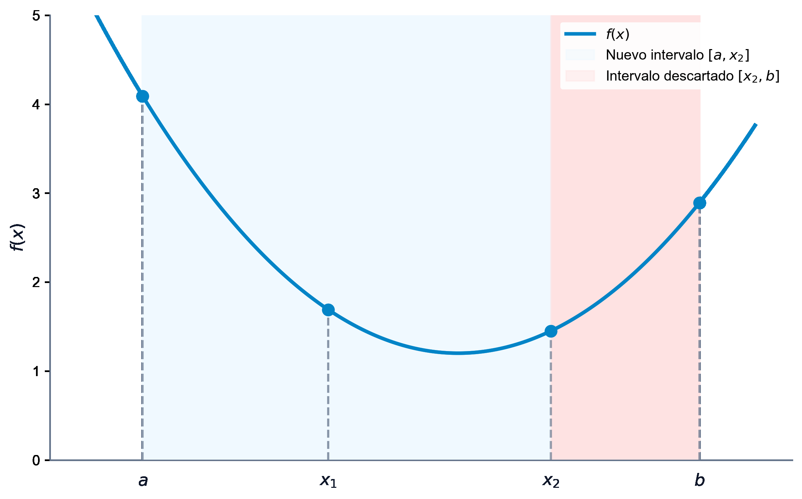

# Optimización No Lineal y Métodos Numéricos

La **optimización no lineal** (Nonlinear Programming, NLP) estudia problemas de decisión donde la función objetivo o alguna de las restricciones presentan comportamientos no lineales. A diferencia de la programación lineal, donde las soluciones óptimas se encuentran siempre en la frontera del conjunto factible (puntos extremos o vértices), en optimización no lineal el óptimo puede situarse en el interior del espacio factible, y la presencia de curvatura exige herramientas avanzadas de análisis multivariable y algoritmos iterativos.

En este capítulo, estudiaremos la clasificación de los problemas no lineales, los fundamentos matemáticos de las derivadas y las matrices hessianas para caracterizar extremos, y los algoritmos iterativos de búsqueda en una dimensión (sección áurea, Fibonacci, bisección, Newton) y en múltiples dimensiones (descenso de gradiente, Newton multivariable y Quasi-Newton).

::: {.callout-important title="Objetivos de aprendizaje"}
Al finalizar este capítulo, serás capaz de:

1.  **Diferenciar** entre mínimos locales y globales (estrictos y no estrictos) y comprender el impacto de la no convexidad en la búsqueda de soluciones.
2.  **Caracterizar la curvatura** de una función multivariable mediante la definición y semidefinición positiva de su matriz hessiana usando determinantes o autovalores.
3.  **Aplicar las condiciones de optimalidad** de primer y segundo orden (FONC, SONC, SOSC) para identificar y clasificar puntos estacionarios.
4.  **Implementar y comparar** algoritmos de búsqueda lineal unidimensional con y sin derivadas (Sección Áurea, Fibonacci, Newton 1D).
5.  **Comprender y programar** métodos de optimización multivariable sin restricciones, analizando las ventajas del método de Newton y Quasi-Newton (BFGS) frente al zigzag del máximo descenso.
:::


## Introducción y Casos de Estudio

En los problemas reales, las relaciones lineales son aproximaciones simplificadas. La no linealidad surge por factores físicos, económicos o estructurales:

-   **Economías de escala**:
    El coste unitario no es constante, sino que disminuye al aumentar el volumen de producción debido a descuentos por volumen o la amortización de costes fijos.
-   **Elasticidad de la demanda**:
    Los ingresos no son proporcionales al precio. Si una empresa sube los precios, la demanda disminuye de forma no lineal, lo que genera una función de ingresos cuadrática o cóncava.
-   **Gestión del riesgo**:
    En finanzas, el riesgo se mide mediante la varianza del rendimiento de una cartera de activos, que es una función cuadrática de las proporciones de capital invertido.

### La Dificultad de la No Linealidad

La transición de modelos lineales a no lineales introduce retos teóricos y algorítmicos formidables. En programación lineal, el teorema fundamental garantiza que si existe una solución óptima, esta se halla en un vértice de la región factible. Esto reduce la búsqueda a un conjunto finito de puntos y permite al algoritmo del Símplex avanzar eficientemente de vértice en vértice.

En optimización no lineal, esta garantía desaparece por completo:

1.  El óptimo puede encontrarse en el interior del espacio factible, alejado de cualquier vértice.
2.  El espacio factible puede ser no convexo, lo que significa que incluso si nos movemos entre puntos factibles, el segmento que los une puede salir de la región de factibilidad.
3.  La presencia de múltiples mínimos locales impide que los algoritmos locales (que solo "ven" el entorno inmediato del punto actual) garanticen haber hallado la mejor solución global del problema.


::: {.callout-note title="Caso de Estudio 1: El Monopolio de Cournot (1838)"}
Consideremos una empresa monopolista que produce un bien $Q$ y desea maximizar su beneficio. La relación entre el precio de venta $P$ y la cantidad demandada $Q$ viene dada por la ecuación de demanda:
$$ Q = 10 - P $$
El coste total de fabricación de la cantidad $Q$ es:
$$ C(Q) = 1 + 3Q $$
Además, el regulador impone un precio máximo de venta de $8$ unidades monetarias, y la capacidad técnica de la fábrica limita la producción a un máximo de $9$ unidades. El beneficio se define como ingresos menos costes:
$$ B(P, Q) = P \cdot Q - C(Q) = P \cdot Q - 3Q - 1 $$
Sustituyendo la ecuación de demanda, el beneficio expresado en función de la cantidad resulta ser una función cuadrática no lineal:
$$ B(Q) = (10 - Q)Q - 3Q - 1 = -Q^2 + 7Q - 1 $$
El problema de optimización se formula como:
$$
\begin{aligned}
\max_{Q} \quad & -Q^2 + 7Q - 1 \\
\text{sujeto a} \quad & 0 \le Q \le 9 \\
& 10 - Q \le 8 \implies Q \ge 2
\end{aligned}
$$
Derivando e igualando a cero para encontrar el punto estacionario:
$$ B'(Q) = -2Q + 7 = 0 \implies Q^* = 3.5 $$
El precio óptimo es $P^* = 6.5$, y el beneficio máximo es $B(3.5) = 11.25$. Dado que $Q^* = 3.5$ cumple con las restricciones de capacidad ($0 \le 3.5 \le 9$) y de precio regulado ($3.5 \ge 2$), esta es la solución óptima del monopolista.
:::


::: {.callout-note title="Caso de Estudio 2: Selección de Cartera de Valores (Markowitz, 1952)"}
Un inversor reparte su capital total $C$ entre $n$ activos financieros disponibles. Sea $x_i$ la cantidad invertida en el activo $i$. El rendimiento esperado de cada activo se denota por $\mu_i$, y la variabilidad conjunta (riesgo) se modela mediante la covarianza $\sigma_{ij}$ entre los activos $i$ y $j$.
El inversor busca maximizar el rendimiento esperado de la cartera al tiempo que minimiza su riesgo, ponderando este último mediante un coeficiente de aversión al riesgo $\beta > 0$. El modelo se formula como:
$$
\begin{aligned}
\max_{x} \quad & \sum_{i=1}^n \mu_i x_i - \beta \sum_{i=1}^n \sum_{j=1}^n \sigma_{ij} x_i x_j \\
\text{sujeto a} \quad & \sum_{i=1}^n x_i \le C \\
& x_i \ge 0, \quad i = 1, \dots, n
\end{aligned}
$$
Este problema posee una función objetivo cuadrática no lineal y restricciones lineales, lo que constituye un problema de **Programación Cuadrática (QP)**. Su naturaleza convexa (cuando la matriz de covarianzas es semidefinida positiva) garantiza que cualquier solución óptima local sea también global [@boyd2004convex; @hillier2010investigacion].
:::


## Tipos de Solución en Optimización No Lineal

Sea $f: \mathbb{R}^n \to \mathbb{R}$ una función real definida sobre un conjunto factible $\mathcal{X} \subseteq \mathbb{R}^n$:

-   **Mínimo global**:
    Un punto $x^* \in \mathcal{X}$ es un mínimo global si:
    $$ f(x) \ge f(x^*), \quad \forall x \in \mathcal{X} $$
-   **Mínimo global estricto**:
    Un punto $x^* \in \mathcal{X}$ es un mínimo global estricto si:
    $$ f(x) > f(x^*), \quad \forall x \in \mathcal{X} \setminus \{x^*\} $$
-   **Mínimo local**:
    Un punto $x^* \in \mathcal{X}$ es un mínimo local si existe una bola de radio $\epsilon > 0$ alrededor de $x^*$ tal que:
    $$ f(x) \ge f(x^*), \quad \forall x \in \mathcal{X} \text{ tal que } \|x - x^*\| < \epsilon $$
-   **Mínimo local estricto**:
    Un punto $x^* \in \mathcal{X}$ es un mínimo local estricto si existe un radio $\epsilon > 0$ tal que:
    $$ f(x) > f(x^*), \quad \forall x \in \mathcal{X} \setminus \{x^*\} \text{ tal que } \|x - x^*\| < \epsilon $$

En problemas no convexos, el algoritmo de optimización puede converger a mínimos locales que son muy inferiores al mínimo global. Esta es la dificultad fundamental que diferencia la optimización no lineal de la lineal y convexa.


## Fundamentos Matemáticos y Condiciones de Optimalidad

Para caracterizar los puntos óptimos localmente, recurrimos al análisis diferencial multivariable. Sea $f: \mathbb{R}^n \to \mathbb{R}$ una función con derivadas de segundo orden continuas (clase $\mathcal{C}^2$).

-   **Vector Gradiente**:
    El vector gradiente $\nabla f(x) \in \mathbb{R}^n$ es el vector columna de derivadas parciales de primer orden:
    $$ \nabla f(x) = \left( \frac{\partial f(x)}{\partial x_1}, \frac{\partial f(x)}{\partial x_2}, \dots, \frac{\partial f(x)}{\partial x_n} \right)^T $$
    Físicamente, el gradiente apunta en la dirección de máximo crecimiento local de la función.
-   **Matriz Hessiana**:
    La matriz hessiana $\nabla^2 f(x) \in \mathbb{R}^{n \times n}$ es la matriz simétrica de derivadas parciales de segundo orden:
    $$ [\nabla^2 f(x)]_{ij} = \frac{\partial^2 f(x)}{\partial x_i \partial x_j} $$
    La matriz hessiana captura la curvatura local de la función en múltiples dimensiones, de manera análoga a la segunda derivada en una dimensión.

### Desarrollo de Taylor Multivariable

El comportamiento local de la función alrededor de un punto de referencia $\bar{x}$ se describe mediante la aproximación cuadrática de Taylor:

$$ f(x) = f(\bar{x}) + \nabla f(\bar{x})^T (x - \bar{x}) + \frac{1}{2} (x - \bar{x})^T \nabla^2 f(\bar{x}) (x - \bar{x}) + o(\mathcal{\|x - \bar{x}\|^2}) $$

Si la función $f(x)$ es cuadrática, la aproximación de segundo orden es exacta para todo $x$.

### Caracterización de Matrices Simétricas y Curvatura

La curvatura local de la función está determinada por el carácter de la matriz hessiana, clasificado según la forma cuadrática $z^T \nabla^2 f(x) z$:

-   **Definida positiva ($\nabla^2 f(x) \succ 0$)**:
    $z^T \nabla^2 f(x) z > 0$ para todo vector no nulo $z \in \mathbb{R}^n$. Esto equivale a que todos los autovalores sean estrictamente positivos, o a que todos los menores principales líderes sean mayores que cero (criterio de Sylvester). La función presenta curvatura hacia arriba (forma de cuenco), garantizando que un punto estacionario sea un mínimo local estricto.
-   **Semidefinida positiva ($\nabla^2 f(x) \succeq 0$)**:
    $z^T \nabla^2 f(x) z \ge 0$ para todo vector $z \in \mathbb{R}^n$. Todos los autovalores son no negativos.
-   **Definida negativa ($\nabla^2 f(x) \prec 0$)**:
    $z^T \nabla^2 f(x) z < 0$ para todo vector no nulo $z \in \mathbb{R}^n$. Equivale a menores principales líderes que alternan de signo comenzando por negativo. La función presenta curvatura hacia abajo (forma de cúpula).
-   **Indefinida**:
    Existen autovalores positivos y negativos. La función presenta direcciones de subida y de bajada. El punto estacionario resultante es un **punto de silla** (como la función de silla de montar $f(x,y) = x^2 - y^2$ en el origen).


::: {.callout-important title="Teorema: Condiciones de Optimalidad de Segundo Orden (Sin Restricciones)"}
Sea $f: \mathbb{R}^n \to \mathbb{R}$ una función dos veces diferenciable.

1.  **Condición Necesaria de Primer Orden (FONC)**:
    Si $x^*$ es un mínimo local, entonces el gradiente se anula:
    $$ \nabla f(x^*) = 0 $$
    Cualquier punto que cumpla esta condición se denomina **punto estacionario** o crítico.
2.  **Condición Necesaria de Segundo Orden (SONC)**:
    Si $x^*$ es un mínimo local, entonces además de la FONC, la matriz hessiana es semidefinida positiva:
    $$ \nabla^2 f(x^*) \succeq 0 $$
3.  **Condición Suficiente de Segundo Orden (SOSC)**:
    Si en un punto $x^*$ se cumple que:
    $$ \nabla f(x^*) = 0 \qquad \text{y} \qquad \nabla^2 f(x^*) \succ 0 $$
    Entonces $x^*$ es un mínimo local estricto.
:::


## Métodos Numéricos de Búsqueda Lineal (1D)

Los métodos unidimensionales buscan el mínimo de una función $f: \mathbb{R} \to \mathbb{R}$ en un intervalo cerrado $[a, b]$. Son fundamentales porque resolver problemas multidimensionales suele requerir resolver una sucesión de problemas unidimensionales a lo largo de direcciones de descenso (búsqueda lineal o *line search*):
$$ \min_{\alpha > 0} \phi(\alpha) = f(x_k + \alpha d_k) $$

### Métodos sin Derivadas

Estos métodos solo evalúan la función objetivo y requieren que la función sea **unimodal** en el intervalo $[a, b]$, es decir, que posea un único mínimo local en dicho intervalo.

{#fig-opt-1d-biseccion fig-align="center" width="80%"}

-   **Búsqueda Dicotómica**:
    Evalúa la función en dos puntos simétricos $\lambda_k$ y $\mu_k$ muy próximos al punto medio del intervalo actual para descartar una porción del intervalo en cada iteración basándose en el signo del cambio.
-   **Sección Áurea (Golden Section)**:
    Optimiza la búsqueda manteniendo constante la razón de reducción de la amplitud del intervalo entre iteraciones sucesivas. Para que un punto evaluado en la iteración $k$ pueda ser reutilizado como punto de evaluación en la iteración $k+1$, los puntos deben colocarse de modo que cumplan la relación del número áureo:
    $$ \alpha = \frac{1 + \sqrt{5}}{2} \approx 1.618033988 $$
    Los puntos de evaluación en cada paso $k$ sobre el intervalo $[a_k, b_k]$ se definen como:
    $$ \lambda_k = b_k - \frac{b_k - a_k}{\alpha}, \qquad \mu_k = a_k + \frac{b_k - a_k}{\alpha} $$
    Esto reduce el intervalo de incertidumbre en cada paso en un factor de $1/\alpha \approx 0.618$, requiriendo una sola evaluación de función por iteración tras la primera.
-   **Búsqueda de Fibonacci**:
    A diferencia de la sección áurea, este método requiere fijar de antemano el número total de evaluaciones de función $N$. Utiliza la sucesión de Fibonacci ($F_k$) para determinar los puntos de evaluación. Proporciona la máxima reducción teórica del intervalo de incertidumbre posible para un número de pasos preestablecido.

::: {.callout-tip title="Código Python: Método de la Sección Áurea" collapse="true"}
La sección áurea nos permite acotar el mínimo de una función unimodal sin calcular derivadas:

```python
import math

def seccion_aurea(f, a, b, tol=1e-5):
    alpha = (1 + math.sqrt(5)) / 2
    # Determinamos el numero de iteraciones necesarias para cumplir la tolerancia
    n_iter = int(math.ceil((math.log(b - a) - math.log(tol)) / math.log(alpha)))
    
    for _ in range(n_iter):
        lmbda = b - (b - a) / alpha
        mu = a + (b - a) / alpha
        
        if f(lmbda) < f(mu):
            b = mu
        else:
            a = lmbda
            
    return (a + b) / 2
```
:::

### Métodos con Derivadas

-   **Método de Bisección (Bolzano)**:
    Busca el cero de la derivada $f'(x) = 0$. Requiere que los signos de la derivada en los extremos del intervalo sean opuestos ($f'(a) < 0$ y $f'(b) > 0$). En cada paso, evalúa la derivada en el punto medio del intervalo y reduce el intervalo exactamente a la mitad.
-   **Método de Newton 1D**:
    Aproxima la función en cada paso por un polinomio cuadrático de Taylor de segundo orden en el punto actual $x_k$ y salta directamente al vértice de la parábola:
    $$ x_{k+1} = x_k - \frac{f'(x_k)}{f''(x_k)} $$
    Posee convergencia cuadrática local (orden 2), lo que significa que el número de dígitos significativos se duplica en cada paso cerca del óptimo. Sin embargo, requiere calcular la segunda derivada y exige que esta sea estrictamente positiva ($f''(x_k) > 0$) para evitar diverger o saltar a un máximo local.


## Métodos Multivariables de Optimización Sin Restricciones

Para minimizar funciones $f: \mathbb{R}^n \to \mathbb{R}$ de múltiples variables sin restricciones, se emplea el siguiente esquema iterativo general:

$$ x_{k+1} = x_k + \alpha_k d_k $$

Donde $d_k$ es la **dirección de descenso** (debe cumplir que $\nabla f(x_k)^T d_k < 0$) y $\alpha_k > 0$ es el **tamaño de paso** obtenido mediante búsqueda unidimensional lineal.

### Máximo Descenso (Steepest Descent)

La dirección de búsqueda se toma como el opuesto del gradiente, que es la dirección que minimiza localmente la derivada direccional:
$$ d_k = -\nabla f(x_k) $$
El tamaño de paso $\alpha_k$ se obtiene resolviendo el problema univariable de búsqueda lineal exacta:
$$ \alpha_k = \arg\min_{\alpha > 0} f(x_k - \alpha \nabla f(x_k)) $$

-   **El Fenómeno del Zigzag**:
    En búsqueda exacta, se puede demostrar analíticamente que las direcciones de descenso en dos iteraciones consecutivas son ortogonales:
    $$ d_k^T d_{k+1} = 0 $$
    Si la función presenta curvas de nivel muy estiradas (problemas mal acondicionados, donde la relación entre el mayor y el menor autovalor de la hessiana es muy grande), el algoritmo zigzaguea con pasos ortogonales consecutivos, ralentizando drásticamente el avance hacia el óptimo.

### Método de Newton Multivariable

El método de Newton incorpora la curvatura local dada por la matriz hessiana para corregir la dirección de búsqueda, apuntando directamente al mínimo de la aproximación cuadrática:
$$ d_k = - [\nabla^2 f(x_k)]^{-1} \nabla f(x_k) $$
Si el punto inicial está cerca del mínimo y la hessiana es definida positiva, el método converge en muy pocas iteraciones con tamaño de paso $\alpha_k = 1$ (convergencia cuadrática). **Inconvenientes**:

1.  Exige calcular explícitamente la matriz hessiana de derivadas de segundo orden en cada paso.
2.  Requiere resolver un sistema de ecuaciones lineales de tamaño $n \times n$ para calcular $[\nabla^2 f(x_k)]^{-1} \nabla f(x_k)$, con un coste computacional de $O(n^3)$ operaciones, inviable para problemas a gran escala.
3.  Si la hessiana no es definida positiva, la dirección puede no ser de descenso, provocando que el algoritmo diverja.

### Métodos Cuasi-Newton (BFGS)

Los métodos Cuasi-Newton evitan el cálculo explícito y la inversión de la hessiana. En su lugar, construyen una aproximación simétrica y definida positiva de la inversa de la hessiana $H_k \approx [\nabla^2 f(x_k)]^{-1}$ basándose únicamente en los cambios observados en los vectores de gradiente entre pasos consecutivos, satisfaciendo la **ecuación de la secante**:
$$ H_{k+1} y_k = s_k $$
Donde $s_k = x_{k+1} - x_k$ y $y_k = \nabla f(x_{k+1}) - \nabla f(x_k)$.

La dirección de descenso se calcula con coste $O(n^2)$ como:
$$ d_k = - H_k \nabla f(x_k) $$

El método más popular y de mayor eficiencia es el algoritmo **BFGS** (Broyden-Fletcher-Goldfarb-Shanno), que actualiza $H_k$ de forma iterativa conservando la simetría y definición positiva de la aproximación, siendo una referencia estándar para la optimización multivariable continua [@nocedal2006numerical; @luenberger2015linear].


::: {.callout-tip title="Código Python: Algoritmo de Descenso de Gradiente con Búsqueda Lineal Exacta" collapse="true"}
Este script implementa el método del máximo descenso en múltiples variables, resolviendo el paso exacto mediante la sección áurea:

```python
import numpy as np

def maximo_descenso(f, grad_f, x_init, tol=1e-5, max_iter=1000):
    x = np.array(x_init, dtype=float)
    for i in range(max_iter):
        g = grad_f(x)
        if np.linalg.norm(g) < tol:
            print(f"Convergencia alcanzada en la iteracion {i}")
            break
            
        # Definimos la funcion unidimensional para la busqueda del tamano de paso alpha
        def f_lineal(alpha):
            return f(x - alpha * g)
            
        # Resolvemos el problema de linea unidimensional usando la Seccion Aurea
        alpha_opt = seccion_aurea(f_lineal, 0.0, 1.0, tol=1e-5)
        
        # Actualizamos el punto
        x = x - alpha_opt * g
        
    return x
```
:::
