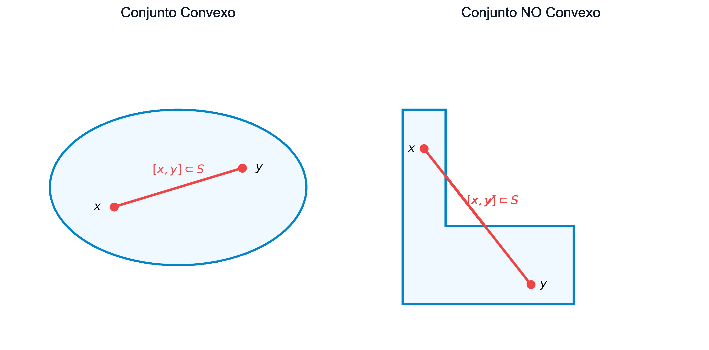
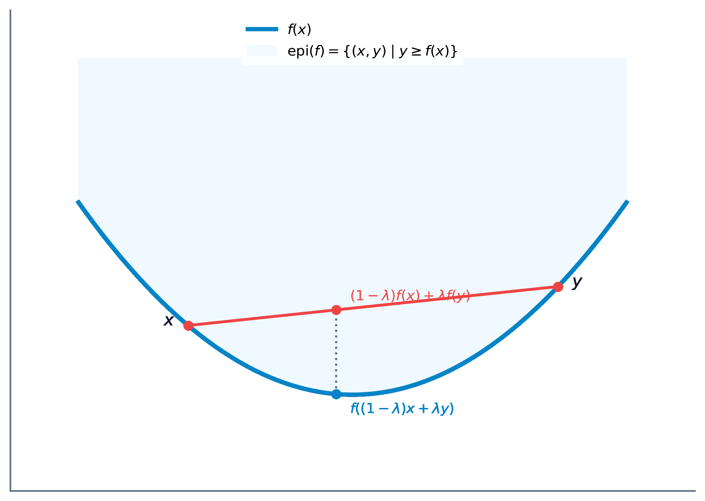
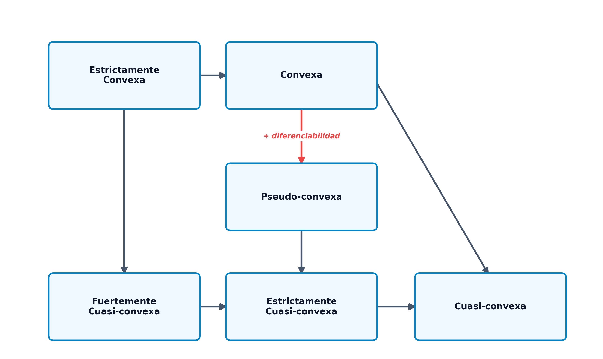

# Análisis Convexo

El **análisis convexo** constituye la columna vertebral de la optimización matemática moderna. Históricamente, la optimización estuvo dominada por el paradigma de la linealidad frente a la no linealidad. Sin embargo, a finales del siglo XX se produjo un cambio de paradigma fundamental, resumido por el matemático R. Tyrrell Rockafellar: *"la divisoria fundamental en optimización no es entre linealidad y no linealidad, sino entre convexidad y no convexidad"* [@rockafellar1970convex]. Bajo la hipótesis de convexidad, cualquier óptimo local se convierte de manera natural en un óptimo global [@boyd2004convex]. Esta propiedad crucial no solo simplifica la búsqueda teórica de soluciones, sino que garantiza la convergencia fiable y veloz de los algoritmos numéricos, evitando que queden atrapados en mínimos locales subóptimos.

En este capítulo, estudiaremos los conjuntos convexos y las operaciones que preservan esta propiedad, las caracterizaciones de primer y segundo orden para funciones convexas diferenciables y no diferenciables (subgradientes), las propiedades fundamentales de sus extremos y las generalizaciones teóricas de la convexidad (cuasi-convexidad y pseudo-convexidad).

::: {.callout-important title="Objetivos de aprendizaje"}
Al finalizar este capítulo, serás capaz de:

1.  **Identificar y demostrar** si un conjunto dado en $\mathbb{R}^n$ es convexo aplicando la definición o las propiedades algebraicas de conservación.
2.  **Diferenciar** entre combinaciones lineales, afines, cónicas y convexas, analizando la estructura geométrica de sus envolturas.
3.  **Comprender e interpretar** los Teoremas de Separación de Hiperplanos y del Hiperplano de Soporte.
4.  **Caracterizar la convexidad de funciones** mediante las propiedades del epígrafe, los conjuntos de nivel y las caracterizaciones de primer y segundo orden (gradiente y hessiana).
5.  **Calcular el subdiferencial** de funciones convexas no diferenciables en puntos singulares de esquina o codo, y aplicar el cálculo de subgradientes.
6.  **Aplicar el Teorema Fundamental de la Optimización Convexa** para deconstruir y verificar la globalidad y unicidad de los mínimos.
7.  **Clasificar y relacionar** las funciones cuasi-convexas, pseudo-convexas y sus variantes, comprendiendo sus implicaciones en la optimización restringida.
:::

## Conjuntos Convexos

### Definición y Conceptos Básicos

Un conjunto es convexo si no presenta "entrantes" o cavidades, de modo que la conexión recta entre cualquier pareja de sus puntos está totalmente contenida en él.

-   **Conjunto Convexo**:
    Un conjunto $\mathcal{S} \subseteq \mathbb{R}^n$ es **convexo** si:
    $$ \forall x_1, x_2 \in \mathcal{S}, \quad \forall \lambda \in (0, 1) \implies \lambda x_1 + (1 - \lambda) x_2 \in \mathcal{S} $$
-   **Combinación Lineal Convexa**:
    Un punto $x$ es una combinación lineal convexa de un conjunto finito de puntos $\{x_1, \dots, x_k\} \subset \mathbb{R}^n$ si puede expresarse de la forma:
    $$ x = \sum_{i=1}^k \lambda_i x_i \quad \text{con} \quad \lambda_i \ge 0 \quad \text{y} \quad \sum_{i=1}^k \lambda_i = 1 $$
-   **Combinación Afín**:
    Se obtiene eliminando la condición de no negatividad de los coeficientes ($\lambda_i \in \mathbb{R}$ con $\sum_{i=1}^k \lambda_i = 1$). Genera subespacios afines (rectas, planos, etc.).
-   **Combinación Conica**:
    Se define exigiendo únicamente la no negatividad de los coeficientes ($\lambda_i \ge 0$ sin exigir que sumen 1). Genera conos convexos.
-   **Combinación Lineal**:
    Se define eliminando ambas condiciones ($\lambda_i \in \mathbb{R}$ sin restricciones). Genera subespacios vectoriales.

{#fig-conjuntos-convexos fig-align="center" width="80%"}

### Ejemplos de Conjuntos Convexos Básicos

-   **Hiperplano**:
    Dado un vector normal no nulo $p \in \mathbb{R}^n$ y un escalar $\alpha \in \mathbb{R}$, el hiperplano es:
    $$ \mathcal{H} = \{ x \in \mathbb{R}^n \mid p^T x = \alpha \} $$
    Representa una superficie plana de dimensión $n-1$.
-   **Semiespacio Cerrado**:
    La región del espacio situada en uno de los lados de un hiperplano:
    $$ \mathcal{H}^- = \{ x \in \mathbb{R}^n \mid p^T x \le \alpha \} $$
-   **Poliedro o Politopo Convexo**:
    La intersección de un número finito de semiespacios cerrados:
    $$ \mathcal{P} = \{ x \in \mathbb{R}^n \mid A x \le b \} $$
    Constituye la región factible típica de la programación lineal. Sus esquinas o vértices se denominan **puntos extremos**.
-   **Bola Métrica**:
    Una bola cerrada en $\mathbb{R}^n$ con centro en $x_0$ y radio $r \ge 0$ definida bajo cualquier norma $\|\cdot\|$:
    $$ \mathcal{B}_r(x_0) = \{ x \in \mathbb{R}^n \mid \|x - x_0\| \le r \} $$

### Operaciones que Conservan la Convexidad

::: {.callout-note title="Lema: Conservación de la Convexidad"}
Sean $\mathcal{S}_1$ y $\mathcal{S}_2$ dos conjuntos convexos en $\mathbb{R}^n$. Las siguientes estructuras también son conjuntos convexos:

1.  **Intersección**:
    $$ \mathcal{S}_1 \cap \mathcal{S}_2 $$
    (Esta propiedad se extiende a la intersección de una familia infinita o arbitraria de conjuntos convexos).
2.  **Suma Directa**:
    $$ \mathcal{S}_1 \oplus \mathcal{S}_2 = \{ x_1 + x_2 \mid x_1 \in \mathcal{S}_1, \ x_2 \in \mathcal{S}_2 \} $$
3.  **Diferencia Directa**:
    $$ \mathcal{S}_1 \ominus \mathcal{S}_2 = \{ x_1 - x_2 \mid x_1 \in \mathcal{S}_1, \ x_2 \in \mathcal{S}_2 \} $$
:::

### Envoltura Convexa y Símplices

-   **Envoltura Convexa ($\mathcal{H}(\mathcal{S})$)**:
    El conjunto de todas las combinaciones lineales convexas posibles de puntos pertenecientes al conjunto $\mathcal{S}$:
    $$ \mathcal{H}(\mathcal{S}) = \left\{ x = \sum_{j=1}^k \lambda_j x_j \;\middle|\; x_j \in \mathcal{S}, \ \lambda_j \ge 0, \ \sum_{j=1}^k \lambda_j = 1 \right\} $$

::: {.callout-important title="Teorema: Minimalidad de la Envoltura Convexa"}
La envoltura convexa $\mathcal{H}(\mathcal{S})$ es el menor conjunto convexo que contiene al conjunto $\mathcal{S}$.

*Demostración*:
Sea $\mathcal{C}$ cualquier conjunto convexo que contiene a $\mathcal{S}$ (es decir, $\mathcal{S} \subseteq \mathcal{C}$). Supongamos por reducción al absurdo que existe un punto $x \in \mathcal{H}(\mathcal{S})$ tal que $x \notin \mathcal{C}$. Como $x \in \mathcal{H}(\mathcal{S})$, se puede escribir como una combinación lineal convexa $x = \sum_{j=1}^k \lambda_j x_j$ donde cada $x_j \in \mathcal{S}$. Dado que $\mathcal{S} \subseteq \mathcal{C}$, se deduce que todos los puntos generadores $x_j$ pertenecen a $\mathcal{C}$. Como $\mathcal{C}$ es convexo por hipótesis, cualquier combinación lineal convexa de sus elementos debe pertenecer a él, lo que obliga a que $x \in \mathcal{C}$, contradiciendo la suposición inicial. $\blacksquare$
:::

-   **Símplex**:
    Un politopo convexo generado por la envoltura convexa de $n+1$ puntos afínmente independientes en $\mathbb{R}^n$. Un simplex en $\mathbb{R}^1$ es un segmento, en $\mathbb{R}^2$ es un triángulo y en $\mathbb{R}^3$ es un tetraedro.

## Teoremas de Separación e Hiperplano de Soporte

La geometría convexa descansa sobre dos teoremas fundamentales que fundamentan la teoría de la dualidad y los multiplicadores de Lagrange.

### Teoremas de Separación de Hiperplanos

Estos teoremas establecen las condiciones bajo las cuales es posible "trazar una frontera plana" (un hiperplano) que separe dos conjuntos convexos disjuntos.

::: {.callout-important title="Teorema de Separación Débil"}
Sean $\mathcal{C}$ y $\mathcal{D}$ dos conjuntos convexos disjuntos no vacíos en $\mathbb{R}^n$. Entonces existe un hiperplano que los separa débilmente. Es decir, existen un vector no nulo $p \in \mathbb{R}^n$ y un escalar $\alpha \in \mathbb{R}$ tales que:
$$ p^T x \le \alpha, \quad \forall x \in \mathcal{C} \qquad \text{y} \qquad p^T y \ge \alpha, \quad \forall y \in \mathcal{D} $$
:::

::: {.callout-important title="Teorema de Separación Estricta"}
Sean $\mathcal{C}$ y $\mathcal{D}$ dos conjuntos convexos disjuntos no vacíos en $\mathbb{R}^n$. Si además $\mathcal{C}$ es cerrado y $\mathcal{D}$ es cerrado y acotado (compacto), entonces existe un hiperplano que los separa estrictamente. Es decir, existen un vector no nulo $p \in \mathbb{R}^n$ y un escalar $\alpha \in \mathbb{R}$ tales que:
$$ p^T x < \alpha, \quad \forall x \in \mathcal{C} \qquad \text{y} \qquad p^T y > \alpha, \quad \forall y \in \mathcal{D} $$
:::

### Teorema del Hiperplano de Soporte

Un hiperplano de soporte para un conjunto $\mathcal{S}$ en un punto de su frontera $x_0 \in \partial \mathcal{S}$ es un hiperplano que pasa por $x_0$ y deja a todo el conjunto $\mathcal{S}$ contenido en uno de sus semiespacios cerrados.

::: {.callout-important title="Teorema del Hiperplano de Soporte"}
Sea $\mathcal{S}$ un conjunto convexo no vacío en $\mathbb{R}^n$, y sea $x_0$ un punto perteneciente a la frontera de $\mathcal{S}$ ($x_0 \in \partial \mathcal{S}$). Entonces existe un hiperplano de soporte para $\mathcal{S}$ en $x_0$. Es decir, existe un vector no nulo $p \in \mathbb{R}^n$ tal que:
$$ p^T x \le p^T x_0, \quad \forall x \in \mathcal{S} $$
:::

Este teorema garantiza que para cualquier conjunto convexo siempre podemos "apoyar" un plano sobre cualquier punto de su superficie exterior sin llegar a cruzar el interior del conjunto.

## Funciones Convexas

### Definición y Significado Geométrico

-   **Función Convexa**:
    Sea $\mathcal{S} \subseteq \mathbb{R}^n$ un conjunto convexo no vacío. Una función $f: \mathcal{S} \to \mathbb{R}$ es **convexa** si para todo par de puntos $x_1, x_2 \in \mathcal{S}$ y cualquier parámetro $\lambda \in (0, 1)$ se cumple que:
    $$ f(\lambda x_1 + (1 - \lambda) x_2) \le \lambda f(x_1) + (1 - \lambda) f(x_2) $$
-   **Función Estrictamente Convexa**:
    Si la desigualdad anterior es estricta ($<$) para todo $x_1 \neq x_2$.
-   **Función Cóncava**:
    Una función $f$ es cóncava si su opuesta $-f$ es convexa.

Geométricamente, una función es convexa si el segmento de cuerda que une los puntos de la gráfica $(x_1, f(x_1))$ y $(x_2, f(x_2))$ queda por encima o sobre la gráfica de la función en dicho intervalo.

### Operaciones que Preservan la Convexidad de Funciones

-   **Suma ponderada positiva**:
    Si $f_1, \dots, f_k$ son convexas y $\alpha_1, \dots, \alpha_k \ge 0$, entonces la combinación $\sum_j \alpha_j f_j$ es convexa.
-   **Supremo puntual (Máximo)**:
    Si $f_1, \dots, f_k$ son convexas, la función envoltura superior $f(x) = \max_{j} \{f_j(x)\}$ es convexa.
-   **Composición afín**:
    Si $g: \mathbb{R}^m \to \mathbb{R}$ es convexa y $h(x) = A x + b$ es una función afín, entonces la composición $f(x) = g(A x + b)$ es convexa.

::: {.callout-important title="Teorema: Convexidad de los Conjuntos de Nivel"}
Sea $f: \mathcal{S} \to \mathbb{R}$ una función convexa sobre un dominio convexo $\mathcal{S}$. Para cualquier constante $\alpha \in \mathbb{R}$, el conjunto de nivel inferior:
$$ \mathcal{S}_\alpha = \{ x \in \mathcal{S} \mid f(x) \le \alpha \} $$
es un conjunto convexo.

*Demostración*:
Sean $x_1, x_2 \in \mathcal{S}_\alpha$. Por definición del conjunto de nivel, se cumple que $f(x_1) \le \alpha$ y $f(x_2) \le \alpha$. Sea $\lambda \in (0, 1)$. Como el dominio $\mathcal{S}$ es convexo, el punto intermedio $\lambda x_1 + (1 - \lambda) x_0$ pertenece a $\mathcal{S}$. Aplicando la definición de convexidad de $f$:
$$ f(\lambda x_1 + (1 - \lambda) x_2) \le \lambda f(x_1) + (1 - \lambda) f(x_2) \le \lambda \alpha + (1 - \lambda) \alpha = \alpha $$
Por tanto, $\lambda x_1 + (1 - \lambda) x_2 \in \mathcal{S}_\alpha$, lo que demuestra la convexidad del conjunto de nivel. $\blacksquare$
:::

*Nota*: El recíproco no es cierto en general (una función con conjuntos de nivel convexos no tiene por qué ser convexa; esta propiedad define a las funciones cuasi-convexas).

### Epígrafe y Subgradientes

-   **Epígrafe ($\text{epi } f$)**:
    El conjunto de puntos en $\mathbb{R}^{n+1}$ situados sobre o por encima de la gráfica de la función:
    $$ \text{epi } f = \{ (x, y) \in \mathcal{S} \times \mathbb{R} \mid y \ge f(x) \} $$

{#fig-epigrafo fig-align="center" width="80%"}

::: {.callout-important title="Teorema: Relación entre Epígrafe y Convexidad"}
Una función $f: \mathcal{S} \to \mathbb{R}$ es convexa si y solo si su epígrafe $\text{epi } f$ es un conjunto convexo en $\mathbb{R}^{n+1}$.

*Demostración*:
$(\Longrightarrow)$ Supongamos que $f$ es convexa. Sean $(x_1, y_1), (x_2, y_2) \in \text{epi } f$ y $\lambda \in (0, 1)$. Por definición de epígrafe, $y_1 \ge f(x_1)$ y $y_2 \ge f(x_2)$. Evaluando la combinación lineal:
$$ \lambda y_1 + (1 - \lambda) y_2 \ge \lambda f(x_1) + (1 - \lambda) f(x_2) \ge f(\lambda x_1 + (1 - \lambda) x_2) $$
Como $\mathcal{S}$ es convexo, el punto combinado pertenece a $\mathcal{S}$, y el par combinado pertenece a $\text{epi } f$, demostrando su convexidad.

$(\Longleftarrow)$ Supongamos que $\text{epi } f$ es un conjunto convexo. Sean $x_1, x_2 \in \mathcal{S}$. Los puntos $(x_1, f(x_1))$ y $(x_2, f(x_2))$ pertenecen a $\text{epi } f$. Por convexidad del epígrafe, para todo $\lambda \in (0, 1)$:
$$ \lambda (x_1, f(x_1)) + (1 - \lambda)(x_2, f(x_2)) = (\lambda x_1 + (1 - \lambda) x_2, \lambda f(x_1) + (1 - \lambda) f(x_2)) \in \text{epi } f $$
Lo que implica directamente que $\lambda f(x_1) + (1 - \lambda) f(x_2) \ge f(\lambda x_1 + (1 - \lambda) x_2)$, es decir, $f$ es convexa. $\blacksquare$
:::

-   **Subgradiente y Subdiferencial**:
    Para funciones no diferenciables (que presentan picos o codos), el gradiente no existe en ciertos puntos. Generalizamos este concepto mediante el **subgradiente**. Un vector $\xi \in \mathbb{R}^n$ es un subgradiente de la función convexa $f$ en el punto $x_0 \in \mathcal{S}$ si:
    $$ f(x) \ge f(x_0) + \xi^T(x - x_0), \quad \forall x \in \mathcal{S} $$
    Geométricamente, define un hiperplano que apoya a la función desde abajo en $x_0$. El conjunto de todos los subgradientes en $x_0$ se denomina **subdiferencial** y se denota por $\partial f(x_0)$.
    
    El subdiferencial $\partial f(x_0)$ es siempre un conjunto convexo y cerrado, cuyo análisis detallado e implicaciones en optimización no diferenciable se estudian extensamente en el análisis convexo clásico [@rockafellar1970convex; @boyd2004convex]. Si la función es diferenciable en $x_0$, el subdiferencial contiene un único elemento que es el gradiente: $\partial f(x_0) = \{\nabla f(x_0)\}$.

::: {.callout-note title="Propiedades y Cálculo del Subdiferencial"}
El cálculo con subgradientes sigue reglas análogas al cálculo diferencial estándar:

1.  **Regla de la Suma**:
    Si $f_1, f_2$ son funciones convexas, el subdiferencial de su suma cumple:
    $$ \partial (f_1(x) + f_2(x)) = \partial f_1(x) \oplus \partial f_2(x) $$
2.  **Multiplicación Escalar**:
    Para cualquier constante $\alpha \ge 0$:
    $$ \partial (\alpha f(x)) = \alpha \partial f(x) $$
3.  **Máximo de Funciones**:
    Si $f(x) = \max \{f_1(x), f_2(x)\}$ con $f_1, f_2$ convexas:
    $$ \partial f(x) = \mathcal{H}(\cup_{i \in \mathcal{I}(x)} \partial f_i(x)) $$
    donde $\mathcal{I}(x)$ es el conjunto de índices de las funciones que alcanzan el máximo en el punto $x$.
:::

::: {.callout-tip title="Caso de Estudio: Subdiferencial en Puntos Singulares (No Diferenciabilidad)" collapse="true"}
Consideremos la función convexa definida por tramos:
$$ f(x) = \max \{ |x| - 4, \ (x - 2)^2 - 4 \} $$
Analicemos su subdiferencial $\partial f(x_0)$ en diferentes regiones de la recta real:

-   **Región diferenciable lineal**:
    Para $x_0 \in (1, 4)$, la función coincide con la recta $x - 4$. Su derivada es constante e igual a 1. Por tanto, el subdiferencial es el conjunto unitario: $\partial f(x_0) = \{1\}$.
-   **Región diferenciable cuadrática**:
    Para $x_0 < 1$ o $x_0 > 4$, la función coincide con la parábola $(x-2)^2 - 4$. La derivada es $2(x_0 - 2)$. Así, $\partial f(x_0) = \{2(x_0 - 2)\}$.
-   **Punto singular $x_0 = 1$**:
    La función presenta un codo donde intersecan la parábola y la recta. La derivada lateral izquierda (cuadrática) es $2(1-2) = -2$, y la derivada lateral derecha (lineal) es $1$. El subdiferencial está formado por todas las pendientes intermedias posibles (combinación convexa de las derivadas laterales):
    $$ \partial f(1) = [-2, 1] $$
-   **Punto singular $x_0 = 4$**:
    La derivada lateral izquierda es $1$ y la derecha es $2(4-2) = 4$. El subdiferencial es el intervalo:
    $$ \partial f(4) = [1, 4] $$
:::

## Caracterización de Funciones Convexas Diferenciables

### Caracterización de Primer Orden

Cuando una función es diferenciable, podemos caracterizar su convexidad analizando su plano tangente.

::: {.callout-important title="Teorema: Caracterización de Primer Orden para Funciones Diferenciables"}
Sea $f: \mathcal{S} \to \mathbb{R}$ una función diferenciable en un conjunto convexo y abierto $\mathcal{S}$.

1.  $f$ es convexa si y solo si:
    $$ f(x) \ge f(x_0) + \nabla f(x_0)^T (x - x_0), \quad \forall x, x_0 \in \mathcal{S} $$
2.  $f$ es estrictamente convexa si y solo si:
    $$ f(x) > f(x_0) + \nabla f(x_0)^T (x - x_0), \quad \forall x, x_0 \in \mathcal{S} \text{ con } x \neq x_0 $$
:::

*Significado geométrico*: La aproximación lineal de primer orden (plano tangente en cualquier punto $x_0$) es un estimador inferior global de la función. Es decir, la gráfica de la función se apoya en su totalidad sobre el plano tangente.

::: {.callout-important title="Teorema: Monotonía del Gradiente"}
Una función diferenciable $f$ es convexa en un conjunto convexo abierto $\mathcal{S}$ si y solo si su gradiente es un operador monótono:
$$ (\nabla f(x_2) - \nabla f(x_1))^T(x_2 - x_1) \ge 0, \quad \forall x_1, x_2 \in \mathcal{S} $$

*Demostración*:
$(\Longrightarrow)$ Si $f$ es convexa, por la caracterización de primer orden se cumplen simultáneamente:
$$ f(x_1) \ge f(x_2) + \nabla f(x_2)^T (x_1 - x_2) $$
$$ f(x_2) \ge f(x_1) + \nabla f(x_1)^T (x_2 - x_1) $$
Sumando ambas inecuaciones miembro a miembro:
$$ f(x_1) + f(x_2) \ge f(x_2) + f(x_1) + \nabla f(x_2)^T(x_1 - x_2) + \nabla f(x_1)^T(x_2 - x_1) $$
Cancelando términos comunes y reordenando:
$$ 0 \ge (\nabla f(x_1) - \nabla f(x_2))^T (x_2 - x_1) \implies (\nabla f(x_2) - \nabla f(x_1))^T(x_2 - x_1) \ge 0 $$
$(\Longleftarrow)$ Se demuestra de manera análoga aplicando el teorema del valor medio. $\blacksquare$
:::

### Caracterización de Segundo Orden (Hessiana)

La convexidad puede verificarse localmente analizando la concavidad o curvatura de segundo orden dada por la matriz hessiana en todo el dominio.

::: {.callout-important title="Teorema: Caracterización de Segundo Orden"}
Sea $f: \mathcal{S} \to \mathbb{R}$ una función dos veces diferenciable en un conjunto convexo abierto $\mathcal{S}$.

1.  $f$ es convexa si y solo si su matriz hessiana es semidefinida positiva en todo punto de $\mathcal{S}$:
    $$ \nabla^2 f(x) \succeq 0, \quad \forall x \in \mathcal{S} $$
2.  Si la matriz hessiana es definida positiva en todo el dominio ($\nabla^2 f(x) \succ 0, \forall x \in \mathcal{S}$), entonces $f$ es estrictamente convexa.
:::

::: {.callout-tip title="Ejemplos de Verificación de Convexidad con Matrices Hessianas" collapse="true"}
Analicemos la convexidad de tres funciones de prueba:

-   **Ejemplo 1**:
    $$ f(x_1, x_2, x_3) = x_1 x_2 + 2x_1^2 + x_2^2 + 2x_3^2 - 6x_1 x_3 $$
    La matriz hessiana de esta función cuadrática es constante:
    $$ \nabla^2 f = \begin{pmatrix} 4 & 1 & -6 \\ 1 & 2 & 0 \\ -6 & 0 & 4 \end{pmatrix} $$
    Calculamos los menores principales líderes para aplicar el criterio de Sylvester:
    -   $M_1 = 4 > 0$.
    -   $M_2 = 4 \cdot 2 - 1^2 = 7 > 0$.
    -   $M_3 = \det(\nabla^2 f) = 4(8) - 1(4) - 6(12) = -20 < 0$.
    Al ser el determinante negativo, la matriz es indefinida, por lo que la función no es ni cóncava ni convexa en $\mathbb{R}^3$.
-   **Ejemplo 2**:
    $$ f(x_1, x_2) = 10 - 2(x_2 - x_1^2)^2 $$
    La matriz hessiana es variable y depende del punto:
    $$ \nabla^2 f(x) = \begin{pmatrix} 8x_2 - 24x_1^2 & 8x_1 \\ 8x_1 & -4 \end{pmatrix} $$
    Para que sea cóncava se requiere $\nabla^2 f(x) \preceq 0$, lo que exige que los menores verifiquen:
    $$ 8x_2 - 24x_1^2 \le 0 \qquad \text{y} \qquad -4(8x_2 - 24x_1^2) - 64x_1^2 \ge 0 \implies 32(x_1^2 - x_2) \ge 0 $$
    Esto define una región del plano donde $x_2 \le x_1^2$.
-   **Ejemplo 3**:
    $$ f(x, y, z) = x^2 + 3y^2 + z^2 + xy - 4z - 5x + 14 $$
    Su hessiana es constante:
    $$ \nabla^2 f = \begin{pmatrix} 2 & 1 & 0 \\ 1 & 6 & 0 \\ 0 & 0 & 2 \end{pmatrix} $$
    Menores principales: $M_1 = 2 > 0$, $M_2 = 11 > 0$, $M_3 = 22 > 0$. Al ser definida positiva, la función es estrictamente convexa en todo el espacio.
:::

## Óptimos de una Función Convexa

### El Teorema Fundamental de la Optimización Convexa

La convexidad simplifica drásticamente la búsqueda de óptimos al eliminar la distinción entre mínimos locales y globales.

::: {.callout-important title="Teorema Fundamental de la Optimización Convexa"}
Sea $f: \mathcal{S} \to \mathbb{R}$ una función convexa sobre un conjunto convexo $\mathcal{S}$.

1.  **Cualquier mínimo local de $f$ en $\mathcal{S}$ es también un mínimo global**.
2.  **Si la función $f$ es estrictamente convexa, el mínimo global (si existe) es único**.

*Demostración*:

1.  Sea $x^*$ un mínimo local de $f$ en $\mathcal{S}$. Por definición, existe un radio $\epsilon > 0$ tal que $f(x) \ge f(x^*)$ para todo $x \in \mathcal{S}$ con $\|x - x^*\| < \epsilon$. Supongamos por contradicción que $x^*$ no es un mínimo global, lo que implica que existe un punto $y \in \mathcal{S}$ tal que $f(y) < f(x^*)$.
    Construimos una combinación lineal convexa de ambos puntos: $x(\lambda) = \lambda y + (1-\lambda) x^*$ para $\lambda \in (0, 1)$. Como el dominio $\mathcal{S}$ es convexo, $x(\lambda) \in \mathcal{S}$. Elegimos un $\lambda$ suficientemente pequeño de forma que el punto $x(\lambda)$ entre dentro de la bola de radio $\epsilon$ alrededor de $x^*$.
    Aplicando la propiedad de convexidad de $f$:
    $$ f(x(\lambda)) \le \lambda f(y) + (1 - \lambda) f(x^*) < \lambda f(x^*) + (1 - \lambda) f(x^*) = f(x^*) $$
    Obtenemos que $f(x(\lambda)) < f(x^*)$, lo cual contradice directamente la suposición de que $x^*$ es un mínimo local. Por tanto, no puede existir tal punto $y$, y $x^*$ es un mínimo global.
2.  Supongamos que $f$ es estrictamente convexa y que existen dos mínimos globales distintos, $x^*$ e $y^*$, con $f(x^*) = f(y^*) = \alpha$. Sea el punto medio $z = \frac{1}{2} x^* + \frac{1}{2} y^* \in \mathcal{S}$. Por la convexidad estricta de $f$:
    $$ f(z) < \frac{1}{2} f(x^*) + \frac{1}{2} f(y^*) = \alpha $$
    Resulta que $f(z) < \alpha$, lo que contradice que $\alpha$ sea el valor mínimo de la función. Por tanto, el mínimo global debe ser único. $\blacksquare$
:::

### Condición Variacional de Optimalidad

-   **Caracterización con subgradientes**:
    Un punto $x^*$ es mínimo global de la función convexa $f$ en $\mathcal{S}$ si y solo si el vector nulo $0$ es un subgradiente de $f$ en $x^*$:
    $$ 0 \in \partial f(x^*) $$
-   **Caracterización variacional diferenciable**:
    Si $f$ es diferenciable, un punto $x^*$ es mínimo global si y solo si:
    $$ \nabla f(x^*)^T (x - x^*) \ge 0, \quad \forall x \in \mathcal{S} $$
    *Interpretación geométrica*: El gradiente $\nabla f(x^*)$ forma un ángulo agudo u obtuso con cualquier dirección que apunte hacia el interior del conjunto factible desde $x^*$, lo que impide la existencia de direcciones de descenso admisibles.

## Maximización de Funciones Convexas

La maximización de una función convexa es un problema no convexo y, por tanto, sumamente complejo.

-   Las condiciones necesarias de primer orden (gradiente nulo en el interior) suelen identificar mínimos locales, no máximos.
-   **Propiedad de los Puntos Extremos**:
    Si maximizamos una función convexa $f$ sobre un politopo convexo y acotado (compacto) $\mathcal{S}$, la teoría matemática garantiza que el máximo global se sitúa en alguno de los **puntos extremos** (vértices) del politopo. Esto justifica que los algoritmos de maximización convexa se centren exclusivamente en explorar los vértices del espacio de soluciones.

## Generalizaciones de la Convexidad

Para mantener las ventajas de la optimalidad global sobre una familia de problemas más amplia, relajamos las exigencias de la convexidad pura:

### Funciones Cuasi-convexas

Una función es cuasi-convexa si todos sus conjuntos de nivel inferior $\mathcal{S}_\alpha$ son convexos. De manera formal:
$$ f(\lambda x_1 + (1 - \lambda) x_2) \le \max \{ f(x_1), f(x_2) \}, \quad \forall x_1, x_2 \in \mathcal{S}, \ \forall \lambda \in [0, 1] $$

-   **Cuasi-convexidad Estricta**:
    $$ f(\lambda x_1 + (1 - \lambda) x_2) < \max \{ f(x_1), f(x_2) \}, \quad \forall x_1, x_2 \in \mathcal{S} \text{ con } f(x_1) \neq f(x_2) $$

::: {.callout-important title="Teorema: Mínimos en Funciones Estrictamente Cuasi-convexas"}
Si $f: \mathcal{S} \to \mathbb{R}$ es una función estrictamente cuasi-convexa definida en un conjunto convexo $\mathcal{S}$, entonces cualquier mínimo local es también un mínimo global.

*Demostración*:
Supongamos por contradicción que $x^*$ es un mínimo local que no es global. Entonces existe un punto $y \in \mathcal{S}$ tal que $f(y) < f(x^*)$. Para todo $\lambda \in (0, 1)$, consideramos el punto intermedio $x(\lambda) = \lambda y + (1-\lambda) x^*$ para $\lambda \in (0, 1)$. Como $x^*$ es mínimo local, para valores suficientemente pequeños de $\lambda$ se cumple que $f(x^*) \le f(x(\lambda))$.
Sin embargo, al ser $f$ estrictamente cuasi-convexa y cumplirse que $f(y) < f(x^*)$:
$$ f(x(\lambda)) < \max \{ f(y), f(x^*) \} = f(x^*) $$
Obtenemos que $f(x(\lambda)) < f(x^*)$, contradiciendo de forma directa que $x^*$ sea un mínimo local. $\blacksquare$
:::

### Funciones Pseudo-convexas

Para funciones diferenciables, la pseudo-convexidad exige que si la función presenta una dirección de subida local, la función crece globalmente en esa dirección:
$$ \nabla f(x_1)^T (x_2 - x_1) \ge 0 \implies f(x_2) \ge f(x_1) $$

Esta propiedad es de gran valor práctico: **cualquier punto estacionario ($\nabla f(x^*) = 0$) en una función pseudo-convexa es de forma garantizada un mínimo global**.

-   **Pseudo-convexidad Estricta**:
    $$ \nabla f(x_1)^T (x_2 - x_1) \ge 0 \implies f(x_2) > f(x_1) \quad \text{para } x_1 \neq x_2 $$

### Relaciones entre Categorías de Convexidad

Las relaciones de implicación lógica entre estas definiciones se estructuran de la siguiente manera:

{fig-align="center" width="85%"}

