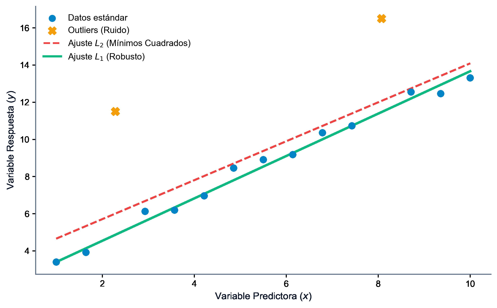

# Optimización en Ciencia de Datos: Regresión y SVM

La optimización matemática es el motor silencioso que impulsa la ciencia de datos y el aprendizaje automático (*machine learning*). Desde el ajuste clásico de una recta hasta el entrenamiento de redes neuronales profundas, el proceso de "aprendizaje" a partir de datos consiste en formular una función de pérdida que mide la discrepancia entre el modelo y la realidad, y resolver el problema de optimización asociado para hallar los parámetros óptimos. En este capítulo, estudiaremos cómo la optimización no lineal y la programación entera mixta dan respuesta a problemas clave: el ajuste de regresiones en diferentes normas, la selección óptima de variables, la formulación de las Máquinas de Vectores de Soporte (SVM) y la generación de explicaciones contrafácticas para modelos de caja negra.

::: {.callout-important title="Objetivos de aprendizaje"}
Al finalizar este capítulo, serás capaz de:

1.  **Formular y resolver** el problema de ajuste de curvas lineales y cuadráticas bajo diferentes normas ($\ell_1$, $\ell_2$, $\ell_\infty$) usando programación lineal y cuadrática.
2.  **Modelar la selección de características** (*feature selection*) en regresión múltiple utilizando variables binarias y restricciones lógicas.
3.  **Deducir la formulación de SVM** de margen máximo y margen blando, y comprender la importancia de su problema dual y el truco del kernel.
4.  **Comprender la necesidad de explicabilidad** en ciencia de datos y formular el problema biobjetivo para la búsqueda de contrafácticos.
5.  **Formular y resolver** el problema de búsqueda de contrafácticos en regresión logística como un modelo de optimización cuadrático entero mixto (MIQP).
6.  **Implementar en Python** modelos de regresión multivariante y clasificadores SVM utilizando las librerías `CVXPY` y `scikit-learn`.
:::


## Introducción a la Optimización en Aprendizaje Automático

El proceso de entrenamiento de un modelo de aprendizaje automático consiste en ajustar los parámetros de una función hipótesis $f(x; w)$ para modelar un patrón en un conjunto de datos, siguiendo los principios y metodologías analíticas del aprendizaje estadístico clásico [@hastie2009elements]. Las principales aplicaciones de la optimización en este ámbito son:

-   **Estimación puntual**:
    Maximizar la función de verosimilitud (MLE) o minimizar el error cuadrático medio.
-   **Regularización**:
    Añadir términos de penalización en la función objetivo (normas $\ell_1$ o $\ell_2$) para controlar la complejidad del modelo y evitar el sobreajuste (*overfitting*).
-   **Clasificación**:
    Maximizar el margen de separación entre clases o minimizar la pérdida de bisagra (*hinge loss*).


## El Problema de Ajuste de Datos en Diferentes Normas

Dada una muestra de observaciones de dos variables, $x$ e $y$, el ajuste de datos consiste en encontrar una función $f(x)$ tal que $y_i \approx f(x_i)$ para toda observación $i = 1, \dots, n$.

Consideremos una muestra de $n = 19$ observaciones:

| $x$ | 0.0 | 0.5 | 1.0 | 1.5 | 1.9 | 2.5 | 3.0 | 3.5 | 4.0 | 4.5 | 5.0 | 5.5 | 6.0 | 6.6 | 7.0 | 7.6 | 8.5 | 9.0 | 10.0 |
|---|---|---|---|---|---|---|---|---|---|---|---|---|---|---|---|---|---|---|---|
| $y$ | 1.0 | 0.9 | 0.7 | 1.5 | 2.0 | 2.4 | 3.2 | 2.0 | 2.7 | 3.5 | 1.0 | 4.0 | 3.6 | 2.7 | 5.7 | 4.6 | 6.0 | 6.8 | 7.3 |

### Regresión Lineal Clásica (Norma $\ell_2$)
La regresión lineal clásica asume que la relación toma la forma de una recta $y = a + b x + \epsilon$. Los parámetros $a$ (intersección) y $b$ (pendiente) se obtienen minimizando el error cuadrático medio:
$$ \min_{a, b} \sum_{i=1}^n (a + b x_i - y_i)^2 $$
Las ecuaciones normales obtenidas al anular el gradiente nos proporcionan la conocida recta por mínimos cuadrados ordinarios (MCO):
$$ Y = 0.4261 + 0.6108 x $$

### Ajustes en Normas Robustas ($\ell_1$ y $\ell_\infty$)
Cuando los datos contienen valores atípicos (*outliers*) o errores de medición severos (como el punto $(5.0, 1.0)$ en nuestra muestra), la norma cuadrática $\ell_2$ se ve fuertemente distorsionada. Proponemos alternativas más robustas:

-   **Norma $\ell_1$ (Desviaciones Absolutas)**:
    Minimiza la suma de los valores absolutos de los residuos:
    $$ \min_{a, b} \sum_{i=1}^n |a + b x_i - y_i| $$
-   **Norma $\ell_\infty$ (Minimax)**:
    Minimiza el máximo error cometido:
    $$ \min_{a, b} \max_{i=1, \dots, n} |a + b x_i - y_i| $$

{#fig-regresion-robusta fig-align="center" width="80%"}


::: {.callout-note title="Formulación en Programación Lineal para Ajustes Robustos"}
Podemos formular la minimización en normas $\ell_1$ y $\ell_\infty$ como problemas de programación lineal continua equivalentes mediante la introducción de variables auxiliares de error:

-   **Formulación para la Norma $\ell_1$**:
    $$
    \begin{aligned}
    \min_{a, b, e} \quad & \sum_{i=1}^n e_i \\
    \text{sujeto a} \quad & a + b x_i - y_i \le e_i, \quad i = 1, \dots, n \\
    & -(a + b x_i - y_i) \le e_i, \quad i = 1, \dots, n \\
    & e_i \ge 0, \quad i = 1, \dots, n
    \end{aligned}
    $$
-   **Formulación para la Norma $\ell_\infty$**:
    $$
    \begin{aligned}
    \min_{a, b, z} \quad & z \\
    \text{sujeto a} \quad & a + b x_i - y_i \le z, \quad i = 1, \dots, n \\
    & -(a + b x_i - y_i) \le z, \quad i = 1, \dots, n \\
    & z \ge 0
    \end{aligned}
    $$
:::

Al resolver estos modelos sobre los datos de nuestra muestra, se aprecian los siguientes ajustes lineales y cuadráticos:

1.  **Ajuste lineal $\ell_1$**:
    $y = 0.6375x + 0.5812$ (con un error total de $11.46$ y un máximo error de $2.77$ en $x=5.0$).
2.  **Ajuste lineal $\ell_\infty$**:
    $y = 0.6245x - 0.4000$ (con un error total de $19.95$ y un máximo error minimizado de $1.725$ en $x=3.5, 7.0$).
3.  **Ajuste cuadrático $\ell_1$**:
    $y = 0.0337x^2 + 0.2945x + 0.9823$.
4.  **Ajuste cuadrático $\ell_\infty$**:
    $y = 0.1250x^2 - 0.6250x + 2.4750$ (máximo error de $1.475$).


## Regresión Lineal Múltiple y Selección de Características

Cuando disponemos de $m$ variables independientes $X_1, \dots, X_m$, el modelo es:
$$ Y = \beta_0 + \beta_1 X_1 + \dots + \beta_m X_m + \epsilon $$

### Selección de Variables mediante Programación Entera Mixta
En presencia de múltiples variables explicativas, a menudo deseamos construir un modelo disperso (*sparse*) que solo incluya un subconjunto óptimo de características. Definimos variables binarias de decisión $\delta_j \in \{0, 1\}$ para indicar si la característica $j$ participa en el modelo ($\beta_j \neq 0$).
Imponemos restricciones de "Gran M" utilizando cotas inferiores $\underline{\beta}_j$ y superiores $\overline{\beta}_j$ sobre el valor físico de los coeficientes:
$$ \underline{\beta}_j \delta_j \le \beta_j \le \overline{\beta}_j \delta_j, \quad j = 1, \dots, m $$
Esto nos permite plantear restricciones estructurales complejas:

-   **Número máximo de variables seleccionadas**:
    $$ \sum_{j=1}^m \delta_j \le M_{\max} $$
-   **Relación de exclusión mutua entre variables $i$ y $j$**:
    $$ \delta_i + \delta_j \le 1 $$
-   **Inclusión obligatoria de al menos una entre $i$ y $j$**:
    $$ \delta_i + \delta_j \ge 1 $$

El problema resultante es un modelo **Entero Cuadrático Mixto (MIQP)**.


## Máquinas de Vectores de Soporte (SVM)

El objetivo de una SVM es clasificar observaciones binarias $y_i \in \{-1, +1\}$ mediante un hiperplano $w^T x + b = 0$ que maximice el margen de separación (la distancia al punto más cercano de cada clase).


::: {.callout-important title="Formulación Primal de SVM (Caso Linealmente Separable)"}
La distancia del punto más cercano al hiperplano es $1/\|w\|_2$. Maximizar el margen $2/\|w\|_2$ equivale a minimizar su recíproco al cuadrado, dando lugar al problema cuadrático convexo restringido:
$$
\begin{aligned}
\min_{w, b} \quad & \frac{1}{2} \|w\|_2^2 \\
\text{sujeto a} \quad & y_i (w^T x_i + b) \ge 1, \quad i = 1, \dots, n
\end{aligned}
$$
:::


::: {.callout-important title="Formulación Primal de SVM (Caso No Separable - Margen Blando)"}
Si los datos no son perfectamente separables, introducimos variables de holgura $\xi_i \ge 0$ que miden la penetración de un punto en el margen o su mala clasificación. El parámetro de regularización $C > 0$ controla el equilibrio entre la maximización del margen y la penalización de errores:
$$
\begin{aligned}
\min_{w, b, \xi} \quad & \frac{1}{2} \|w\|_2^2 + C \sum_{i=1}^n \xi_i \\
\text{sujeto a} \quad & y_i (w^T x_i + b) \ge 1 - \xi_i, \quad i = 1, \dots, n \\
& \xi_i \ge 0, \quad i = 1, \dots, n
\end{aligned}
$$
:::


::: {.callout-important title="Formulación Dual de SVM y el Truco del Kernel"}
Planteando las condiciones de optimalidad de la Lagrangiana, podemos reescribir el problema en su forma dual:
$$
\begin{aligned}
\max_{\alpha} \quad & \sum_{i=1}^n \alpha_i - \frac{1}{2} \sum_{i=1}^n \sum_{j=1}^n \alpha_i \alpha_j y_i y_j (x_i^T x_j) \\
\text{sujeto a} \quad & 0 \le \alpha_i \le C, \quad i = 1, \dots, n \\
& \sum_{i=1}^n \alpha_i y_i = 0
\end{aligned}
$$
-   **Vectores de soporte**:
    Los puntos con multiplicador óptimo $\alpha_i > 0$ son los únicos que determinan la posición del hiperplano óptimo.
-   **El Truco del Kernel**:
    Dado que los datos de entrada solo intervienen en el problema dual mediante el producto escalar $x_i^T x_j$, podemos reemplazar este término por una función de coincidencia kernel $K(x_i, x_j) = \phi(x_i)^T \phi(x_j)$. Esto permite proyectar los datos de forma implícita a un espacio de características infinito o de gran dimensión (como el kernel Gaussiano RBF), logrando fronteras de decisión altamente no lineales en el espacio original sin incurrir en costes computacionales prohibitivos.
:::


## Explicabilidad y Contrafácticos (Counterfactuals)

El auge de los modelos de caja negra (redes neuronales, random forests) ha motivado el desarrollo de técnicas de explicabilidad. Una explicación contrafáctica responde a la pregunta: *"¿Qué cambios mínimos debe realizar una persona $x^0$ clasificada en la clase negativa para cambiar la predicción a la clase positiva?"*

### Formulación del Problema de Optimización
Dado un clasificador $P: \mathcal{X} \to [0, 1]$ que devuelve la probabilidad de clase positiva, y un perfil $x^0$ con $P(x^0) < \tau$ (negativo), buscamos un nuevo perfil factible $x$ que minimice la función de coste del cambio $C(x^0, x)$ bajo la condición de cruzar el umbral de clasificación:
$$
\begin{aligned}
\min_{x \in \mathcal{X}(x^0)} \quad & C(x^0, x) \\
\text{sujeto a} \quad & P(x) \ge \nu
\end{aligned}
$$
-   **Contrafácticos Endógenos**:
    El conjunto de búsqueda se restringe a muestras reales de la base de datos ya clasificadas como positivas. Su modelización es discreta (localización de instalaciones).
-   **Contrafácticos Exógenos**:
    El contrafáctico generado es un perfil sintético en un espacio continuo, resolviéndose mediante optimización continua o entera mixta.

### Formulación Entera Mixta para un Clasificador de Regresión Logística
En la regresión logística, la probabilidad de clase positiva es $\varphi(w^T x - b)$ con $\varphi(t) = 1/(1+e^{-t})$. La restricción de probabilidad $P(x) \ge \nu$ se linealiza como:
$$ w^T x - b \ge \ln\left(\frac{\nu}{1 - \nu}\right) $$
Si la función de coste combina la distancia euclídea ($\ell_2$) y una penalización por el número de características modificadas ($\ell_0$), el modelo se formula como un problema **MIQP**:
$$
\begin{aligned}
\min_{x, \delta} \quad & \sum_{k=1}^K (x_k^0 - x_k)^2 + \lambda \sum_{k=1}^K \delta_k \\
\text{sujeto a} \quad & \sum_{k=1}^K w_k x_k - b \ge \ln\left(\frac{\nu}{1 - \nu}\right) \\
& -M_k \delta_k \le x_k^0 - x_k \le M_k \delta_k, \quad k = 1, \dots, K \\
& x_k = x_k^0, \quad \forall k \in \mathcal{K}_{\text{inmutable}} \\
& \delta_k \in \{0, 1\}, \quad k = 1, \dots, K
\end{aligned}
$$


## Implementación Práctica en Python


::: {.callout-tip title="Código Python: Ajustes en Diferentes Normas y SVM con CVXPY" collapse="true"}
El siguiente script completo implementa los ajustes de datos univariantes utilizando las normas $\ell_1, \ell_2, \ell_\infty$, y formula el clasificador SVM de margen blando en 2D:

```python
import cvxpy as cp
import numpy as np

# 1. Datos del ajuste de curvas
x_data = np.array([0.0, 0.5, 1.0, 1.5, 1.9, 2.5, 3.0, 3.5, 4.0, 4.5, 5.0, 5.5, 6.0, 6.6, 7.0, 7.6, 8.5, 9.0, 10.0])
y_data = np.array([1.0, 0.9, 0.7, 1.5, 2.0, 2.4, 3.2, 2.0, 2.7, 3.5, 1.0, 4.0, 3.6, 2.7, 5.7, 4.6, 6.0, 6.8, 7.3])

# Variables de decision para la recta y = a + bx
a = cp.Variable()
b = cp.Variable()

# --- Ajuste L2 (Minimos Cuadrados Ordinarios) ---
cost_l2 = cp.sum_squares(a + b * x_data - y_data)
prob_l2 = cp.Problem(cp.Minimize(cost_l2))
prob_l2.solve()
print("Recta L2 (MCO):")
print(f"  y = {a.value:.4f} + {b.value:.4f}x")

# --- Ajuste L1 (Desviaciones Absolutas - Robustez) ---
cost_l1 = cp.sum(cp.abs(a + b * x_data - y_data))
prob_l1 = cp.Problem(cp.Minimize(cost_l1))
prob_l1.solve()
print("\nRecta L1:")
print(f"  y = {a.value:.4f} + {b.value:.4f}x")

# --- Ajuste L_infinito (Minimax - Minimo Error Maximo) ---
cost_linf = cp.norm(a + b * x_data - y_data, "inf")
prob_linf = cp.Problem(cp.Minimize(cost_linf))
prob_linf.solve()
print("\nRecta L_infinito:")
print(f"  y = {a.value:.4f} + {b.value:.4f}x")


# 2. Formulacion Primal de SVM de Margen Blando
np.random.seed(42)
X_svm = np.vstack([np.random.randn(10, 2) - 2, np.random.randn(10, 2) + 2])
y_svm = np.array([-1]*10 + [1]*10)
m, d = X_svm.shape

w = cp.Variable(d)
intercept = cp.Variable()
xi = cp.Variable(m)
C = 1.0  # Parametro de penalizacion

objetivo_svm = cp.Minimize(0.5 * cp.sum_squares(w) + C * cp.sum(xi))
restricciones_svm = [
    y_svm[i] * (X_svm[i] @ w + intercept) >= 1 - xi[i] for i in range(m)
] + [xi >= 0]

prob_svm = cp.Problem(objetivo_svm, restricciones_svm)
prob_svm.solve()
print("\nHiperplano Separador SVM:")
print(f"  w = {w.value}")
print(f"  b = {intercept.value:.4f}")
```
:::
