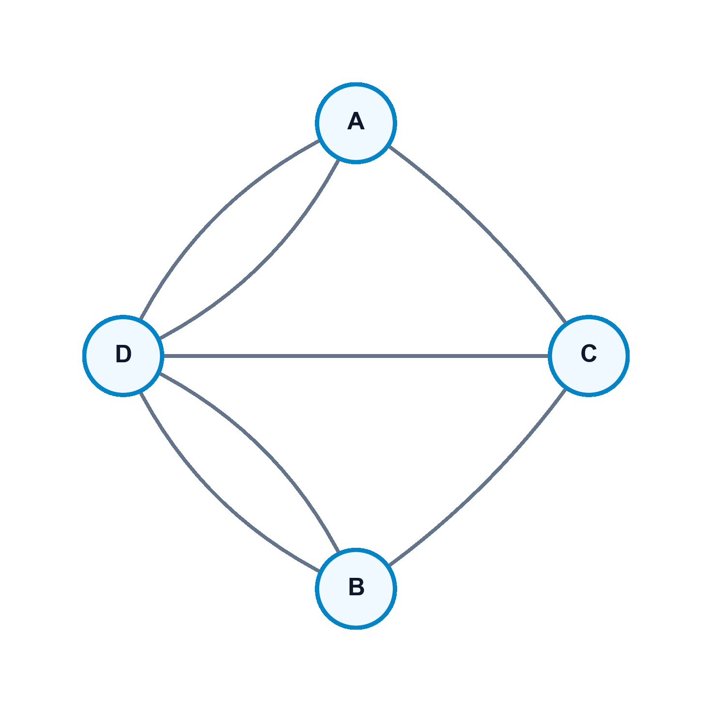
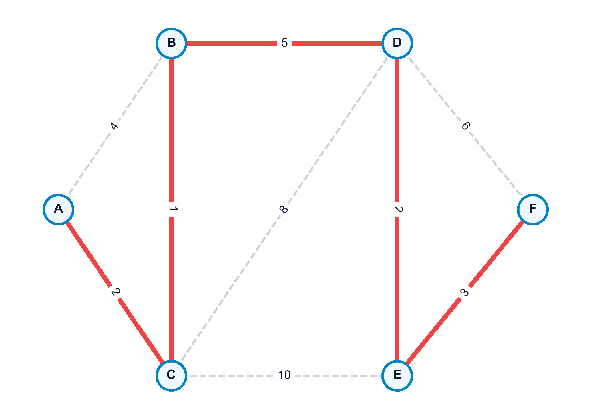

# Introducción a Grafos y Árboles Soporte

El **análisis de redes** es una de las disciplinas más transversales y aplicadas de las matemáticas discretas y la optimización. Muchas de las infraestructuras de la sociedad moderna (las redes de transporte eléctrico, el tráfico vial, la fibra óptica, Internet o los mapas metabólicos celulares) se modelan matemáticamente mediante **grafos**. La abstracción espacial que proporciona un grafo permite obviar la geometría física de los sistemas para centrarse en sus propiedades topológicas, conectividad y flujos, siguiendo los enfoques fundamentales de la optimización y algoritmos de redes [@ahuja1993network; @bertsekas1998network; @cormen2009introduction].

En este capítulo, estudiaremos los conceptos elementales de la teoría de grafos, las formas estándar de representar redes en ordenador, las propiedades analíticas de los grafos planares y bipartitos, las caracterizaciones algebraicas de los árboles y los algoritmos clásicos de Kruskal y Prim para construir el árbol soporte de mínimo peso (MST) con sus aplicaciones en el aprendizaje no supervisado.

::: {.callout-important title="Objetivos de aprendizaje"}
Al finalizar este capítulo, serás capaz de:

1.  **Definir e identificar** los diferentes tipos de grafos (dirigidos, no dirigidos, valorados, bipartitos y planares) y sus elementos constituyentes.
2.  **Aplicar el Teorema de Euler para grafos planares** para relacionar el número de vértices, aristas y regiones, y deducir los límites de densidad de aristas.
3.  **Utilizar el Teorema de Kuratowski** para demostrar analíticamente si un grafo dado es planar o no planar mediante la búsqueda de subdivisiones de $K_5$ o $K_{3,3}$.
4.  **Caracterizar la estructura de los árboles** empleando sus diversas definiciones equivalentes basadas en conectividad, aciclicidad y recuento de aristas.
5.  **Explicar e implementar** los algoritmos de Kruskal y Prim para el cálculo del árbol soporte de mínimo peso (MST).
6.  **Modelar problemas de agrupamiento** (*clustering*) jerárquico continuo a través del MST, y programar estas soluciones en Python usando la librería **NetworkX**.
:::


## Origen Histórico y Definiciones Básicas

### El Problema de Königsberg (Euler, 1736)
La teoría de grafos nació formalmente en 1736 cuando Leonhard Euler resolvió el problema de los puentes de Königsberg. La ciudad estaba dividida por el río Pregel en cuatro porciones de tierra conectadas por siete puentes. El reto consistía en encontrar una ruta que cruzara cada puente exactamente una vez y regresara al origen.
Euler demostró que tal recorrido (denominado hoy ciclo euleriano) era imposible. Lo fundamental de su análisis fue que obvió los detalles de las distancias o la forma de las riberas, modelando el problema como una red de nodos (tierra) y líneas (puentes). Dujo que un nodo solo puede cruzarse de forma completa si cada entrada tiene una salida, lo que exige que todos los nodos tengan un grado par. En Königsberg, los nodos tenían grado impar, cerrando toda posibilidad.

{#fig-puentes-konigsberg fig-align="center" width="50%"}

### Definición Formal de un Grafo

-   **Grafo No Dirigido**:
    Un par ordenado $G = (V, E)$ donde $V$ es un conjunto no vacío de **vértices** o **nodos** y $E$ es un conjunto de **aristas** formadas por pares no ordenados de vértices distintos $\{u, v\}$.
-   **Grafo Dirigido (Digrafo)**:
    Un par ordenado $G = (V, A)$ donde los elementos de $A$ son **arcos** definidos por pares ordenados de vértices $(u, v)$ (donde el flujo va del nodo origen $u$ al nodo destino $v$).
-   **Multigrafo**:
    Grafo que contiene múltiples aristas conectando el mismo par de nodos.
-   **Red o Grafo Valorado**:
    Un grafo asociado a una función de coste $w: E \to \mathbb{R}$ que asigna un peso o longitud a cada conexión.

### Subgrafos, Conectividad y Grados

-   **Subgrafo**:
    Un grafo $G' = (V', E')$ es subgrafo de $G = (V, E)$ si $V' \subseteq V$ y $E' \subseteq E \cap (V' \times V')$.
-   **Grafo Parcial (Spanning Subgraph)**:
    Un subgrafo que contiene a todos los vértices del grafo original ($V' = V$).
-   **Grado de un vértice ($d(v)$)**:
    Número de aristas incidentes en $v$. En digrafos se desglosa en:
    -   *Grado de entrada ($d^-(v)$)*: Número de arcos entrantes.
    -   *Grado de salida ($d^+(v)$)*: Número de arcos salientes.
-   **Conexión**:
    Una cadena es una secuencia de nodos y aristas consecutivas. Si no se repiten aristas es *simple*, y si no se repiten nodos es *elemental*. Un ciclo es una cadena cerrada simple.
-   **Grafo Conexo**:
    Existe al menos una cadena entre cualquier pareja de nodos de $V$. En digrafos, si existe un camino dirigido de ida y vuelta para cualquier par, se denomina **fuertemente conexo**.


## Representación de Grafos

### Representación Geométrica y Grafos Planares
Un grafo es **planar** si puede ser dibujado en el plano bidimensional de manera que sus aristas solo se corten en sus vértices.

-   **Regiones**:
    Las caras cerradas (y la región no acotada exterior) delimitadas por la representación en el plano de un grafo planar.


::: {.callout-important title="Teorema: Fórmula Planar de Euler"}
Sea $G = (V, E)$ un grafo planar conexo con $n = |V|$ vértices y $m = |E|$ aristas. Si $r$ es el número de regiones de su representación planar, entonces se cumple:
$$ n + r = m + 2 $$

*Demostración (por inducción sobre el número de aristas $m$)*:

-   **Base de la inducción ($m=1$)**:

    -   Si conecta dos nodos distintos ($n=2$), define 1 región (exterior): $2 + 1 = 1 + 2$ (correcto).
    -   Si es un bucle sobre un único nodo ($n=1$), divide el plano en una región interior y otra exterior ($r=2$): $1 + 2 = 1 + 2$ (correcto).

-   **Paso inductivo**:

    Asumimos que la fórmula se cumple para grafos de $k$ aristas. Sea $G$ un grafo con $m = k+1$ aristas:
    -   *Caso 1*: Si $G$ contiene un nodo de grado 1 (vértice pendiente $v$), al eliminar $v$ y su arista asociada obtenemos un subgrafo conexo con $n-1$ vértices, $k$ aristas y las mismas $r$ regiones. Por hipótesis: $(n-1) + r = k + 2 \implies n + r = (k+1) + 2$.
    -   *Caso 2*: Si no hay nodos de grado 1, $G$ contiene al menos un ciclo. Al eliminar una arista del ciclo, el número de aristas pasa a $k$ y las dos regiones adyacentes a la arista se unen en una sola ($r-1$ regiones en el subgrafo). Por hipótesis: $n + (r-1) = k + 2 \implies n + r = (k+1) + 2$. $\blacksquare$
:::


::: {.callout-important title="Corolario de la Planaridad"}
Si $G$ es un grafo simple conexo planar con $n \ge 3$ vértices y $m$ aristas, entonces:
$$ 3r \le 2m \qquad \text{y} \qquad m \le 3n - 6 $$

*Demostración*:
Como el grafo es simple y sin bucles, la frontera de toda región (incluida la exterior) contiene al menos 3 aristas. Sumando las fronteras sobre todas las regiones, cada arista se contabiliza a lo sumo dos veces (una para cada región que delimita). Por tanto:
$$ 3r \le \sum_{i=1}^r \text{longitud(frontera}_i) \le 2m \implies 3r \le 2m $$
Sustituyendo el teorema de Euler ($r = m - n + 2$):
$$ 3(m - n + 2) \le 2m \implies 3m - 3n + 6 \le 2m \implies m \le 3n - 6. \quad \blacksquare $$
:::

Una consecuencia de este corolario es que el grafo completo $K_5$ (5 nodos, 10 aristas) no es planar, puesto que violaría la cota: $10 \le 3(5) - 6 = 9$ (falso).


::: {.callout-important title="Teorema de Kuratowski (1930)"}
Un grafo es planar si y solo si no contiene ningún subgrafo que sea homeomorfo (una subdivisión de aristas) o contenga como menor a los grafos no planares básicos $K_5$ o $K_{3,3}$.
:::


::: {.callout-important title="Teorema: Caracterización de Grafos Bipartitos"}
Un grafo es bipartito (sus vértices se dividen en dos conjuntos disjuntos $V_1$ y $V_2$ sin conexiones internas) si y solo si **no contiene ningún ciclo de longitud impar**.
:::

### Representación en Ordenador

-   **Matriz de Adyacencia ($A \in \mathbb{R}^{n \times n}$)**:
    Matriz donde la posición $a_{ij}$ indica la existencia (1) o el coste de la arista que une los nodos $i$ y $j$.
-   **Matriz de Incidencia ($M \in \mathbb{R}^{n \times m}$)**:
    Para digrafos, cada columna representa un arco y tiene un $1$ en la fila de origen y un $-1$ en la fila de destino. Al ser esta matriz **totalmente unimodular (TUM)**, los determinantes de sus submatrices cuadradas son siempre $-1, 0$ o $1$, garantizando soluciones enteras bajo restricciones de balance.
-   **Lista de Adyacencia**:
    Estructura optimizada que asocia a cada nodo un vector dinámico con sus vecinos directos. Es idónea para grafos dispersos.


## Estructura Matemática de los Árboles

Un árbol es un grafo que modela conexiones jerárquicas mínimas sin redundancia.


::: {.callout-important title="Teorema: Caracterizaciones Equivalentes de un Árbol"}
Sea $G = (V, E)$ un grafo simple no dirigido con $n$ vértices. Las siguientes proposiciones son equivalentes:

1.  $G$ es un árbol (conexo y acíclico).
2.  $G$ es conexo y tiene exactamente $n-1$ aristas.
3.  $G$ es acíclico y tiene exactamente $n-1$ aristas.
4.  Existe un único camino elemental entre cualquier par de vértices de $G$.
5.  $G$ es acíclico, pero si se añade una arista cualquiera se forma exactamente un ciclo.
6.  $G$ es conexo, pero si se elimina una arista cualquiera se desconecta.
:::


## Árbol Soporte de Mínimo Peso (MST)

Dado un grafo conexo no dirigido valorado $G = (V, E, w)$, un **árbol soporte de mínimo peso** es un grafo parcial $T = (V, E_T)$ con $E_T \subseteq E$ que es un árbol y minimiza el coste total de sus conexiones:

$$ \min \sum_{e \in E_T} w(e) $$

{#fig-kruskal-prim-mst fig-align="center" width="75%"}

### Algoritmo de Kruskal (1956)
Es de naturaleza codiciosa (greedy) y procesa las aristas de forma aislada:

1.  Ordenar todas las aristas del grafo de menor a mayor peso.
2.  Inicializar cada nodo en su propia componente conexa disjunta.
3.  Recorrer las aristas en orden. Si los extremos de la arista actual pertenecen a componentes conexas distintas (no forman ciclo), añadir la arista al árbol y fusionar las componentes. En caso contrario, descartar.
4.  Terminar al seleccionar $n-1$ aristas.
-   *Complejidad*: $O(|E| \log |E|)$ debido al coste de la ordenación inicial.

### Algoritmo de Prim
Hace crecer una única componente conectada desde un nodo raíz arbitrario $s$:

1.  Inicializar los nodos cubiertos $V_T = \{s\}$ y el árbol de aristas $E_T = \emptyset$.
2.  Identificar la arista de coste mínimo $\{u, v\}$ tal que $u \in V_T$ y $v \notin V_T$.
3.  Añadir el nodo $v$ a $V_T$ y la arista $\{u, v\}$ a $E_T$.
4.  Repetir hasta cubrir todos los nodos ($V_T = V$).
-   *Complejidad*: $O(|E| + |V| \log |V|)$ si se implementa mediante colas de prioridad con montículos de Fibonacci.


::: {.callout-note title="Clustering Jerárquico Basado en MST"}
El MST es una herramienta potente en aprendizaje no supervisado. Para agrupar un conjunto de observaciones en $k$ grupos o clústeres disjuntos:

1.  Construir un grafo completo donde los nodos son las observaciones y los pesos de las aristas corresponden a la distancia métrica (euclídea, Manhattan) entre los perfiles.
2.  Calcular el MST del grafo.
3.  Eliminar las $k-1$ aristas de mayor peso del MST.
4.  Las $k$ componentes conexas resultantes definen los clústeres óptimos bajo el criterio de enlace simple (*Single-Linkage*).
:::


## Implementación en Python


::: {.callout-tip title="Código Python: Cálculo de MST y Agrupamiento con NetworkX" collapse="true"}
El siguiente script construye un grafo valorado, extrae su MST usando Kruskal y realiza una partición en $k=3$ clústeres basados en la topología de pesos:

```python
import networkx as nx

# 1. Inicializar el grafo no dirigido con pesos
G = nx.Graph()
edges = [
    ("A", "B", 4), ("A", "H", 8), ("B", "C", 8), ("B", "H", 11),
    ("C", "D", 7), ("C", "F", 4), ("C", "I", 2), ("D", "E", 9),
    ("D", "F", 14), ("E", "F", 10), ("F", "G", 2), ("G", "H", 1),
    ("G", "I", 6), ("H", "I", 7)
]
G.add_weighted_edges_from(edges)

# 2. Calcular el MST usando el algoritmo de Kruskal
mst = nx.minimum_spanning_tree(G, algorithm="kruskal")
peso_mst = mst.size(weight="weight")
print(f"Peso total del MST obtenido: {peso_mst:.2f}")
print("Aristas del arbol soporte:")
for u, v, data in mst.edges(data=True):
    print(f"  {u} - {v}: coste = {data['weight']}")

# 3. Clustering basado en MST (k = 3 grupos)
k = 3
# Ordenamos las aristas del MST por peso de forma ascendente
aristas_mst_ordenadas = sorted(mst.edges(data=True), key=lambda x: x[2]['weight'])

# Eliminamos las k-1 aristas mas costosas del arbol
for i in range(k - 1):
    u, v, _ = aristas_mst_ordenadas[-(i + 1)]
    mst.remove_edge(u, v)

# Las componentes conexas resultantes representan los clusters
clusters = list(nx.connected_components(mst))
print(f"\nParticion del Grafo en {k} clusters:")
for idx, cluster in enumerate(clusters):
    print(f"  Cluster {idx + 1}: {cluster}")
```
:::
