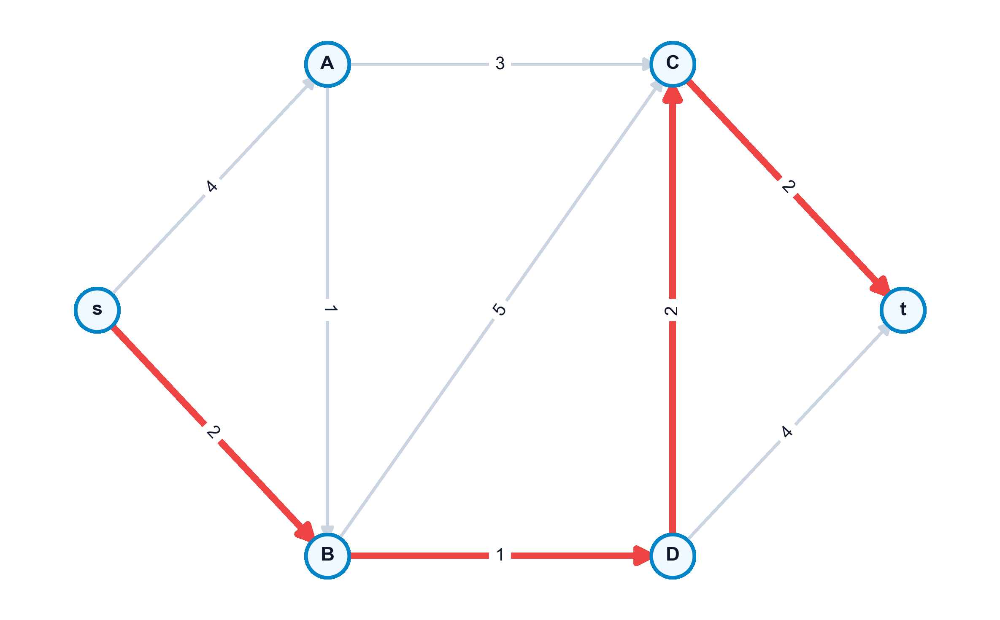

# El Problema del Camino Mínimo

El problema del **camino mínimo** (Shortest Path Problem) es una de las piedras angulares de la optimización de redes. Su propósito es determinar la ruta de menor coste o distancia acumulada entre un nodo origen $s$ y un nodo destino $t$, o desde un origen único hacia todos los demás nodos de la red. Este problema no solo cuenta con aplicaciones directas en sistemas de navegación vial y enrutamiento de paquetes de datos en telecomunicaciones, sino que sirve como subproblema crítico en algoritmos de mayor envergadura (como los algoritmos de generación de columnas o los problemas de flujo de coste mínimo), constituyendo un campo fundamental de estudio en la optimización combinatoria [@ahuja1993network; @bertsekas1998network; @cormen2009introduction].

En este capítulo, estudiaremos el Principio de Optimalidad y las ecuaciones de Bellman, los algoritmos especializados según la naturaleza de los pesos (ordenación topológica para DAGs, Dijkstra para pesos positivos, y Bellman-Ford para pesos negativos), el algoritmo de Floyd-Warshall para caminos entre todos los pares de nodos, y el modelado matemático mediante programación lineal primal-dual destacando la propiedad de total unimodularidad.

::: {.callout-important title="Objetivos de aprendizaje"}
Al finalizar este capítulo, serás capaz de:

1.  **Formular y justificar** las ecuaciones de optimalidad de Bellman para caminos mínimos basándote en el Principio de Optimalidad.
2.  **Aplicar la ordenación topológica** para resolver el problema del camino mínimo en redes acíclicas (DAGs) en tiempo lineal $O(|V| + |A|)$.
3.  **Ejecutar e implementar** el algoritmo de Dijkstra en redes con pesos no negativos, comprendiendo su carácter ávido y su complejidad temporal.
4.  **Resolver problemas** con aristas de coste negativo usando el algoritmo de Bellman-Ford y demostrar analíticamente cómo se detectan los ciclos de coste negativo.
5.  **Calcular las distancias** de todos los pares de nodos simultáneamente aplicando la relación de recurrencia de programación dinámica de Floyd-Warshall.
6.  **Formular el problema** como un programa lineal continuo, justificando la integridad de sus soluciones mediante la propiedad totalmente unimodular (TUM) de la matriz de incidencia y relacionando las variables duales con los potenciales de los nodos.
:::


## Definición Formal y Condiciones de Existencia

Sea un digrafo conexo valorado $G = (V, A, c)$, donde $c_{ij}$ es el coste o peso asociado al arco dirigido $(i, j) \in A$.
Dado un camino dirigido $\mu = (v_0, v_1, \dots, v_k)$ con arcos $(v_{i-1}, v_i) \in A$, la longitud o coste de la ruta es:
$$ c(\mu) = \sum_{j=1}^k c_{v_{j-1}, v_j} $$

El problema busca encontrar un camino elemental $\mu^*$ de $s$ a $t$ de coste mínimo. Para que exista una solución óptima acotada y bien definida, se deben cumplir dos condiciones:

-   **Accesibilidad**:
    Debe existir al menos un camino dirigido que una el origen $s$ con el destino $t$.
-   **Ausencia de ciclos de coste negativo**:
    No debe haber ningún ciclo de coste total negativo en la red que sea accesible desde $s$ y desde el cual se pueda alcanzar el destino $t$. Si existiera tal ciclo, podríamos recorrerlo indefinidamente, reduciendo el coste total acumulado hacia $-\infty$, por lo que el camino mínimo no estaría bien definido.

{#fig-camino-minimo-dijkstra fig-align="center" width="75%"}


## El Principio de Optimalidad de Bellman

El **Principio de Optimalidad de Bellman** es la base teórica de la programación dinámica aplicada a redes: *"Si el camino óptimo para ir de un nodo $s$ a un nodo $t$ pasa por un nodo intermedio $i$, entonces la porción de la ruta que une $s$ con $i$ debe ser también el camino óptimo entre estos dos nodos"*.


::: {.callout-important title="Las Ecuaciones de Bellman"}
Sea $d(j)$ la distancia mínima desde el origen fijo $s$ al nodo $j$. Las distancias mínimas satisfacen de forma garantizada el sistema de ecuaciones:
$$ d(s) = 0 $$
$$ d(j) = \min_{i \in \text{Pred}(j)} \{ d(i) + c_{ij} \}, \quad \forall j \neq s $$
Donde $\text{Pred}(j) = \{ i \in V \mid (i, j) \in A \}$ representa el conjunto de predecesores directos del nodo $j$ en la red.
:::


## Redes Sin Circuitos (DAGs) y Ordenación Topológica

Si el digrafo no contiene ciclos (Directed Acyclic Graph, DAG), podemos explotar su estructura geométrica ordenando sus nodos para resolver las ecuaciones de Bellman en un único paso secuencial.

### Ordenación Topológica
Consiste en etiquetar los nodos con números $t(i) \in \{1, \dots, n\}$ tales que para todo arco dirigido $(i, j) \in A$ se cumpla la relación de orden $t(i) < t(j)$. El algoritmo localiza repetidamente nodos con grado de entrada cero ($d^-(i) = 0$), les asigna la etiqueta correspondiente y los elimina de la red junto con sus arcos salientes.

### Algoritmo de Resolución
Una vez reordenados los nodos como $1, 2, \dots, n$ (con el origen $s$ como nodo 1), calculamos las distancias de forma directa:
$$ d(1) = 0 $$
$$ d(j) = \min_{i < j, (i,j) \in A} \{ d(i) + c_{ij} \}, \quad j = 2, \dots, n $$
-   *Complejidad*: $O(|V| + |A|)$, que es lineal y óptima.


## Redes con Pesos No Negativos: Algoritmo de Dijkstra

Cuando los costes de los arcos son no negativos ($c_{ij} \ge 0$), se utiliza el **Algoritmo de Dijkstra**. Es un método de etiquetado que mantiene un conjunto de distancias provisionales y permanentes:

1.  **Inicialización**:
    Hacer permanente la distancia del origen $d(s) = 0$. Para todo nodo $j \neq s$ adyacente a $s$, asignar la etiqueta provisional $d(j) = c_{sj}$ (hacer $d(j) = \infty$ si no es adyacente). El conjunto de nodos con distancia permanente es $S = \{s\}$.
2.  **Selección del óptimo local**:
    Localizar el nodo $i \notin S$ que tenga la menor distancia provisional:
    $$ i = \arg\min_{j \notin S} \{ d(j) \} $$
3.  **Fijar etiqueta**:
    Añadir el nodo $i$ al conjunto $S$ (su distancia $d(i)$ se convierte en permanente). Si $S = V$ o $d(i) = \infty$, terminar.
4.  **Actualización de distancias**:
    Para cada vecino $j \notin S$ tal que $(i, j) \in A$, relajar la arista:
    $$ d(j) = \min \{ d(j), \ d(i) + c_{ij} \} $$
    Volver al paso 2.
-   *Complejidad*: $O(|A| + |V| \log |V|)$ si se utilizan colas de prioridad con montículos de Fibonacci.


## Redes con Pesos Negativos: Algoritmo de Bellman-Ford

Si existen arcos con pesos negativos, Dijkstra puede fallar debido a que la etiqueta de un nodo fijada como permanente podría abaratarse posteriormente a través de un camino con arcos negativos. En este escenario, aplicamos el **Algoritmo de Bellman-Ford**.

### Algoritmo Paso a Paso

1.  **Inicialización**:
    $d(s) = 0$ e $d(j) = \infty$ para todo $j \neq s$.
2.  **Relajación sistemática**:
    Realizar exactamente $|V| - 1$ iteraciones. En cada iteración, recorrer todos los arcos $(i, j) \in A$ del digrafo y actualizar:
    $$ d(j) = \min \{ d(j), \ d(i) + c_{ij} \} $$


::: {.callout-caution title="Detección de Ciclos Negativos"}
Para comprobar si existen ciclos negativos en la red que hagan que las distancias diverjan hacia $-\infty$, se realiza una iteración adicional de relajación sobre todos los arcos $(i, j) \in A$. Si para alguna arista se cumple que:
$$ d(j) > d(i) + c_{ij} $$
Entonces existe al menos un **ciclo de coste negativo** accesible desde el origen $s$, lo que indica que no hay solución óptima acotada.
:::


## Formulación en Programación Lineal Primal-Dual

El problema del camino mínimo puede formularse y resolverse como un programa lineal continuo.

### Modelo Primal (Flujo de Coste Mínimo de Una Unidad)
Asumiendo que queremos enviar una unidad de flujo desde el origen $s$ al destino $t$:

$$
\begin{aligned}
\min_{x} \quad & \sum_{(i,j) \in A} c_{ij} x_{ij} \\
\text{sujeto a} \quad & \sum_{j \mid (i,j) \in A} x_{ij} - \sum_{j \mid (j,i) \in A} x_{ji} = \begin{cases} 1 & \text{si } i = s \\ -1 & \text{si } i = t \\ 0 & \text{si } i \neq s, t \end{cases} \quad \forall i \in V \\
& x_{ij} \ge 0, \quad \forall (i, j) \in A
\end{aligned}
$$

La variable continua $x_{ij}$ representa la cantidad de flujo que pasa por el arco $(i,j)$.
-   **Total Unimodularidad (TUM)**:
    La matriz de coeficientes de este sistema es la matriz de incidencia nodo-arco de la red. Al ser esta matriz totalmente unimodular, cualquier base factible del problema de programación lineal es entera. Por tanto, resolver el problema lineal continuo garantiza obtener una solución binaria óptima ($x_{ij}^* \in \{0, 1\}$) que define de forma exacta el camino mínimo.

### Modelo Dual (Potenciales Nodales)
Asociando una variable dual no restringida $u_i \in \mathbb{R}$ a la ecuación de balance de cada nodo $i \in V$, el problema dual es:

$$
\begin{aligned}
\max_{u} \quad & u_t - u_s \\
\text{sujeto a} \quad & u_j - u_i \le c_{ij}, \quad \forall (i, j) \in A \\
& u_i \text{ no restringida en signo}
\end{aligned}
$$


::: {.callout-note title="Interpretación Física y Dual del Potencial Nodal"}
Las variables duales $u_i$ representan potenciales nodales o tensiones. Si fijamos de forma arbitraria el potencial del origen $u_s = 0$, la variable dual óptima $u_j^*$ coincide exactamente con la distancia mínima $d(j)$ del origen al nodo $j$. Las restricciones duales $u_j - u_i \le c_{ij}$ son las condiciones de consistencia de distancias: la diferencia de potencial entre dos nodos no puede superar el coste directo de la arista que los conecta.
:::


## Camino Mínimo Entre Todos los Pares de Nodos: Floyd-Warshall

El **Algoritmo de Floyd-Warshall** es un método de programación dinámica que calcula las distancias mínimas entre cualquier pareja de nodos de forma simultánea.


::: {.callout-important title="Relación de Recurrencia de Floyd-Warshall"}
Sea $d_{ij}^{(k)}$ la distancia mínima para ir del nodo $i$ al nodo $j$ pudiendo utilizar como nodos intermedios únicamente un subconjunto de nodos $\{1, 2, \dots, k\}$.
La relación de recurrencia en la iteración $k$ es:
$$ d_{ij}^{(k)} = \min \left\{ d_{ij}^{(k-1)}, \ d_{ik}^{(k-1)} + d_{kj}^{(k-1)} \right\} $$
Con las condiciones iniciales en $k=0$ dadas por los pesos directos de los arcos ($d_{ij}^{(0)} = c_{ij}$ si hay arco, $d_{ii}^{(0)} = 0$, y $d_{ij}^{(0)} = \infty$ en caso contrario).
-   *Complejidad*: $O(|V|^3)$, lo que lo hace muy eficiente para redes densas.
:::


## Implementación en Python con NetworkX


::: {.callout-tip title="Código Python: Resolución de Caminos Mínimos con NetworkX" collapse="true"}
El siguiente script define un digrafo que contiene una arista de peso negativo y resuelve el camino mínimo utilizando los algoritmos de Dijkstra y Bellman-Ford, además de comprobar la existencia de ciclos negativos y calcular la matriz de distancias:

```python
import networkx as nx

# 1. Inicializar el digrafo con aristas y pesos
G = nx.DiGraph()
edges = [
    ("s", "A", 4), ("s", "B", 3), ("A", "B", -2), ("A", "C", 2),
    ("B", "C", 3), ("B", "t", 6), ("C", "t", 2)
]
G.add_weighted_edges_from(edges)

# 2. Intentar resolver mediante Dijkstra
try:
    path_dij = nx.dijkstra_path(G, "s", "t")
    dist_dij = nx.dijkstra_path_length(G, "s", "t")
    print("Dijkstra:")
    print(f"  Ruta = {path_dij}, Distancia = {dist_dij}")
except ValueError as e:
    print(f"Error en Dijkstra: {e}")

# 3. Resolver de forma robusta con Bellman-Ford
path_bf = nx.bellman_ford_path(G, "s", "t")
dist_bf = nx.bellman_ford_path_length(G, "s", "t")
print("\nBellman-Ford:")
print(f"  Ruta = {path_bf}, Distancia = {dist_bf}")

# 4. Comprobar si el digrafo contiene ciclos de coste negativo
tiene_ciclo_neg = nx.negative_edge_cycle(G)
print(f"\n¿Tiene el digrafo algun ciclo de coste negativo?: {tiene_ciclo_neg}")

# 5. Distancias entre todos los pares (Floyd-Warshall)
dist_pares = dict(nx.floyd_warshall(G))
print("\nDistancias minimas desde el origen 's' a todos los nodos (Floyd-Warshall):")
for destino, dist in dist_pares["s"].items():
    print(f"  s -> {destino}: {dist:.1f}")
```
:::
