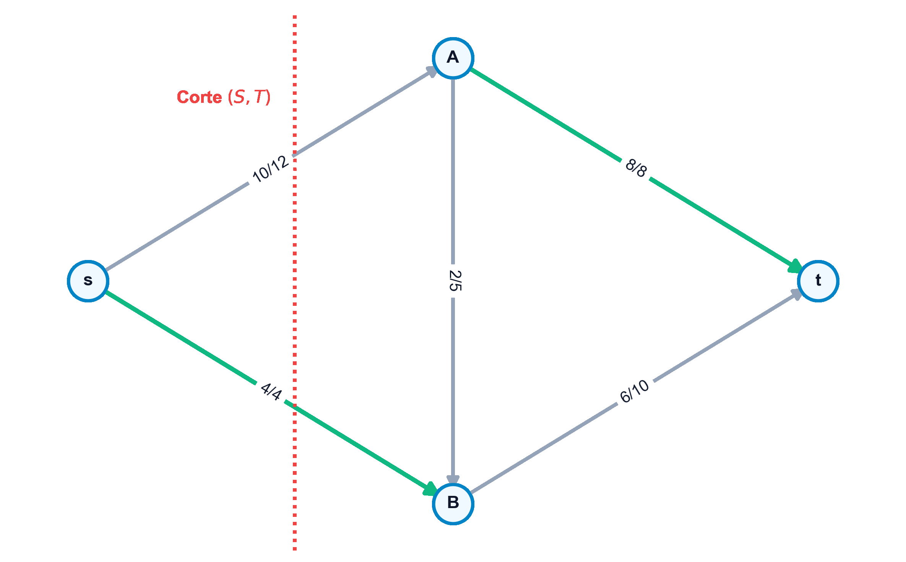

# Problemas de Flujo en Redes

La optimización de **flujos en redes** representa una de las ramas más maduras y de mayor impacto práctico de la investigación operativa. Permite modelar y resolver de forma exacta el envío de entidades físicas o lógicas (tales como toneladas de mercancía, litros de crudo, vatios de potencia eléctrica o gigabytes de datos) a través de canales con capacidades limitadas, cuya teoría y aplicaciones algorítmicas se estudian detalladamente en los textos clásicos de flujos y optimización en redes [@ahuja1993network; @bertsekas1998network]. En este capítulo, estudiaremos el concepto algebraico de flujo y cociclo, el célebre Lema de Coloración de Arcos de Minty (herramienta teórica cardinal para demostrar optimalidades), el teorema de flujo máximo y corte mínimo, el algoritmo de Ford-Fulkerson y el problema general del flujo de coste mínimo y transbordo.

::: {.callout-important title="Objetivos de aprendizaje"}
Al finalizar este capítulo, serás capaz de:

1.  **Formular algebraicamente** el concepto de flujo y circulación en redes, aplicando las ecuaciones de balance y conservación en los nodos.
2.  **Identificar y calcular** cociclos (cortes) en digrafos, distinguiendo entre arcos directos e inversos y calculando su capacidad física.
3.  **Comprender y aplicar** el Lema de Coloración de Arcos de Minty, ejecutando el algoritmo constructivo de etiquetado para demostrar la existencia de ciclos y cociclos coloreados.
4.  **Demostrar y aplicar** el teorema Max-Flow Min-Cut de Ford-Fulkerson para hallar la capacidad de transporte límite de una red y sus cuellos de botella.
5.  **Ejecutar e implementar** el algoritmo de Ford-Fulkerson en la red residual para encontrar caminos aumentantes y actualizar flujos.
6.  **Modelar y resolver** problemas de flujo a coste mínimo y transbordo mediante programación lineal y la librería **NetworkX**.
:::


## Estructura Algebraica de Flujos y Cociclos

Sea un digrafo conexo $G = (V, A)$.

### Definición de Flujo y Circulación
Un **flujo** en la red $G$ es un vector $x \in \mathbb{R}^{|A|}$ que asigna a cada arco dirigido $(i, j) \in A$ un caudal o cantidad $x_{ij}$. El flujo debe cumplir con las ecuaciones de conservación en los nodos:
$$ \sum_{j \mid (i, j) \in A} x_{ij} - \sum_{j \mid (j, i) \in A} x_{ji} = b_i, \quad \forall i \in V $$
Donde el vector $b \in \mathbb{R}^{|V|}$ representa los balances externos:

-   **fuentes ($b_i > 0$)**: Nodos inyectores de flujo.
-   **sumideros ($b_i < 0$)**: Nodos extractores de flujo.
-   **transbordo ($b_i = 0$)**: Nodos intermedios (todo flujo entrante sale).

Para que el sistema tenga solución factible, la red debe estar en equilibrio global: $\sum_{i \in V} b_i = 0$. Si $b_i = 0$ para todo $i \in V$, el flujo $x$ se denomina **circulación**.


::: {.callout-note title="Definición de Cociclo (Corte)"}
Dado un subconjunto de nodos $S \subset V$ (y su complementario $T = V \setminus S$), el **cociclo** $w(S)$ es el conjunto de arcos que conectan nodos de $S$ con nodos de $T$, independientemente de su dirección:
$$ w(S) = w^+(S) \cup w^-(S) $$
Donde:
-   **$w^+(S)$ (arcos directos)**: Arcos orientados desde $S$ hacia $T$:
    $$ w^+(S) = \{ (i, j) \in A \mid i \in S, \ j \notin S \} $$
-   **$w^-(S)$ (arcos inversos)**: Arcos orientados desde $T$ hacia $S$:
    $$ w^-(S) = \{ (j, i) \in A \mid i \in S, \ j \notin S \} $$
:::


## El Lema de Coloración de Arcos de Minty (1966)

El lema de coloración de Minty es un teorema fundamental en optimización combinatoria. Permite demostrar de forma directa teoremas de dualidad y existencia de flujos compatibles.


::: {.callout-important title="Lema de Coloración de Arcos de Minty"}
Sea $G = (V, A)$ un digrafo conexo cuyos arcos se pueden colorear de forma arbitraria con tres colores: **negro** ($N$), **verde** ($V$), **rojo** ($R$) o dejarse **sin color** ($0$). Se exige que al menos un arco $u_0 = (t, s) \in A$ esté coloreado de **negro**.

Entonces, se verifica una, y solo una, de las dos afirmaciones siguientes:

1.  El arco negro $u_0$ pertenece a un **ciclo elemental** coloreado (formado solo por arcos negros, verdes o rojos). Los arcos negros están orientados en sentido directo en el ciclo, los verdes en sentido inverso y los rojos en cualquier sentido.
2.  El arco negro $u_0$ pertenece a un **cociclo elemental** coloreado (formado solo por arcos negros, verdes o sin color). Los arcos negros están orientados en sentido directo en el corte, los verdes en sentido inverso y los arcos sin color en cualquier sentido.
:::


::: {.callout-note title="Demostración y Algoritmo de Etiquetado de Minty" collapse="true"}
La demostración del lema es constructiva y define el algoritmo de etiquetado:

1.  **Etiquetado inicial**:
    Etiquetar el nodo $s$ (extremo del arco negro de referencia $u_0 = (t, s)$) como $p(s) = s$. Todos los demás nodos se marcan como no etiquetados ($p(j) = 0$).
2.  **Propagación**:
    Buscar un nodo $i$ etiquetado ($p(i) \neq 0$) y un nodo $j$ no etiquetado ($p(j) = 0$) adyacentes en la red. Etiquetar $j$ asignando $p(j) = i$ si se cumple alguna de las siguientes condiciones:
    -   Existe el arco dirigido $u = (i, j) \in A$ y $u$ está coloreado de negro o rojo.
    -   Existe el arco dirigido $u = (j, i) \in A$ y $u$ está coloreado de verde o rojo.
3.  **Criterio de Parada**:
    Repetir el paso 2 hasta que no se puedan realizar más etiquetas. Al finalizar:
    -   *Caso A (El nodo $t$ está etiquetado)*: Siguiendo la cadena de predecesores desde $t$ hasta $s$ ($t - p(t) - p(p(t)) - \dots - s$) junto con el arco $u_0 = (t, s)$, se define un ciclo elemental que satisface la primera afirmación del lema.
    -   *Caso B (El nodo $t$ no está etiquetado)*: Definimos el conjunto $S = \{i \in V \mid p(i) \neq 0\}$. Al no estar $t$ etiquetado, $s \in S$ y $t \notin S$, por lo que el cociclo $w(S)$ contiene al arco $u_0$. Por construcción de las etiquetas, este cociclo no puede contener arcos rojos ni arcos con orientaciones prohibidas, satisfaciendo la segunda afirmación. $\blacksquare$
:::


## El Problema del Flujo Máximo

Busca enviar la mayor cantidad posible de flujo desde un nodo fuente $s$ a un nodo sumidero $t$ respetando las capacidades superiores de los arcos $u_{ij}$:

$$
\begin{aligned}
\max_{x, v} \quad & v \\
\text{sujeto a} \quad & \sum_{j \mid (i, j) \in A} x_{ij} - \sum_{j \mid (j, i) \in A} x_{ji} = \begin{cases} v & \text{si } i = s \\ -v & \text{si } i = t \\ 0 & \text{si } i \neq s, t \end{cases} \quad \forall i \in V \\
& 0 \le x_{ij} \le u_{ij}, \quad \forall (i, j) \in A
\end{aligned}
$$

### Cortes y Capacidad de un Corte
Un corte $(S, T)$ es una partición del conjunto de nodos $V$ tal que el origen $s \in S$ y el destino $t \in T$ (donde $T = V \setminus S$). La **capacidad del corte** es la suma de las capacidades de los arcos que cruzan de $S$ a $T$:
$$ C(S, T) = \sum_{i \in S, j \in T} u_{ij} $$


::: {.callout-important title="Teorema de Flujo Máximo - Corte Mínimo (Ford-Fulkerson, 1956)"}
-   **Acotación débil**:
    Para cualquier flujo factible $v$ y cualquier corte $(S, T)$, se cumple que $v \le C(S, T)$.
-   **Igualdad fuerte**:
    El valor del flujo máximo de $s$ a $t$ coincide exactamente con la capacidad mínima de un corte $(S, T)$ que separe $s$ de $t$:
    $$ v^* = \min_{(S,T)} C(S, T) $$
:::

{#fig-red-flujo-maximo fig-align="center" width="75%"}

### Algoritmo de Ford-Fulkerson (Camino Aumentante)
El algoritmo busca repetidamente rutas donde sea posible añadir flujo de $s$ a $t$ en la **red residual** $G_f$:

-   **Red Residual $G_f$**:
    Para cada arco original $(i, j) \in A$ con capacidad $u_{ij}$ y flujo actual $x_{ij}$, se definen en $G_f$:

    -   Un arco directo $(i, j)$ con capacidad residual $u_{ij} - x_{ij}$ (espacio libre para aumentar flujo).
    -   Un arco inverso $(j, i)$ con capacidad residual $x_{ij}$ (capacidad de cancelar o retornar flujo).
    
-   **Pasos del Algoritmo**:

    1.  Fijar el flujo inicial $x_{ij} = 0$ para todos los arcos.
    2.  Buscar un camino simple de $s$ a $t$ en la red residual $G_f$. Si no existe, terminar (el flujo actual es óptimo).
    3.  Para el camino aumentante $\mu$ hallado, calcular su cuello de botella:
        $$ \delta = \min_{e \in \mu} \{ \text{capacidad residual de } e \} $$
    4.  Actualizar el flujo original: añadir $\delta$ en los arcos directos del camino y restar $\delta$ en los arcos inversos.
    5.  Volver al paso 2.


## Problema de Flujo de Coste Mínimo y Transbordo

El problema de flujo de coste mínimo busca satisfacer las demandas $b_i$ de todos los nodos al menor coste lineal posible, respetando capacidades inferiores y superiores en los arcos:

$$
\begin{aligned}
\min_{x} \quad & \sum_{(i,j) \in A} c_{ij} x_{ij} \\
\text{sujeto a} \quad & \sum_{j \mid (i, j) \in A} x_{ij} - \sum_{j \mid (j, i) \in A} x_{ji} = b_i, \quad \forall i \in V \\
& l_{ij} \le x_{ij} \le u_{ij}, \quad \forall (i, j) \in A
\end{aligned}
$$

El **problema del transbordo** es una versión donde existen nodos intermedios que no tienen demanda ni oferta externa propia ($b_i = 0$), actuando puramente como puntos de consolidación o bifurcación del flujo. Se formula directamente bajo el esquema del problema de flujo de coste mínimo.


## Implementación en Python con NetworkX


::: {.callout-tip title="Código Python: Flujo Máximo, Corte Mínimo y Coste Mínimo en NetworkX" collapse="true"}
El siguiente script construye una red de transporte con capacidades, calcula el flujo máximo y el corte mínimo correspondiente, y resuelve un problema de flujo de coste mínimo compatible usando el algoritmo del Símplex de redes:

```python
import networkx as nx

# 1. Resolver el problema de Flujo Maximo y Corte Minimo
G_max = nx.DiGraph()
edges_flow = [
    ("s", "A", 16), ("s", "B", 13), ("A", "B", 10), ("B", "A", 4),
    ("A", "C", 12), ("B", "D", 14), ("C", "B", 9), ("D", "C", 7),
    ("C", "t", 20), ("D", "t", 4)
]
for u, v, cap in edges_flow:
    G_max.add_edge(u, v, capacity=cap)

# Calcular el flujo maximo
valor_flujo, dict_flujo = nx.maximum_flow(G_max, "s", "t")
print(f"Flujo Maximo de s a t: {valor_flujo} unidades")
print("Flujo asignado por arco:")
for u, vecinos in dict_flujo.items():
    for v, val in vecinos.items():
        if val > 0:
            print(f"  {u} -> {v}: {val}")

# Calcular el corte minimo asociado
cap_corte, (S, T) = nx.minimum_cut(G_max, "s", "t")
print(f"\nCapacidad del Corte Minimo: {cap_corte}")
print(f"  Nodos del conjunto S (fuente): {S}")
print(f"  Nodos del conjunto T (sumidero): {T}")


# 2. Resolver el problema de Flujo de Coste Minimo (Min-Cost Flow)
G_cost = nx.DiGraph()
# balances de nodo: b_i > 0 oferta, b_i < 0 demanda, b_i = 0 transbordo
G_cost.add_node("s1", demand=-4)   # Oferta de 4 unidades
G_cost.add_node("s2", demand=-3)   # Oferta de 3 unidades
G_cost.add_node("n1", demand=0)
G_cost.add_node("n2", demand=0)
G_cost.add_node("d1", demand=5)    # Demanda de 5 unidades
G_cost.add_node("d2", demand=2)    # Demanda de 2 unidades

# Arcos con formato (origen, destino, capacidad, coste unitario)
arcs_cost = [
    ("s1", "n1", 4, 2), ("s1", "n2", 2, 5), ("s2", "n2", 3, 1),
    ("n1", "d1", 3, 4), ("n1", "n2", 2, 2), ("n2", "d1", 2, 3),
    ("n2", "d2", 5, 6), ("d1", "d2", 1, 1)
]
for u, v, cap, cost in arcs_cost:
    G_cost.add_edge(u, v, capacity=cap, weight=cost)

try:
    coste_opt, flujo_opt = nx.network_simplex(G_cost)
    print(f"\nCoste total minimo del flujo: {coste_opt}")
    print("Distribucion optima de flujos:")
    for u, vecinos in flujo_opt.items():
        for v, val in vecinos.items():
            if val > 0:
                print(f"  {u} -> {v}: {val} unidades (coste unitario = {G_cost[u][v]['weight']})")
except nx.NetworkXUnfeasible as e:
    print(f"\nError: El problema de flujo de coste minimo no es factible: {e}")
```
:::
